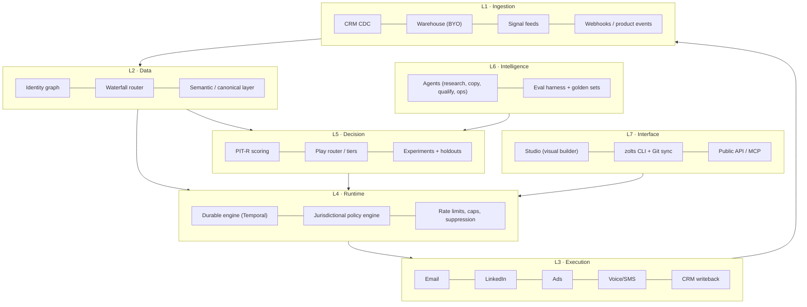

# 02 — Product and platform architecture

## Guiding principle

> Everything a GTM engineer configures must be **versionable, testable, reversible text**. The UI is an editor over that text, never the source of truth.

## Layers

The loop is closed: L3 writes outcomes back into L1, which feed retraining in L5. **That loop is the compounding moat.**

## Critical components

### 1. Durable runtime
A GTM program is a long-running workflow: wait three days, retry a downed provider, respect quiet hours, pause when the contact replies. Implementing this with cron plus queues is guaranteed debt.

- **Temporal** as the engine: durable execution, retries, workflow versioning, deterministic replay.
- Every execution produces an **auditable trace**: which signal triggered it, which data was purchased and from whom, what the scorer decided, which text which model generated from which prompt, what was sent, and what happened.
- Cost is attributed per execution (credits, tokens, sends) — the basis of the per-play P&L.

### 2. Policy engine (pre-execution, blocking)
Every action passes a policy evaluation before it executes: contact jurisdiction, legal basis, permitted channel, suppression, frequency, quiet hours, tenant quotas, spend cap. A failure blocks the action with a recorded reason — never "best effort". Detail in [11](11-compliance-and-governance.md).

### 3. Canonical semantic layer
A single entity model (Account, Person, Signal, Membership, Play, Touch, Outcome). Customer objects map onto this canon through an **AI-assisted mapper** with human confirmation. Custom fields live in `attributes JSONB` against a tenant-declared schema → any CRM, any vertical, no fork.

### 4. Waterfall router
Provider abstraction by *field*, not by *vendor*. See [07](07-data-engine-and-waterfall.md).

### 5. Experimentation service
Deterministic assignment (stable hash of `account_id + program_id + salt`) to control or treatment. No program runs without declaring its holdout. See [10](10-measurement-and-incrementality.md).

## Technical stack (decisions)

| Layer | Choice | Rejected alternative | Reason |
|---|---|---|---|
| Core language | TypeScript (Node 22) | Go | Iteration speed, one language front to back, connector ecosystem |
| ML / scoring | Python (FastAPI + scikit/LightGBM) | Pure TS | Mature modelling tooling; isolated service |
| Workflow runtime | Temporal | BullMQ / Airflow | Durability and replay; Airflow is batch, not event-driven |
| OLTP | Postgres 16 + RLS | MySQL | RLS for multi-tenancy, JSONB, pgvector, extensions |
| OLAP | ClickHouse | Own BigQuery | Per-event cost on touches and traces; dashboard latency |
| Customer warehouse | Snowflake/BigQuery/Databricks/Postgres (BYO) | Copy everything into Zolts | Removes the data governance objection and storage COGS |
| Streaming | Redpanda (Kafka API) | SQS | Event replay, log semantics |
| Cache / rate limiting | Redis | — | Per-provider and per-mailbox quotas |
| Vectors | pgvector | Pinecone | One less system to operate below 10^8 vectors |
| LLM | Claude (Anthropic API) primary, multi-model router | Single provider | Cost and latency per task; avoid single-vendor dependence |
| Frontend | Next.js + tRPC + Tailwind | — | — |
| Infrastructure | Kubernetes (EKS/GKE), Terraform IaC | Pure serverless | Long-running workers and per-region network control |
| Residency | Per-region clusters (eu-central-1, us-east-1) | Single region | European enterprise requirement |

## ADRs (architecture decisions, condensed)

**ADR-001 · Multi-tenancy via RLS on shared Postgres, with physical isolation available on Enterprise.**
Linear operating cost versus a database per customer; physical isolation is sold as an add-on (pricing power).

**ADR-002 · The DSL is the source of truth; the UI generates DSL.**
Prevents UI/engine divergence and enables GitOps, pull requests over GTM logic, and rollback.

**ADR-003 · Zero-copy by default over the customer's warehouse.**
Zolts materialises only what execution requires (IDs, program state, suppressions). Reduces GDPR surface and COGS.

**ADR-004 · Every agent writes proposals; it never executes.**
An agent emits a `proposed_action`; the runtime validates it against policy and evals before materialising it. Strict proposal/execution separation.

**ADR-005 · Idempotency is mandatory on every external action.**
`idempotency_key = hash(program_version, entity_id, step_id, window)`. Without it, a Temporal replay duplicates emails: an unrecoverable trust failure.

**ADR-006 · One connector SDK with contract tests.**
Every connector implements the same interface (`discover`, `read`, `write`, `capabilities`, `limits`) and passes a contract suite in CI. This contains connector debt, the sector's main engineering sink.

**ADR-007 · Durable execution is a Postgres outbox with leases, not an external orchestrator.**
Every external action is a row written in the same transaction as the state change that justified it. Workers claim rows with `for update skip locked` under a lease; a worker that dies leaves an expired lease another worker reclaims. This gives at-least-once delivery at the runtime and exactly-once at the provider via the idempotency key of ADR-005, with a database as the only infrastructure.

Reconsider when any of these becomes true: a play needs human-in-the-loop waits measured in weeks rather than days, a single action needs to fan out to more than a few hundred children, or the execution history itself becomes a compliance artefact a customer audits directly. Until then an external orchestrator is a second system to operate, a second failure domain and a third party holding the record of what was sent to whom. `runtime/repo/actions.py` is the seam: swapping the claim and the retry schedule is a contained change, which is why the state machine lives in one file.

**ADR-008 · Tenant isolation is enforced by the database, and a missing tenant raises.**
Every tenant-scoped table has `force row level security`, so the owning role is bound by the policy too — without forcing, migrations and application code see different databases. The application connects as a role that cannot bypass RLS. The tenant is set per transaction, and a query that does not set it raises rather than returning an empty set: an empty set is indistinguishable from a correct answer, which is how an isolation bug survives a suite that asserts on results.

The privileged surface is two `security definer` functions, both returning identifiers only: one resolves an API token to a tenant (the one lookup that cannot be tenant-scoped, because resolving the tenant is its purpose), and one claims due actions across tenants for the workers.

**ADR-009 · The internal schema is never named after a plausible database role.**
Postgres resolves `"$user"` ahead of `public` in the default `search_path`. A schema named `zolts` alongside a role named `zolts` caused a second migration run to create a complete duplicate of every table inside the shadowing schema, silently, and report success. The schema is `zolts_internal` and every connection pins `search_path` at connect time. Two locks, because the failure is invisible until a query returns the wrong data.

**ADR-010 · Cost governance is delegated to Trazum, not reimplemented.**
Before the runtime spends on a model call it asks `spend_guard` over MCP whether it may. The pricing catalogue and the verdict live in one place; a second price table in this repository would drift, and the copy that drifts is the one that authorises the spend.

Three properties make the tool usable as a gate rather than as a report: it never makes a provider call to answer, so consulting it is free; without a ceiling somebody set it answers `cannot-tell` rather than a yes nobody measured, which matches this runtime's own rule that an unmeasured thing is not a pass; and a refusal carries the cheaper ways to make the same call, priced for this call, so the agent has a lever instead of a dead end.

Fail-closed: an unreachable guard refuses. A cost control that opens when it breaks is not a cost control.

**ADR-011 · One SDK, a movable endpoint.**
Agents call Claude through the official Anthropic SDK. `base_url` is configurable, so a tenant can route through their own gateway — OmniRoute serves the Messages API shape, so the SDK reaches it unchanged — without this repository growing a provider-neutral abstraction that has to be kept honest against every provider it claims to support.

**ADR-012 · A generated message is a proposal, never a send.**
An agent writes a row in `proposal`. It cannot write to `action`. The only two paths from generated text to a provider are the eval gate approving it and a human approving it, and both record which one it was. The question "who approved this message" has a row as its answer, and the answer distinguishes a threshold from a person.

**ADR-013 · Two CRMs are built natively; the long tail is bought, not written.**
A GTM runtime that only reads HubSpot is a HubSpot add-on. But "connect to every CRM" is the sink ADR-006 names: a hundred providers, each with its own auth, object model, pagination and rate limits, maintained forever by a team that does not exist yet.

The split is by what being wrong costs.

| Layer | Approach | Why |
|---|---|---|
| The CRM the entry segment actually uses | Native connector | Depth wins the deal: task creation in the rep's own workflow, and opt-out state read correctly |
| Everything else in the long tail | A unified CRM API (Merge, Nango or equivalent) as **one more `CrmSource`** | Converts a permanent engineering liability into a variable cost |
| A customer whose CRM nobody supports | The ingest API plus a webhook endpoint, driven by their own iPaaS | Already built; it is the same `POST /v1/accounts` and `/v1/people` the runtime uses |

Salesforce is the third native connector, added in ADR-018 because the entry segment's enterprise buyers ask for it by name. It is also what proved the seam holds: it shares almost nothing with the first two, and the contract did not move to accommodate it.

The seam that makes all three interchangeable is `runtime/connectors/crm.py`: canonical records, a declared `Capabilities`, and a contract suite every source passes in CI. A unified-API vendor is not an architectural decision under this design — it is an implementation of an interface that two native connectors already satisfy, and it can be added or dropped without touching the sync, the entities or the policy engine.

**The field that decides whether a connector is an asset or a liability is `reads_opt_out`.** A CRM that cannot say whether someone unsubscribed must not have its silence read as permission: the contact is stored with consent `unknown`, the policy engine has no rule that admits `unknown`, and the operator is told which source cannot answer. Unified APIs normalise this field worst of all — it is the one place where a native connector still earns its cost — so the capability is declared per source and the contract suite fails a source that claims it and never returns one.

**ADR-014 · A CRM the runtime has never seen is connected by a document, not by code.**
ADR-013 splits the market into a native tier, a bought long tail and an ingest API. It assumes every CRM is a CRM somebody sells. A partner running an in-house system built around their own object model is none of the three: there is no connector to write, no unified API that covers it, and telling them to build an iPaaS pipeline moves the integration cost onto the customer at exactly the moment they are deciding whether to buy.

The unit of work stops being the connector and becomes the mapping.

| | Connector | Mapping |
|---|---|---|
| Artefact | Python module in this repository | YAML document authored by the tenant |
| Who ships it | This team, on a release cycle | The tenant, at publish time |
| Review | Code review, tests, deploy | Schema validation at the door, versioned by `spec_hash` |
| Blast radius | Every tenant | One tenant |
| Cost of the hundredth one | Linear engineering, forever | Zero |

`GenericSource` reads a mapping and implements the same `CrmSource` protocol as HubSpot and Pipedrive, and it passes the same contract suite. That is the load-bearing claim: a mapping is not a lesser integration on a side path, it is a first-class source whose behaviour happens to be configuration. This is product invariant 5 — *program logic is versioned configuration, never ad-hoc code* — applied to integration.

The path language is deliberately small: nested fields, an array index, an array element flagged primary, and a fixed transform pipeline. Anything more expressive is a program, and a customer-authored program evaluated against a customer payload inside this runtime is a liability sold as a feature.

Two transports, because a CRM is either reachable or it is not. `http` means the runtime pulls, paging the way the mapping says it pages. `push` means the tenant posts batches, because their system sits behind a VPN or has no API at all. Everything after the transport is identical — same normaliser, same canonical records, same policy engine — which is the reason the transport is not part of the contract.

**Consent is where a mapping earns or loses its keep.** `reads_opt_out` is not a flag the author sets; it is derived from whether the document names the field that carries opt-out state. A mapping that stays silent about consent is published, and every contact it imports is stored `unknown` and is unreachable until a basis is established elsewhere. The one shape refused outright is `default: allowed` with no value map, which marks the entire imported list contactable regardless of what the CRM says: that has to be a sentence somebody wrote, not a shape they fell into.

A customer-authored document is an input, and the publish endpoint treats it as one. Three things are refused outright, each for a reason found by executing the code rather than by reading it:

| Refused | Why |
|---|---|
| An unmapped value read as consent | A bare boolean was being guessed at, which granted `allowed` for a state the document never named and inverted every positively-phrased field: `email_ok: true` meant consent and was read as an opt-out. A boolean is mapped like any other value |
| A `base_url` on loopback or link-local | The runtime makes that request with its own network position; `169.254.169.254` answers with the instance's cloud credentials. RFC1918 stays allowed, because a CRM behind a VPN is the use case rather than the threat |
| A provider name a built-in connector owns | The built-in wins wherever the name is resolved, so the mapping would store cleanly and never be used |

Path syntax is checked at publish for the same reason. `extract` walks only as far as a record takes it, so a malformed third segment in a field that is usually absent surfaces on the one record that has it — halfway through a customer's first sync.

What this costs: mapping correctness is the tenant's, not this team's, and the sync report says so in a caveat on every run. What it buys: the answer to "does it work with our CRM?" stops being a roadmap question.

**ADR-015 · A partner signs up by invitation, and minting one has no HTTP surface.**
Creating a tenant required database access, so every partner cost founder time and the product could not be sold without a human in the loop. Removing that human is the difference between a product and a service.

Open self-serve signup is the obvious answer and the wrong one here. It puts an unauthenticated tenant-creating endpoint on the internet for a product sold to a handful of design partners, and it gives away the one thing worth keeping at this stage: control of who gets in.

| | Open signup | **Invitation** | Founder runs the CLI |
|---|---|---|---|
| Who decides who gets in | Nobody | The operator | The operator |
| Partner needs a shell | No | No | Yes |
| Unauthenticated write surface | Signup, forever | Signup, redeemable once per token | None |
| Abuse story | Tenant spam, mailbox enumeration | A leaked token creates one tenant | None |

Minting is a CLI command with no HTTP route at all. An operator capability reachable from a tenant's key is a privilege escalation waiting to be found, and there is no super-tenant in this data model to hold one safely.

Three properties the redemption path must have, each of which is a test:

1. **A token is never stored.** sha256 at rest, shown once at mint time, unrecoverable — the same discipline as an API key.
2. **Invalid, expired and already-redeemed are indistinguishable.** Telling them apart tells a caller which tokens exist.
3. **Redemption is once, even under concurrency.** The row is locked with `for update` before the tenant is created and marked redeemed only once it exists. Marking it redeemed first and naming its tenant afterwards leaves a committed row that is half-redeemed, which the table's own check constraint refuses — that constraint caught the first implementation.

Starter programs are published **as drafts**. A tenant that signs up and starts contacting people before anyone has read a program is not onboarding, it is an incident. And seven of the eleven blueprints ship no example program: the response says so and names what the blueprint declares, because an empty list with no sentence beside it is how a new tenant concludes the product is broken.

Invitations are operator state, not tenant state — they exist before their tenant does — so the table carries `redeemed_tenant_id` rather than `tenant_id`, and the role that serves tenant requests has its access to it revoked.

**ADR-016 · A reply is read before it is counted, and a verdict must quote.**
Every reply was recorded as `reply_positive`. Somebody writing "take me off your list" was counted as a conversion, left contactable, and folded into the lift the product reports. Two failures at once, and the second is the worse one:

| | |
|---|---|
| Compliance | An opt-out written in prose was invisible. Only a provider-signalled unsubscribe ever suppressed anybody |
| Measurement | The primary conversion signal counted negative replies as wins. In cold outreach most replies are negative, so every reported lift was inflated by an unknown and unbounded amount — in a product whose entire claim is honest measurement |

The triage agent classifies the reply's text into `unsubscribe`, `negative`, `wrong_person`, `not_now` or `positive`, and stops there. It does not suppress, does not record an outcome, and does not decide whether it is confident enough: the runtime does, which is product invariant 1. An unsubscribe found here goes through the **same** suppression path a provider's unsubscribe event takes, because two suppression mechanisms would have to agree forever.

**A verdict must quote the reply.** The classification carries the span of text that supports it, and a verdict whose quote is not in the reply is discarded entirely. The failure mode of a classifier over free text is a confident label with nothing behind it, and it reads exactly like a correct one — while deciding whether somebody is contacted again. This is the same discipline the copywriter's provenance check applies to a draft, in the direction that matters more.

Three things a blocked verdict is not: a weaker signal, a reason to fail the webhook, or a default. Absent a usable verdict — agents off, no model, no body in the payload, the spend guard refusing, the quote unverifiable — the reply is recorded as `reply_positive`, exactly as before.

That last choice is deliberate and it over-counts. Making the safe default "not a conversion" would move every existing tenant's measured lift on a deploy, silently, in the direction that flatters nobody but surprises everybody; and a provider that reports a reply with no body has genuinely told us only that a human responded.

**So the over-count is not hidden, it is counted.** Every outcome records whether anybody read the words behind it (`verified_by`), and the measurement reports *conversions read of conversions total* beside the lift itself — not in a footnote, because a caveat nobody reaches is not a disclosure. A program whose lift rests on 62% unread replies says so on the same screen as the lift.

Three things that buys, in order of what they are worth:

| | |
|---|---|
| Nobody's number moves on a deploy | The correction is a disclosure, not a silent restatement |
| The buyer watches the mechanism work on their own data | Every competing tool would have drawn the chart. This one shows what the chart rests on |
| It closes by itself | The share falls as providers send bodies and tenants enable the agent layer. No migration, no announcement |

The alternative — deflating quietly — trades a visible over-count for an invisible under-count. That is a different bias, not less bias, and it forfeits the only hard-to-fake evidence this product has that it does not flatter its own numbers.

Cost is governed like every other model call: the spend guard prices the classification first and a refusal blocks it rather than downgrading the answer. A reply arriving at a tenant over their ceiling is recorded, not guessed at.

**ADR-017 · The price list lives in code; the document is what a test checks it against.**
`cost_event.billed_credits` existed from the first migration and no caller ever set it. `docs/12` prices eight billable actions and four plans in full, and the runtime billed nothing: the column was there, the structure was there, and every action was free.

A price that lives only in prose is a price two people read differently. So `zolts/billing.py` holds the list and the plans, and a test parses `docs/12` and asserts they agree. When they diverge the **document** is corrected, per the repository's own rule — the reverse would let an invoice drift by editing a paragraph.

Four decisions the metering makes, each of which was a defect before it made them:

| | |
|---|---|
| **An unpriced action raises** | `credits_for("enrichment.mobile")` fails rather than returning zero. A silent zero is how a whole category of usage becomes free without anybody deciding it should be |
| **Billing does not depend on knowing our own cost** | Recording a credit only `if result.cost_micros` made every send through a provider that reports no COGS free to the customer. A send is one credit whether or not we know what it cost us |
| **A closed period keeps the terms it was sold** | The plan's numbers are copied in when the period opens. A customer who upgrades mid-month is billed on what they were sold for the month they consumed, and a price list that changes must not restate a closed one |
| **Enterprise has no default terms** | `plan_for("enterprise")` returns nothing and the statement refuses to compute. A number here is a number somebody eventually invoices |

**A tenant at their ceiling is held, not cancelled and not silently extended.** The check runs before the spend and before anything about the particular action — a tenant who has run out should not also have their work cancelled for a contact that could not be resolved this minute. They have not done anything wrong: the action goes back to pending, due when the period turns.

**The overage rate was never open; it was unimplemented.** `docs/12` prices additional credits on a volume ladder (0-100k → €0.010, 100k-500k → €0.008, >500k → €0.006) and an additional seat at €90/month. The runtime charged for neither, and reported that the rate was "contractual" — a statement that read as prudence and was in fact a price list the product had not read. Both are now charged, and a test re-reads each number out of `docs/12` so they cannot drift apart quietly.

The document leaves one thing genuinely ambiguous: what the ladder is measured over. It is applied **graduated, over the overage alone** — the first 100,000 credits past the plan at €0.010, the next 400,000 at €0.008, the rest at €0.006. The alternative, one flat rate chosen by total volume, has a cliff at every boundary: a tenant crossing 100,000 credits would watch the whole invoice reprice downward, so consuming more would cost less. That is not a discount, it is a defect, and the test that rules it out asserts the property rather than the arithmetic — **the bill never falls as consumption rises**, checked across the whole ladder.

A statement reports the blended rate it worked out at. A tenant who sees €0.008 in the price list and €0.0094 on the invoice has not been overcharged, and the number that explains it belongs on the statement rather than in a support conversation.

**The ceiling had to become raisable before any of that could be earned.** `docs/18` I6 settled "overage with an 80% alert and a configurable hard ceiling"; the runtime stopped every tenant at their included credits, which is a ceiling that cannot be raised. So overage was priced in the document and unreachable in the product — no tenant could consume a credit beyond their plan, and the expansion revenue `docs/12` names as the first driver of NRR was arithmetic nobody could run. `tenant.credit_ceiling` defaults to null, meaning the included allowance, so the default behaviour is unchanged and nobody overspends by accident. Raising it is provisioning, like changing a plan, and a deliberate act is what overage bills for. The 80% alert now exists too, and fires on the ceiling rather than the plan, because it is the ceiling that stops work.

**ADR-018 · Some CRMs are not one host, and the connection's config is part of the address.**
HubSpot and Pipedrive each answer at a single hostname, so a credential is the whole address and `CrmSource.accounts(credential)` was enough. Salesforce gives every org its own — `https://acme.my.salesforce.com` — and the third connector is where that assumption surfaced.

The contract did not change. A source that needs configuring exposes `from_config(config)`; the sync path calls it when it exists and leaves every other source untouched. The connection row already carried a `config` column for exactly this kind of thing, and the sync had simply never read it.

| What only Salesforce does | How it is handled |
|---|---|
| Per-org base URL | `from_config` builds a configured connector; absent an `instance_url` it raises **naming it**, rather than requesting some other org's host |
| Records come from SOQL, not resource paths | One endpoint; the query names the fields |
| Paging is a URL the server hands back | Nothing to increment and nothing to guess. A repeated continuation terminates rather than looping |
| Employee count is an integer | Stored as an attribute and declared as a caveat, exactly as HubSpot's is. Inventing a band from a number is a mapping nobody agreed |

**The interesting field is `HasOptedOutOfEmail`, and it is a boolean.** A boolean cannot distinguish "asked us to stop" from "was never asked". `true` is an opt-out and is reported as one; `false` is reported as `ALLOWED`, which is correct in this model rather than a guess: `ALLOWED` means *legitimate interest applies — the CRM was checked and carries no opt-out*, not that anybody consented.

That distinction is worth stating because getting it wrong has a precedent in this repository. The tenant-authored mapping layer shipped reading a bare boolean as an opt-out flag, which inverted consent for every positively-phrased field and granted a legal basis the document never named. Here the field's meaning is fixed by Salesforce and the mapping is written once, in code, with a test on both values.

So Salesforce claims `reads_opt_out` and genuinely cannot report "never asked". The contract suite's never-asked row skips for this source, and a dedicated test asserts that the skip is a property of the CRM rather than a gap in a fixture — along with the caveat telling an operator that an org holding opt-out in a custom field or in Marketing Cloud needs a mapping instead.

**ADR-019 · A play reads what the contact did, and a send moves rather than being cancelled.**
Every enrollment walked every step regardless of what happened. A breakup email to somebody mid-conversation is the shape of automation a buyer points at when they say these tools embarrass them — and `wait: 2d` after a Friday afternoon is Sunday afternoon, then 03:00 for a contact three timezones away.

Both are versioned configuration, per product invariant 5. Neither is a new language.

**Branching.** A step may carry `when`, evaluated in the same expression language as triggers and exit rules against an `engagement` scope read from touches and outcomes. A second condition language is a second set of rules to get wrong, and a counter kept alongside those tables is a second source of truth that drifts.

The distinction worth naming is `no_response` versus `not has_replied`. They are not the same, and flattening them sends a breakup to somebody who is reading.

**The send window.** The policy engine already denies on quiet hours — for voice, SMS and WhatsApp, where the interruption *is* the harm. Email is different: nothing is harmed by a message existing at 03:00, it is wasted. So the window is not a second policy check.

| | |
|---|---|
| It moves a send | Discarding a step because it fell on a Sunday throws away work over a scheduling detail |
| It never moves one earlier | Bringing a send forward would shorten a wait the program declared |
| It is the customer's local time | 08:00 Madrid is 07:00 UTC in January and 06:00 in July. A window stored in UTC drifts by an hour twice a year |
| It is opt-in | A program declaring none behaves exactly as before. Adding one silently to every program would move live sequences on a deploy |
| A window that wraps midnight is refused | It is two windows, and declaring it as one silently sends at the hour it was meant to avoid |
