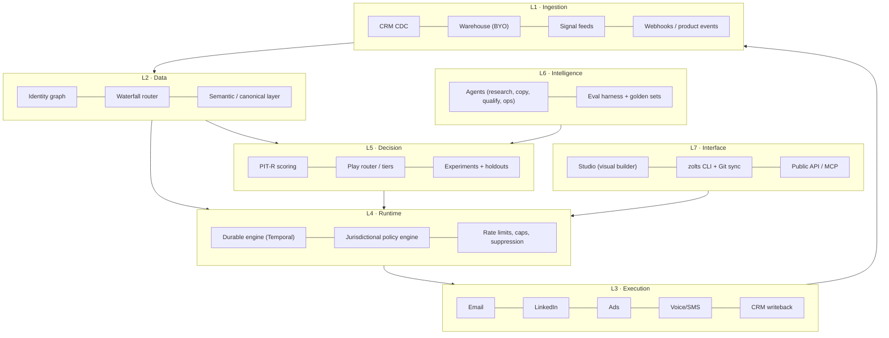

# 02 — Product and platform architecture

## Guiding principle

> Everything a GTM engineer configures must be **versionable, testable, reversible text**. The UI is an editor over that text, never the source of truth.

## Layers

The loop is closed: L3 writes outcomes back into L1, which feed retraining in L5. **That loop is the compounding moat.**

## Critical components

### 1. Durable runtime
A GTM program is a long-running workflow: wait three days, retry a downed provider, respect quiet hours, pause when the contact replies. Implementing this with cron plus queues is guaranteed debt.

- **Temporal** as the engine: durable execution, retries, workflow versioning, deterministic replay.
- Every execution produces an **auditable trace**: which signal triggered it, which data was purchased and from whom, what the scorer decided, which text which model generated from which prompt, what was sent, and what happened.
- Cost is attributed per execution (credits, tokens, sends) — the basis of the per-play P&L.

### 2. Policy engine (pre-execution, blocking)
Every action passes a policy evaluation before it executes: contact jurisdiction, legal basis, permitted channel, suppression, frequency, quiet hours, tenant quotas, spend cap. A failure blocks the action with a recorded reason — never "best effort". Detail in [11](11-compliance-and-governance.md).

### 3. Canonical semantic layer
A single entity model (Account, Person, Signal, Membership, Play, Touch, Outcome). Customer objects map onto this canon through an **AI-assisted mapper** with human confirmation. Custom fields live in `attributes JSONB` against a tenant-declared schema → any CRM, any vertical, no fork.

### 4. Waterfall router
Provider abstraction by *field*, not by *vendor*. See [07](07-data-engine-and-waterfall.md).

### 5. Experimentation service
Deterministic assignment (stable hash of `account_id + program_id + salt`) to control or treatment. No program runs without declaring its holdout. See [10](10-measurement-and-incrementality.md).

## Technical stack (decisions)

| Layer | Choice | Rejected alternative | Reason |
|---|---|---|---|
| Core language | TypeScript (Node 22) | Go | Iteration speed, one language front to back, connector ecosystem |
| ML / scoring | Python (FastAPI + scikit/LightGBM) | Pure TS | Mature modelling tooling; isolated service |
| Workflow runtime | Temporal | BullMQ / Airflow | Durability and replay; Airflow is batch, not event-driven |
| OLTP | Postgres 16 + RLS | MySQL | RLS for multi-tenancy, JSONB, pgvector, extensions |
| OLAP | ClickHouse | Own BigQuery | Per-event cost on touches and traces; dashboard latency |
| Customer warehouse | Snowflake/BigQuery/Databricks/Postgres (BYO) | Copy everything into Zolts | Removes the data governance objection and storage COGS |
| Streaming | Redpanda (Kafka API) | SQS | Event replay, log semantics |
| Cache / rate limiting | Redis | — | Per-provider and per-mailbox quotas |
| Vectors | pgvector | Pinecone | One less system to operate below 10^8 vectors |
| LLM | Claude (Anthropic API) primary, multi-model router | Single provider | Cost and latency per task; avoid single-vendor dependence |
| Frontend | Next.js + tRPC + Tailwind | — | — |
| Infrastructure | Kubernetes (EKS/GKE), Terraform IaC | Pure serverless | Long-running workers and per-region network control |
| Residency | Per-region clusters (eu-central-1, us-east-1) | Single region | European enterprise requirement |

## ADRs (architecture decisions, condensed)

**ADR-001 · Multi-tenancy via RLS on shared Postgres, with physical isolation available on Enterprise.**
Linear operating cost versus a database per customer; physical isolation is sold as an add-on (pricing power).

**ADR-002 · The DSL is the source of truth; the UI generates DSL.**
Prevents UI/engine divergence and enables GitOps, pull requests over GTM logic, and rollback. The first clause was enforced from the first commit — `POST /v1/programs` validates a whole document against `examples/schema/zolts-program.schema.json`, runs the same linter as `scripts/validate.py`, checks the holdout and stores a new version. The second had no implementation until ADR-029: the console was read-only and nothing in the repository emitted a program document.

**ADR-003 · Zero-copy by default over the customer's warehouse — intent, not yet implementation.**
Zolts would materialise only what execution requires (IDs, program state, suppressions), reducing GDPR surface and COGS. **This is not what ships.** The word *warehouse* appears nowhere in `runtime/`: contacts and accounts are copied into Zolts's own Postgres through the CRM connectors. Stated in the present tense it was a claim a buyer's security review would ask to see, and there is nothing to show. Decision 29 holds the revisit.

**ADR-004 · Every agent writes proposals; it never executes.**
An agent emits a `proposed_action`; the runtime validates it against policy and evals before materialising it. Strict proposal/execution separation.

**ADR-005 · Idempotency is mandatory on every external action.**
`idempotency_key = hash(program_version, entity_id, step_id, window)`. Without it, a Temporal replay duplicates emails: an unrecoverable trust failure.

**ADR-006 · One connector SDK with contract tests.**
Every connector implements the same interface (`discover`, `read`, `write`, `capabilities`, `limits`) and passes a contract suite in CI. This contains connector debt, the sector's main engineering sink.

**ADR-007 · Durable execution is a Postgres outbox with leases, not an external orchestrator.**
Every external action is a row written in the same transaction as the state change that justified it. Workers claim rows with `for update skip locked` under a lease; a worker that dies leaves an expired lease another worker reclaims. This gives at-least-once delivery at the runtime and exactly-once at the provider via the idempotency key of ADR-005, with a database as the only infrastructure.

Reconsider when any of these becomes true: a play needs human-in-the-loop waits measured in weeks rather than days, a single action needs to fan out to more than a few hundred children, or the execution history itself becomes a compliance artefact a customer audits directly. Until then an external orchestrator is a second system to operate, a second failure domain and a third party holding the record of what was sent to whom. `runtime/repo/actions.py` is the seam: swapping the claim and the retry schedule is a contained change, which is why the state machine lives in one file.

**ADR-008 · Tenant isolation is enforced by the database, and a missing tenant raises.**
Every tenant-scoped table has `force row level security`, so the owning role is bound by the policy too — without forcing, migrations and application code see different databases. The application connects as a role that cannot bypass RLS. The tenant is set per transaction, and a query that does not set it raises rather than returning an empty set: an empty set is indistinguishable from a correct answer, which is how an isolation bug survives a suite that asserts on results.

The privileged surface is two `security definer` functions, both returning identifiers only: one resolves an API token to a tenant (the one lookup that cannot be tenant-scoped, because resolving the tenant is its purpose), and one claims due actions across tenants for the workers.

**ADR-009 · The internal schema is never named after a plausible database role.**
Postgres resolves `"$user"` ahead of `public` in the default `search_path`. A schema named `zolts` alongside a role named `zolts` caused a second migration run to create a complete duplicate of every table inside the shadowing schema, silently, and report success. The schema is `zolts_internal` and every connection pins `search_path` at connect time. Two locks, because the failure is invisible until a query returns the wrong data.

**ADR-010 · Cost governance is delegated to Trazum, not reimplemented.**
Before the runtime spends on a model call it asks `spend_guard` over MCP whether it may. The pricing catalogue and the verdict live in one place; a second price table in this repository would drift, and the copy that drifts is the one that authorises the spend.

Three properties make the tool usable as a gate rather than as a report: it never makes a provider call to answer, so consulting it is free; without a ceiling somebody set it answers `cannot-tell` rather than a yes nobody measured, which matches this runtime's own rule that an unmeasured thing is not a pass; and a refusal carries the cheaper ways to make the same call, priced for this call, so the agent has a lever instead of a dead end.

Fail-closed: an unreachable guard refuses. A cost control that opens when it breaks is not a cost control.

**ADR-011 · One SDK, a movable endpoint.**
Agents call Claude through the official Anthropic SDK. `base_url` is configurable, so a tenant can route through their own gateway — OmniRoute serves the Messages API shape, so the SDK reaches it unchanged — without this repository growing a provider-neutral abstraction that has to be kept honest against every provider it claims to support.

**ADR-012 · A generated message is a proposal, never a send.**
An agent writes a row in `proposal`. It cannot write to `action`. The only two paths from generated text to a provider are the eval gate approving it and a human approving it, and both record which one it was. The question "who approved this message" has a row as its answer, and the answer distinguishes a threshold from a person.

**ADR-013 · Two CRMs are built natively; the long tail is bought, not written.**
A GTM runtime that only reads HubSpot is a HubSpot add-on. But "connect to every CRM" is the sink ADR-006 names: a hundred providers, each with its own auth, object model, pagination and rate limits, maintained forever by a team that does not exist yet.

The split is by what being wrong costs.

| Layer | Approach | Why |
|---|---|---|
| The CRM the entry segment actually uses | Native connector | Depth wins the deal: task creation in the rep's own workflow, and opt-out state read correctly |
| Everything else in the long tail | A unified CRM API (Merge, Nango or equivalent) as **one more `CrmSource`** | Converts a permanent engineering liability into a variable cost |
| A customer whose CRM nobody supports | The ingest API plus a webhook endpoint, driven by their own iPaaS | Already built; it is the same `POST /v1/accounts` and `/v1/people` the runtime uses |

Salesforce is the third native connector, added in ADR-018 because the entry segment's enterprise buyers ask for it by name. It is also what proved the seam holds: it shares almost nothing with the first two, and the contract did not move to accommodate it.

The seam that makes all three interchangeable is `runtime/connectors/crm.py`: canonical records, a declared `Capabilities`, and a contract suite every source passes in CI. A unified-API vendor is not an architectural decision under this design — it is an implementation of an interface that two native connectors already satisfy, and it can be added or dropped without touching the sync, the entities or the policy engine.

**The field that decides whether a connector is an asset or a liability is `reads_opt_out`.** A CRM that cannot say whether someone unsubscribed must not have its silence read as permission: the contact is stored with consent `unknown`, the policy engine has no rule that admits `unknown`, and the operator is told which source cannot answer. Unified APIs normalise this field worst of all — it is the one place where a native connector still earns its cost — so the capability is declared per source and the contract suite fails a source that claims it and never returns one.

**ADR-014 · A CRM the runtime has never seen is connected by a document, not by code.**
ADR-013 splits the market into a native tier, a bought long tail and an ingest API. It assumes every CRM is a CRM somebody sells. A partner running an in-house system built around their own object model is none of the three: there is no connector to write, no unified API that covers it, and telling them to build an iPaaS pipeline moves the integration cost onto the customer at exactly the moment they are deciding whether to buy.

The unit of work stops being the connector and becomes the mapping.

| | Connector | Mapping |
|---|---|---|
| Artefact | Python module in this repository | YAML document authored by the tenant |
| Who ships it | This team, on a release cycle | The tenant, at publish time |
| Review | Code review, tests, deploy | Schema validation at the door, versioned by `spec_hash` |
| Blast radius | Every tenant | One tenant |
| Cost of the hundredth one | Linear engineering, forever | Zero |

`GenericSource` reads a mapping and implements the same `CrmSource` protocol as HubSpot and Pipedrive, and it passes the same contract suite. That is the load-bearing claim: a mapping is not a lesser integration on a side path, it is a first-class source whose behaviour happens to be configuration. This is product invariant 5 — *program logic is versioned configuration, never ad-hoc code* — applied to integration.

The path language is deliberately small: nested fields, an array index, an array element flagged primary, and a fixed transform pipeline. Anything more expressive is a program, and a customer-authored program evaluated against a customer payload inside this runtime is a liability sold as a feature.

Two transports, because a CRM is either reachable or it is not. `http` means the runtime pulls, paging the way the mapping says it pages. `push` means the tenant posts batches, because their system sits behind a VPN or has no API at all. Everything after the transport is identical — same normaliser, same canonical records, same policy engine — which is the reason the transport is not part of the contract.

**Consent is where a mapping earns or loses its keep.** `reads_opt_out` is not a flag the author sets; it is derived from whether the document names the field that carries opt-out state. A mapping that stays silent about consent is published, and every contact it imports is stored `unknown` and is unreachable until a basis is established elsewhere. The one shape refused outright is `default: allowed` with no value map, which marks the entire imported list contactable regardless of what the CRM says: that has to be a sentence somebody wrote, not a shape they fell into.

A customer-authored document is an input, and the publish endpoint treats it as one. Three things are refused outright, each for a reason found by executing the code rather than by reading it:

| Refused | Why |
|---|---|
| An unmapped value read as consent | A bare boolean was being guessed at, which granted `allowed` for a state the document never named and inverted every positively-phrased field: `email_ok: true` meant consent and was read as an opt-out. A boolean is mapped like any other value |
| A `base_url` on loopback or link-local | The runtime makes that request with its own network position; `169.254.169.254` answers with the instance's cloud credentials. RFC1918 stays allowed, because a CRM behind a VPN is the use case rather than the threat |
| A provider name a built-in connector owns | The built-in wins wherever the name is resolved, so the mapping would store cleanly and never be used |

Path syntax is checked at publish for the same reason. `extract` walks only as far as a record takes it, so a malformed third segment in a field that is usually absent surfaces on the one record that has it — halfway through a customer's first sync.

What this costs: mapping correctness is the tenant's, not this team's, and the sync report says so in a caveat on every run. What it buys: the answer to "does it work with our CRM?" stops being a roadmap question.

**ADR-015 · A partner signs up by invitation, and minting one has no HTTP surface.**
Creating a tenant required database access, so every partner cost founder time and the product could not be sold without a human in the loop. Removing that human is the difference between a product and a service.

Open self-serve signup is the obvious answer and the wrong one here. It puts an unauthenticated tenant-creating endpoint on the internet for a product sold to a handful of design partners, and it gives away the one thing worth keeping at this stage: control of who gets in.

| | Open signup | **Invitation** | Founder runs the CLI |
|---|---|---|---|
| Who decides who gets in | Nobody | The operator | The operator |
| Partner needs a shell | No | No | Yes |
| Unauthenticated write surface | Signup, forever | Signup, redeemable once per token | None |
| Abuse story | Tenant spam, mailbox enumeration | A leaked token creates one tenant | None |

Minting is a CLI command with no HTTP route at all. An operator capability reachable from a tenant's key is a privilege escalation waiting to be found, and there is no super-tenant in this data model to hold one safely.

Three properties the redemption path must have, each of which is a test:

1. **A token is never stored.** sha256 at rest, shown once at mint time, unrecoverable — the same discipline as an API key.
2. **Invalid, expired and already-redeemed are indistinguishable.** Telling them apart tells a caller which tokens exist.
3. **Redemption is once, even under concurrency.** The row is locked with `for update` before the tenant is created and marked redeemed only once it exists. Marking it redeemed first and naming its tenant afterwards leaves a committed row that is half-redeemed, which the table's own check constraint refuses — that constraint caught the first implementation.

Starter programs are published **as drafts**. A tenant that signs up and starts contacting people before anyone has read a program is not onboarding, it is an incident. And seven of the eleven blueprints ship no example program: the response says so and names what the blueprint declares, because an empty list with no sentence beside it is how a new tenant concludes the product is broken.

Invitations are operator state, not tenant state — they exist before their tenant does — so the table carries `redeemed_tenant_id` rather than `tenant_id`, and the role that serves tenant requests has its access to it revoked.

**ADR-016 · A reply is read before it is counted, and a verdict must quote.**
Every reply was recorded as `reply_positive`. Somebody writing "take me off your list" was counted as a conversion, left contactable, and folded into the lift the product reports. Two failures at once, and the second is the worse one:

| | |
|---|---|
| Compliance | An opt-out written in prose was invisible. Only a provider-signalled unsubscribe ever suppressed anybody |
| Measurement | The primary conversion signal counted negative replies as wins. In cold outreach most replies are negative, so every reported lift was inflated by an unknown and unbounded amount — in a product whose entire claim is honest measurement |

The triage agent classifies the reply's text into `unsubscribe`, `negative`, `wrong_person`, `not_now` or `positive`, and stops there. It does not suppress, does not record an outcome, and does not decide whether it is confident enough: the runtime does, which is product invariant 1. An unsubscribe found here goes through the **same** suppression path a provider's unsubscribe event takes, because two suppression mechanisms would have to agree forever.

**A verdict must quote the reply.** The classification carries the span of text that supports it, and a verdict whose quote is not in the reply is discarded entirely. The failure mode of a classifier over free text is a confident label with nothing behind it, and it reads exactly like a correct one — while deciding whether somebody is contacted again. This is the same discipline the copywriter's provenance check applies to a draft, in the direction that matters more.

Three things a blocked verdict is not: a weaker signal, a reason to fail the webhook, or a default. Absent a usable verdict — agents off, no model, no body in the payload, the spend guard refusing, the quote unverifiable — the reply is recorded as `reply_positive`, exactly as before.

That last choice is deliberate and it over-counts. Making the safe default "not a conversion" would move every existing tenant's measured lift on a deploy, silently, in the direction that flatters nobody but surprises everybody; and a provider that reports a reply with no body has genuinely told us only that a human responded.

**So the over-count is not hidden, it is counted.** Every outcome records whether anybody read the words behind it (`verified_by`), and the measurement reports *conversions read of conversions total* beside the lift itself — not in a footnote, because a caveat nobody reaches is not a disclosure. A program whose lift rests on 62% unread replies says so on the same screen as the lift.

Three things that buys, in order of what they are worth:

| | |
|---|---|
| Nobody's number moves on a deploy | The correction is a disclosure, not a silent restatement |
| The buyer watches the mechanism work on their own data | Every competing tool would have drawn the chart. This one shows what the chart rests on |
| It closes by itself | The share falls as providers send bodies and tenants enable the agent layer. No migration, no announcement |

The alternative — deflating quietly — trades a visible over-count for an invisible under-count. That is a different bias, not less bias, and it forfeits the only hard-to-fake evidence this product has that it does not flatter its own numbers.

Cost is governed like every other model call: the spend guard prices the classification first and a refusal blocks it rather than downgrading the answer. A reply arriving at a tenant over their ceiling is recorded, not guessed at.

**ADR-017 · The price list lives in code; the document is what a test checks it against.**
`cost_event.billed_credits` existed from the first migration and no caller ever set it. `docs/12` prices eight billable actions and four plans in full, and the runtime billed nothing: the column was there, the structure was there, and every action was free.

A price that lives only in prose is a price two people read differently. So `zolts/billing.py` holds the list and the plans, and a test parses `docs/12` and asserts they agree. When they diverge the **document** is corrected, per the repository's own rule — the reverse would let an invoice drift by editing a paragraph.

Four decisions the metering makes, each of which was a defect before it made them:

| | |
|---|---|
| **An unpriced action raises** | `credits_for("enrichment.mobile")` fails rather than returning zero. A silent zero is how a whole category of usage becomes free without anybody deciding it should be |
| **Billing does not depend on knowing our own cost** | Recording a credit only `if result.cost_micros` made every send through a provider that reports no COGS free to the customer. A send is one credit whether or not we know what it cost us |
| **A closed period keeps the terms it was sold** | The plan's numbers are copied in when the period opens. A customer who upgrades mid-month is billed on what they were sold for the month they consumed, and a price list that changes must not restate a closed one |
| **Enterprise has no default terms** | `plan_for("enterprise")` returns nothing and the statement refuses to compute. A number here is a number somebody eventually invoices |

**A tenant at their ceiling is held, not cancelled and not silently extended.** The check runs before the spend and before anything about the particular action — a tenant who has run out should not also have their work cancelled for a contact that could not be resolved this minute. They have not done anything wrong: the action goes back to pending, due when the period turns.

**The overage rate was never open; it was unimplemented.** `docs/12` prices additional credits on a volume ladder (0-100k → €0.010, 100k-500k → €0.008, >500k → €0.006) and an additional seat at €90/month. The runtime charged for neither, and reported that the rate was "contractual" — a statement that read as prudence and was in fact a price list the product had not read. Both are now charged, and a test re-reads each number out of `docs/12` so they cannot drift apart quietly.

The document leaves one thing genuinely ambiguous: what the ladder is measured over. It is applied **graduated, over the overage alone** — the first 100,000 credits past the plan at €0.010, the next 400,000 at €0.008, the rest at €0.006. The alternative, one flat rate chosen by total volume, has a cliff at every boundary: a tenant crossing 100,000 credits would watch the whole invoice reprice downward, so consuming more would cost less. That is not a discount, it is a defect, and the test that rules it out asserts the property rather than the arithmetic — **the bill never falls as consumption rises**, checked across the whole ladder.

A statement reports the blended rate it worked out at. A tenant who sees €0.008 in the price list and €0.0094 on the invoice has not been overcharged, and the number that explains it belongs on the statement rather than in a support conversation.

**The ceiling had to become raisable before any of that could be earned.** `docs/18` I6 settled "overage with an 80% alert and a configurable hard ceiling"; the runtime stopped every tenant at their included credits, which is a ceiling that cannot be raised. So overage was priced in the document and unreachable in the product — no tenant could consume a credit beyond their plan, and the expansion revenue `docs/12` names as the first driver of NRR was arithmetic nobody could run. `tenant.credit_ceiling` defaults to null, meaning the included allowance, so the default behaviour is unchanged and nobody overspends by accident. Raising it is provisioning, like changing a plan, and a deliberate act is what overage bills for. The 80% alert now exists too, and fires on the ceiling rather than the plan, because it is the ceiling that stops work.

**ADR-018 · Some CRMs are not one host, and the connection's config is part of the address.**
HubSpot and Pipedrive each answer at a single hostname, so a credential is the whole address and `CrmSource.accounts(credential)` was enough. Salesforce gives every org its own — `https://acme.my.salesforce.com` — and the third connector is where that assumption surfaced.

The contract did not change. A source that needs configuring exposes `from_config(config)`; the sync path calls it when it exists and leaves every other source untouched. The connection row already carried a `config` column for exactly this kind of thing, and the sync had simply never read it.

| What only Salesforce does | How it is handled |
|---|---|
| Per-org base URL | `from_config` builds a configured connector; absent an `instance_url` it raises **naming it**, rather than requesting some other org's host |
| Records come from SOQL, not resource paths | One endpoint; the query names the fields |
| Paging is a URL the server hands back | Nothing to increment and nothing to guess. A repeated continuation terminates rather than looping |
| Employee count is an integer | Stored as an attribute and declared as a caveat, exactly as HubSpot's is. Inventing a band from a number is a mapping nobody agreed |

**The interesting field is `HasOptedOutOfEmail`, and it is a boolean.** A boolean cannot distinguish "asked us to stop" from "was never asked". `true` is an opt-out and is reported as one; `false` is reported as `ALLOWED`, which is correct in this model rather than a guess: `ALLOWED` means *legitimate interest applies — the CRM was checked and carries no opt-out*, not that anybody consented.

That distinction is worth stating because getting it wrong has a precedent in this repository. The tenant-authored mapping layer shipped reading a bare boolean as an opt-out flag, which inverted consent for every positively-phrased field and granted a legal basis the document never named. Here the field's meaning is fixed by Salesforce and the mapping is written once, in code, with a test on both values.

So Salesforce claims `reads_opt_out` and genuinely cannot report "never asked". The contract suite's never-asked row skips for this source, and a dedicated test asserts that the skip is a property of the CRM rather than a gap in a fixture — along with the caveat telling an operator that an org holding opt-out in a custom field or in Marketing Cloud needs a mapping instead.

**ADR-019 · A play reads what the contact did, and a send moves rather than being cancelled.**
Every enrollment walked every step regardless of what happened. A breakup email to somebody mid-conversation is the shape of automation a buyer points at when they say these tools embarrass them — and `wait: 2d` after a Friday afternoon is Sunday afternoon, then 03:00 for a contact three timezones away.

Both are versioned configuration, per product invariant 5. Neither is a new language.

**Branching.** A step may carry `when`, evaluated in the same expression language as triggers and exit rules against an `engagement` scope read from touches and outcomes. A second condition language is a second set of rules to get wrong, and a counter kept alongside those tables is a second source of truth that drifts.

The distinction worth naming is `no_response` versus `not has_replied`. They are not the same, and flattening them sends a breakup to somebody who is reading.

**The send window.** The policy engine already denies on quiet hours — for voice, SMS and WhatsApp, where the interruption *is* the harm. Email is different: nothing is harmed by a message existing at 03:00, it is wasted. So the window is not a second policy check.

| | |
|---|---|
| It moves a send | Discarding a step because it fell on a Sunday throws away work over a scheduling detail |
| It never moves one earlier | Bringing a send forward would shorten a wait the program declared |
| It is the customer's local time | 08:00 Madrid is 07:00 UTC in January and 06:00 in July. A window stored in UTC drifts by an hour twice a year |
| It is opt-in | A program declaring none behaves exactly as before. Adding one silently to every program would move live sequences on a deploy |
| A window that wraps midnight is refused | It is two windows, and declaring it as one silently sends at the hour it was meant to avoid |

**ADR-020 · Sending capacity is enforced by the runtime, and what it enforces depends on who owns the mailboxes.**
`zolts/deliverability.py` had modelled warm-up curves, reputation factors, the [09](09-execution-and-deliverability.md) thresholds, per-provider segregation and a staggered ramp since the reference core existed, and its tests proved every one of them. Nothing in the runtime imported it. The `mailbox` table shipped in migration 002 with columns for warm-up and four rates, and no line of code ever wrote or read one of them. [15](15-risks-and-debt.md) ranks deliverability collapse as the highest-impact risk in the product and names the mitigation "sending capacity as managed inventory": the inventory existed as a specification and as a table, and was managed by nothing.

| Decision | Why |
|---|---|
| **Every rate is derived, never stored** | The four rate columns were dropped rather than populated. A stored rate is correct when written and wrong from then on, and it fails silently: a stale 0.0% bounce rate is indistinguishable from a healthy mailbox |
| **Warm-up is a date, not a counter** | `warmed_days` had to be incremented by something every day. One missed run and a mailbox is permanently younger than it is, sending under its real capacity forever |
| **No capacity holds the send** | The same posture as a tenant out of credits. The work is good and the condition passes on its own; what no retry budget should be spent on is a mailbox that will still be at its cap in five minutes |
| **A domain nobody registered has no capacity** | Missing authentication is not a reputation problem to recover from, it is mail filtered on arrival. Fail closed, like everything else here |
| **A complaint pauses the domain; a bounce pauses the program** | A complaint rate is a reputation problem and reputation is scored per domain. A bounce rate is a list-quality problem, and pausing the domain would stop every other program sharing it for a fault none of them has |
| **Cut-offs are checked on the event, not on a schedule** | A threshold evaluated overnight lets a bad afternoon run to completion, and these are the numbers whose damage cannot be undone on that timescale |
| **A complaint and an unsubscribe stopped being the same event** | Both suppress, and the suppression code was right to treat them alike. For reputation they are nothing alike, and routed through one `OPT_OUT` set the cut-off that matters most could never fire |

**What the gate buys depends on the provider, and saying so is the point.** Smartlead takes a recipient and picks the sending mailbox itself. On that path the allocated mailbox is Zolts' intent recorded on the touch, not an observation, and what the gate enforces is a bound on the volume Zolts releases per day. That is a real control and it is not the same control as choosing the mailbox. A per-mailbox guarantee the provider never agreed to is exactly the kind of claim that gets discovered to be false by a burned domain — registered as decision 19 rather than quietly implied.

**A tenant with no registered domain is reported, not blocked.** This runtime cannot enforce a cap on mailboxes it has never been told about, and refusing to send in that state would stop a tenant for a reason no operator could act on. So the console, the CLI and `/health/liveness` all say that capacity is unmanaged, because a fleet with no members and a provider-owned fleet look identical in a summary and are opposite in consequence.

**ADR-021 · Enrichment is bought in the order the waterfall says, and a miss is ours to absorb.**
`docs/12` prices eight billable actions. Two of them ran. The three enrichment actions — a verified email at 8 credits, a mobile at 25, firmographics at 4 — are the bulk of the consumption the pricing model assumes, and none of them existed: a Growth tenant paying €1,490 for 60,000 credits could physically spend about a tenth of them. `zolts/waterfall.py` had been the cost optimiser [07](07-data-engine-and-waterfall.md) calls the margin lever since the reference core existed, and nothing in the runtime imported it — the fourth complete specification in this repository with no caller.

| Decision | Why |
|---|---|
| **A miss is not billed to the tenant** | We pay every provider we ask; the customer pays for a field they got. The expensive half, and deliberate: it makes the waterfall's efficiency our margin rather than the customer's problem, which is what [07](07-data-engine-and-waterfall.md) claims the optimiser is for |
| **Hit rates are measured, not declared** | A registration carries a conservative default used only until that provider has made 30 calls in a cohort. Everything after comes from `enrichment_attempt`, so the optimiser gets better at a customer's own segments by running |
| **An error is not a miss** | A miss lowers a measured hit rate and the optimiser learns from it. Counting a 401 or a timeout the same way teaches it that a broken integration is a provider with poor coverage |
| **One table is the matrix and the provenance** | The latest hit for an entity and a field is where that value came from. Two tables could disagree about which provider supplied a phone number, and only one of them would be shown to a DPO |
| **A cohort is coarse** | Country and size, and no further. A matrix keyed finely enough to be interesting never accumulates enough calls per cell to mean anything, and the optimiser reads a cell with four observations as confidently as one with four thousand |
| **A value belonging to another person is refused** | Three people at one company and the provider knows one address. Writing it merges two identities, which is worse than not having the field |
| **A phone is a column** | National do-not-call registries are matched on the number. A phone in `attributes` is a phone that cannot be suppressed |

**Two defects a real run found that reading would not have.** The first version passed `credential=None` to every provider while `data_provider.connection_id` had pointed at a stored credential all along — three 401s against a real endpoint. The same run then hit a unique-constraint violation on the second row, because the provider returned one shared address for three colleagues, and lost the whole batch to it. The error handling was right both times: the 401 raised rather than recording three false misses, and the constraint refused rather than merging two people.

**Automatic enrichment mid-send is deliberately absent.** Buying data costs money, and doing it silently on every send would spend a budget nobody authorised. `zolts enrich` is the deliberate path; whether a program may buy a missing address on its own is decision 22.

**ADR-022 · The runtime goes and looks, and a check is priced per account-day.**
[06](06-signal-library.md) opens by calling signal-to-action latency the highest-leverage variable in the whole GTM system and a product SLA rather than an implementation detail. Nothing watched anything: a signal reached this runtime only when a customer pushed one at `POST /v1/signals` or a CRM sync implied one, so the product learned about a funding round when its customer already knew — and a runtime that is told cannot have a latency of its own, it inherits somebody else's.

| Decision | Why |
|---|---|
| **A definition carries the strength, the decay, the basis and the SLA** | [06](06-signal-library.md) requires cost, decay and legal basis of every signal, and a signal ingested with somebody's guess at its half-life decays wrongly for as long as it lives. Cost is deliberately absent from the definition: [12](12-pricing-and-unit-economics.md) prices a check per account-day, not per signal, and a definition naming its own price would contradict the price list |
| **Only what a live program is waiting on** | Watching a signal no program consumes is spending a data budget to fill a table. The catalogue is the menu; the live programs are the order |
| **A check is billed once per account per day** | The consequence is the point: a Tier A definition refreshing hourly costs the same as one refreshing daily, so the fast refresh its four-hour action SLA needs is affordable. Billing per check would make the product's own SLA the most expensive thing a customer could ask for |
| **A detection past its freshness SLA is refused and counted** | Acting on a three-day-old pricing-page visit with a 48-hour half-life spends a touch on somebody whose moment has gone. Counted rather than dropped, because a source that keeps finding things too late is a source to replace, and that only shows up if the staleness is recorded |
| **A source that errors leaves no trail** | Nothing recorded and nothing billed. The check history is what the refresh clock reads, so an outage that wrote "checked, found nothing" would silence the signal until the window passed again |
| **The source's confidence scales the strength** | [06](06-signal-library.md)'s decay function multiplies exactly this way. A feed 60% sure it saw a funding round should not enroll as hard as one that is certain |

**Time to touch was measured from the wrong end, and the comment beside it said so.** The console measured enrollment to touch while its own comment called the number the signal-to-touch SLA. For a pushed signal those are nearly the same instant; for a detected one the difference is however long the source took to notice, and a program looked fast because the clock started after the slow part. It is now measured from the signal, and the detection half is reported separately — an operator whose latency is bad needs to know whether to change source or add workers, and those are opposite fixes.

**ADR-023 · A rail entry is a promise, and every one of them is now kept.**
The console shipped with three working views and five links that did nothing: Signals, Experiments, Spend, Policy and Audit log. That is the same defect as a specification with no caller, moved to where a customer meets it — and it is worse there, because a link that does nothing teaches the operator that clicking things in this product is pointless.

Underneath it was a harder problem than a missing screen. `/v1/accounts` and `/v1/people` were POST-only, so a tenant could create a prospect and never read one back. The prospect list was not unbuilt; it was unbuildable, and enrichment was reachable only by an operator with a shell.

| Decision | Why |
|---|---|
| **"Missing" comes from the engine's own rule** | `prospects_view` asks `dataprovider.unresolved`, the same function the enrichment path uses to decide whether to spend. A screen with its own idea of what is missing offers to buy a field the engine then declines to buy |
| **An opted-out contact is shown, not filtered** | An operator who cannot see them wonders why the count does not add up, and the answer — that somebody unsubscribed — is one they need |
| **`POST /v1/enrich` takes named ids** | It spends a data budget. An endpoint that bills for whatever the caller happened to have unresolved is one nobody can predict the cost of |
| **Three links were removed rather than left** | The data behind Policy and Audit log exists and a view for each is honest work still to do. A link pretending it is done is not |

A test now asserts that every rail entry carries a `data-view` and that something renders it, so the next dead link fails a build rather than a customer's afternoon.

**One defect the tests found immediately.** The enrich handler called `Settings.from_env()` to reach the secret key, and that requires the database URL as well — so it worked only in a process whose environment matched the one that built the app, which is no test and no deployment that passes configuration in rather than exporting it. The app already carried the key on `app.state`.

**ADR-024 · A step is charged when the runtime ran it, not when it queued it.**
`docs/12` prices program execution at 0.2 credits and the runtime billed none of it. It is the highest-volume action in the price list — a six-step play over ten thousand accounts is twelve thousand of them — so the base unit of the product's own consumption was free, and every program running produced margin nobody invoiced.

The word in the price list is *execution*, and it decides where the meter goes. The planner queues exactly one step at a time and an exit rule cancels what is still pending, so a step billed at the queue is a step a reply or an opt-out correctly threw away — charged for.

| Disposition | Billed | Why |
|---|---|---|
| Sent, generated, or handed to a person | **Yes** | The runtime did the work the customer is buying. A manual step is not a no-op: creating the task was the job |
| Refused by the policy gate | No | Billing it would make the safest configuration the most expensive one to run, and would put a customer's suppression list on their invoice |
| Held for budget or capacity | No | A tenant out of credits has done nothing wrong, and holding is not a service anybody charges for |
| Belonging to the holdout | No | Never queued, so never billed. A holdout that costs credits is a holdout customers waive, and product invariant 4 depends on it being free |

The billing mark lives on the action's own row rather than in a separate ledger, because **the action is the step**: an outbox row already carrying the idempotency key that makes that step unique within its enrollment. At-least-once execution therefore cannot mean at-least-once billing — a second settlement finds the row already marked — and the question "was this step charged" is answered by looking at the step rather than by joining two tables and hoping they agree.

One call site, not three. The rule is about the action's outcome and not about which branch reached it, so `meter_step` charges a succeeded action and nothing else; a future fourth disposition is billed correctly without anybody remembering to add a line.

**ADR-025 · The dossier is an artefact with a price, so it is stored and it is reused.**
`docs/08` gives the Researcher a role — account plus signals in, a dossier with citations and sources out — and `docs/12` prices it at 20 credits, the most expensive line in the list. Nothing produced one. The word existed in this runtime as a local variable inside the copywriter, holding evidence assembled for a single email and discarded when the email was written.

At that price the interesting decisions are all about *not* spending.

| Decision | Why |
|---|---|
| **Evidence first, model second** | An account nothing is known about is refused before a model is called. Twenty credits for a confident description of a company nobody has data on is the exact purchase this layer exists to prevent |
| **A current dossier is served, not rewritten** | `built_through` records the newest signal the dossier read, so freshness is a comparison rather than a clock: written a month ago on an account that has done nothing since, it is still the answer. Charging per request would make the console's own account page the most expensive screen in the product |
| **The budget is checked before the call** | It is the largest single purchase available, and a tenant who finds out afterwards has already been charged |
| **A refusal is stored and never billed** | The next caller learns why without paying to find out again, and an operator can see that the runtime declined rather than failed. Same rule as an enrichment miss (decision 21) |
| **Struck-out claims are kept and shown** | A message that loses a sentence to the verifier is a weaker message; a dossier that loses one is a research document with a hole, and the hole is the finding. What the model wanted to say and could not support is what tells an operator how much of the rest to believe |

Coverage is reported beside staleness, never alone. A dossier on every account, every one written before this quarter's news, is full coverage and no knowledge.

With this, all eight actions `docs/12` prices can be executed by the runtime that charges for them.

**ADR-026 · The two screens a regulated buyer asks for first.**
ADR-023 removed Policy and Audit log from the rail rather than leave links that did nothing, and recorded the debt. This pays it. Both answers existed in the database from the day the gate and the ledger did; neither was reachable without a terminal, which makes them evidence nobody can produce in the room where it is asked for.

| Decision | Why |
|---|---|
| **Policy is grouped by rule, not by contact** | One contact denied once is a correct denial. One rule denying four fifths of a program is a program to fix, and the per-contact list hides that behind its own length |
| **The rail counts denials, not decisions** | The total includes every allow and never moves. What an operator acts on is the work the engine stopped |
| **The audit log answers who, not what** | An audit asks which human authorised something. The runtime's own actions are in the touch and decision ledgers; this table is for the ones a person took |
| **Entries carry key ids, never tokens** | A token is shown once at creation, and this table is read by people who did not create the key |
| **Experiments stays off the rail** | The measurement is often right to withhold a conclusion, and a screen that renders "not significant" as a number is worse than no screen. It goes back when it can say what it rests on, not when it can draw a chart |

The rail is now eight entries and still has no link that leads nowhere; the test that asserts that has not changed.

**ADR-027 · A channel is a price and a limit, not only a connector.**
The connector contract has existed since the first one — `Request` in, `Result` out — and it is not where the assumptions lived. Three of them were email's and had been written as though there would only ever be one channel. Each is a defect with a customer on the other end.

| Was | Consequence |
|---|---|
| Every dispatch priced at `email.send` | `task` and `crm` both have a registered provider, so a HubSpot task written for a salesperson was billed to the customer as **an email they never sent** |
| Every dispatch allocated a mailbox seat | That task consumed no sending reputation and was **held anyway** once the mailboxes hit their daily cap — a limit borrowed from a channel it is not on |
| `linkedin`, `ads` and `webhook` dispatchable with no provider | The shipped flagship program's four LinkedIn steps queued, failed as a permanent error, and were **cancelled one at a time** while the sequence carried on. Loud in a row nobody reads is silent |

`runtime/channels.py` holds what the connector cannot: what a touch costs, what bounds the volume, and whether the runtime performs the channel at all. The planner reads its keys rather than carrying a second literal — two lists drift, and the one that drifts is the one that spends money.

**A channel the price list does not carry is priced `None`, never zero.** Zero is a price somebody chose; `None` is a price nobody has been asked for. A `task` and a `crm` write are dispatched and not separately billed, because the `program.step` that produced them was already charged and inventing a price here would contradict `docs/12`.

**A step naming a channel this runtime cannot execute becomes somebody's work.** That was already the planner's rule for an unknown channel and it is the right default: a play that names a channel we cannot send on should reach a person, not disappear. It now applies to LinkedIn, which is an improvement on cancelling it.

The price of a second sending channel is not set here (decision 27). Neither is whether an internal action needs its own consent basis — the pack requires consent for any channel it does not list, which is the fail-closed direction, and loosening it is a compliance decision rather than a refactor (decision 28).

**ADR-028 · A column's width is a declaration, and prose declares itself.**
The console's centre list sized its columns in fixed pixels. On a 1920px display the layout gave roughly 500px of spare width to empty gutter while `local-services-multisite` was still cut off inside a hard-coded 152px column. The screen had the room; the specification refused to use it.

| Column holds | Width | Because |
|---|---|---|
| A dot, a percentage, a count, a status | fixed px | The content has a known size, and a number column that breathes is harder to scan, not easier |
| A name, a key, an identifier, an address | `minmax(px, fr)` | Length is unbounded; where the screen has width to spare, the text gets it |
| A sentence | `w:` in the head spec | No width fits one on a line, so the column wraps to two and the row grows once, by a known amount |

`whatsapp requires consent, contact has none on record` was 245px wider than its column. No rebalancing could have fixed that, because it is not a value — it is prose. The head spec that names a column now also says how it behaves: `r:` right-aligns, `w:` wraps. One declaration is read by the header, by the cell, by the phone's stacked label, and by the guard, so a view cannot label a column one way and render it another.

**The guard checks the exemption is earned.** Prose cells are exempt from the no-clipping rule, so the check also asserts they actually wrap — a view could otherwise declare `w:` and keep clipping behind the exemption. Both directions are verified by breaking them: a fixed column returns to the spec and the wide-screen check fails; `.cell.w` loses `white-space:normal` and the prose check fails.

At 1280px an identifier may still ellipsise. That is honest: the centre column has 723px for eight columns there, the full value is on the `title` attribute and in the detail panel. The invariant is not "text never truncates" — it is **"where there is width to spare, the text gets it"**, and it is checked at 1920px where that is true.

**ADR-029 · The console emits a whole document, and the schema draws the form.**
"The UI generates DSL" was a sentence in ADR-002 with a button under it labelled *Open in editor* that did nothing. A read-only console is not a smaller version of an editable one: an operator who cannot change a holdout without a deploy will change it somewhere else.

| Decision | Alternative rejected | Because |
|---|---|---|
| The form emits a complete document | Send the changed fields as a patch | A patch makes the engine decide how to merge, so there are two authors — the divergence ADR-002 exists to prevent |
| Publishing writes a new version | Edit the running version in place | Enrollments already executing under v2.1.0 would point at a spec that no longer describes what they did |
| Controls are derived from the schema | List the bounds in the console | A restated range goes on being offered after the schema moves, and the operator learns it is wrong from a 422 |
| Eleven money-and-risk dials, not every field | A free-form YAML editor | Changing an audience's SQL or a play's copy from a console is a code review, not a form. Blast radius decides the surface |

`zolts.dsl.TUNABLE` names the paths; `zolts.dsl.controls()` reads type, minimum, maximum, enum and pattern out of the schema at call time. The served console and the static demo render from the same derivation, so neither can offer a value the validator rejects.

**Clearing a box is refused, not interpreted.** An emptied field that previously held a value is ambiguous between "publish the old number" and "remove the ceiling", and the second silently uncaps what a program may spend per account. The editor names the field and disables publish until a number is back.

**The check is the round trip, not the render.** `scripts/browser_console.py` opens the editor in a real browser against a real server against a real database, changes the holdout, publishes, and then asserts in SQL that a new version exists at the bumped number carrying the typed value — and that the audience the form never touched survived. A test that only proved the form rendered would have passed against a UI that emitted a patch.

**ADR-030 · A published version is written once.**
Found by mutation, not by reading: breaking the editor's version bump to see the guard fail produced a *passing* run. `programs.publish` was a plain upsert — `on conflict (tenant_id, key, version) do update set spec = excluded.spec` — so republishing v2.1.0 with a different holdout silently replaced the spec of a version that was already live.

| Consequence | Why it is not cosmetic |
|---|---|
| Enrollments already executing under v2.1.0 point at a spec that no longer describes what they did | The audit log says the program did X; the program now says Y |
| One measured lift covers two different programs | The holdout, the score floor and the audience can all have changed mid-experiment |
| Product invariant 5 — "program logic is versioned configuration" — is false | Configuration you can overwrite in place is not versioned |

**Identical content still succeeds.** A retried request and a re-seeded starter program change nothing, and refusing them would turn the API's own idempotency into a failure. The conflict clause updates only `metadata` and only `where program.spec_hash = excluded.spec_hash`; a mismatch matches no row, returns nothing, and `publish` raises `VersionIsImmutable`.

**409, not 422.** The document is valid; the version is taken. An operator republishing v2.1.0 with a new holdout needs to be told to bump it, not that their spec is wrong.

The general lesson is the one this repository keeps relearning: a guard that passes when you break the thing it guards is not a guard. The mutation was cheap and the defect it exposed had been shipping since the first version of `publish`.

**ADR-031 · The five product invariants were mutated, and two had no guard.**
The method that found the mutable version was applied to the rest: break each invariant's enforcement point on purpose, run the suite fail-fast, and see whether anything notices. Two did not.

| Invariant | Mutation | Before |
|---|---|---|
| 1 · Agents propose; the runtime disposes | an agent imports a connector | **nothing** — it happened not to, which is a fact about four files, not a property |
| 2 · Every external action carries an idempotency key | the key drops the step, so a sequence's steps collide | caught |
| 3 · Every action records a policy decision | the gate records nothing | caught |
| 3 · …**with a reason** | the gate records `rationale=None` | **nothing** — the whole suite passed |
| 4 · Every program declares a holdout or a written waiver | the waiver check is deleted | caught |
| 5 · Program logic is versioned configuration | the version is not bumped | **nothing** — this is ADR-030 |

**A reason is not optional.** `rationale` was a nullable column and `record_decision` took `str | None`, while `zolts.policy.PolicyDecision.rationale` has always been a plain `str` — the engine produced one and the persistence layer did not require it. The console's Policy view reads that column straight to the screen, so a null renders as a decision nobody can explain, which is the only question the table exists to answer. Migration 018 makes it `not null` with a non-blank check; `record_decision` raises `DecisionWithoutAReason` so the failure names its cause rather than surfacing as a constraint violation three layers down.

**Invariant 1 is now structural.** No module under `runtime/agents/` may import `runtime.connectors`, `runtime.channels`, `runtime.fleet`, the worker, the gate or the action repository. A model call is not an external action in this sense — it is the agent thinking, it is guarded for spend, and it touches nobody's prospect. What is forbidden is reaching the machinery that contacts a person or writes to a customer's CRM. The fifth agent is the one that would have broken this, and the failure mode is an email nobody approved.

The score: **three of five invariants were enforced, two were intentions.** Both are now checked, and each check was verified by the mutation that motivated it.

**ADR-032 · The commands CI runs and the commands the platform runs are the same commands.**
CI built the image, migrated inside it, seeded a tenant, ran preflight both ways, booted the container and curled `/health` and `/console`. All of that exercised the image's **default CMD**. `fly.toml` runs neither of its processes with that command:

| | Verified by CI | Run by a deploy |
|---|---|---|
| API | the Dockerfile `CMD`, port 8000 | `python3 -m runtime.cli serve --host 0.0.0.0 --port 8080` |
| Worker | **nothing** | `python3 -m runtime.cli worker` |

The worker is the product. The API answers questions; the worker is what actually contacts anybody. A renamed flag or subcommand would have left the suite green while the next deploy brought up an API that answers and a worker that crashlooped — and the visible symptom is a console showing a queue that grows and never drains, with no error anywhere.

**The process table is read, never restated.** `tests/test_deployment.py` parses `fly.toml` and checks each command against the parser that has to accept it, plus two things a parser cannot catch: that `--port` matches `http_service.internal_port` (a mismatch builds, boots, fails every health check and is rolled back), and that the API binds `0.0.0.0` rather than a loopback address unreachable from outside its own container.

**Parsing is not running.** A command that parses can still fail on a missing file, an unset variable or a wrong working directory, so CI now also executes both — the worker with `--once` so it drains and exits, the API against the port `fly.toml` routes to.

What is still unverified is Fly itself, and that is correct: it needs an account and three secrets that are the founder's to hold. Everything up to the boundary of that account is now executed rather than described.

**ADR-033 · The restore is run, and the first attempt to run it proved nothing.**
`scripts/restore.sh` ends with the line *"a restore that has not been preflighted is a backup nobody has tested"*, and the script had never been executed. Two tests asserted the *reasoning* behind its first step — `pg_dump` of one database emits `GRANT ... TO zolts_app` and no `CREATE ROLE`, because roles are cluster-wide, so a restore into a fresh project silently produces an application role with no privileges — and nothing ran the four steps. That is the worst place in the system to keep an untested claim: a restore happens after a customer's data is gone, and a typo in step 3 is found at the one moment there is no time to debug it.

**The first version of the test was worthless, and the mutations said so.** It restored into a new database on the *same cluster*, where `zolts_app` already exists — so the condition the script guards against never arose. Deleting the entire role-creation step left every test passing. Roles being cluster-wide is the whole reason the failure exists, and a test that restores beside the original database cannot see it.

The fix is to rewrite the dump so its grants name a role this cluster does not have. That is a dump carried to a fresh managed project, reproduced without a second cluster.

| Mutation | First version | Now |
|---|---|---|
| step 1 deleted and `ON_ERROR_STOP` dropped — the silent failure | passed | 5 tests fail |
| `ON_ERROR_STOP` dropped alone, against a dump with a bad statement | passed | fails |
| step 3 deleted, against a dump one migration behind | passed | fails |

**A second wrong test, corrected rather than accommodated.** The step-3 test first faked a stale dump by deleting the newest migration's bookkeeping row from a current one, and the restore then failed on `add constraint ... already exists`. That looked like a defect in migration 018 and was not: `Database.migrate` commits the DDL and the bookkeeping row together and rolls both back on failure, so a migration is either applied and recorded or neither, and the state the test built cannot occur. The test now builds a real predecessor — every migration but the last, applied and recorded — and asserts the restore brings it forward.

The lesson is the session's, repeated at one more level: it is not enough to run the thing. The run has to be able to fail.

**ADR-034 · The audience decides who may be enrolled, and until now nothing read it.**
`spec.audience` is required by the schema and validated on every publish. Enrolment matched on the signal type, the trigger window, the trigger predicate, the cooldown and the holdout — and never on membership.

| The program said | What happened |
|---|---|
| software companies, 51–500 people, six countries | anyone who emitted the trigger was enrolled |
| not accounts with an open opportunity | accounts with a live deal were enrolled |
| not suppressed accounts | suppressed accounts were enrolled, occupying a holdout arm and a denominator |

The policy gate suppressed at send time and always did, so nobody was contacted who should not have been. But an enrolment is not free: it spends enrichment, it fills an experiment arm, and it puts an account into a program's reported measurement. The audience is where those accounts should never have entered.

**It is a membership test, not a list.** The runtime asks "is this subject in the audience", one subject at a time, because that is the question enrolment has. Materialising the whole audience per signal is the same answer at a much larger cost, and stale by the time it is computed.

**It fails closed, and says why.** A broken audience stops the enrolment rather than allowing it, and records an `enrollment.refused` audit row — because a program that has silently stopped enrolling looks exactly like a program with no matching signals.

**The savepoint is not incidental.** A failing statement aborts the whole transaction, so catching the exception without one leaves the caller unable to run anything further — including the audit row that explains the refusal, and the signal record that justified the enrolment. The audience runs inside a nested transaction so a failure rolls back to it and the caller continues.

**Executing it revealed that all four shipped programs could not run.**

| Program | Referred to | Exists |
|---|---|---|
| `series-a-hiring-surge` | `a.industry_code_group`, `opportunity`, `suppression.account_id` | column no, table no, column no |
| `workspace-expansion-trigger` | `workspace` | no |
| `replenishment-winback` | `customer` | no |
| `new-site-and-reputation` | `a.industry_code_group` | no |

Four flagship programs, none of which could enrol anybody once the field was read. They passed schema validation because the schema checks the shape of the document, not whether the query inside it can execute.

**The rule the rewrite follows:** facts the runtime owns are columns; facts a tenant brings are `attributes`. Plan tier, weekly active users, lifetime orders and location count are the tenant's own product data and belong in the JSONB column that already existed, not in tables Zolts invents on their behalf. Numeric comparisons go through `jsonb_path_exists`, so a missing attribute or a string where a number was expected is *false* rather than an error that stops the audience.

**One exclusion is absent rather than fake.** There is no `opportunity` table and no CRM sync that would fill one, so "not accounts with an open opportunity" is removed from the flagship program with a comment saying so, rather than written as a clause that always passes. A guard that cannot fail is worse than no guard, because it reads as protection. Decision 32.

**The guard is that every shipped audience runs.** A test loads each example program and executes its audience against the real schema. It would have caught all of this on the first commit, and it is the same shape as every other guard this repository has had to learn: run the thing, and make the run able to fail.

**ADR-035 · A program buys what it declared, and may only declare what can be billed.**
`spec.enrich` was the second field in the same condition as the audience: present in every shipped program, and read by nothing. The waterfall existed, was priced, was measured and had a hit-rate optimiser; the only way to trigger it was an operator typing `runtime.cli enrich` for one field of one entity. A program declaring `require: [email, phone]` spent nothing and got nothing, and the sequence sent to whatever contact details happened to already be there.

**The vocabularies did not even overlap.** The programs asked for `work_email`, `linkedin_urn`, `title`, `tech_stack`, `headcount_by_dept`, `funding_history`; `zolts/billing.py` prices `email`, `phone`, `firmographics`. Executing the block would have raised "not a priced field" for every field of every program — the specification could not have worked if anything had called it.

| Option | Consequence |
|---|---|
| Price the six missing fields | Six prices nobody has set, and pricing is not an engineering decision |
| Alias `work_email` → `email` | The vocabulary problem moves rather than closes, and `tech_stack` still has no price |
| **Programs may ask only for what is priced** | Three fields that bill correctly, today. Decision 33 |

**A runtime that buys what it cannot bill pays for its customers.** `BUYABLE` is exactly the set the price list carries, and a test asserts the two agree — a field priced and not buyable can never be bought; one buyable and not priced raises inside a worker tick.

**The cap is per subject, not per field, and it is enforced where the prices are.** `max_cost_per_contact` is what a program may spend resolving one contact across every field it asked for; read per field, a program naming six fields would spend six times what its author intended. The first implementation checked the running total between fields and permitted one purchase that crossed the cap — a declared 0.50 spending 0.80, which a customer can prove. The remaining budget now goes down into `enrichment.resolve`, which knows what each provider costs and does not try one it cannot afford.

**Refused at publish, not at runtime.** A field with no price, an account field asked of a person, a person field asked of an account: each is a configuration mistake, and discovering one while a worker is mid-tick turns it into a stalled program. The check runs beside the audience's.

**A miss is absorbed and does not block.** ADR-021 already decided that not finding a phone number is an answer. The step proceeds with what is known, because a sequence that stops on a missing optional field is a sequence that stops.

**ADR-036 · An override is applied or refused, never ignored.**
`spec.policy.overrides` allows four keys and the gate read one. `quiet_hours`, `channels_require_basis` and `lists_check` were parsed by the schema, stored in the spec, rendered in the console — and dropped.

| A program declaring | What happened |
|---|---|
| quiet from 19:00 where the pack is quiet from 20:00 | it sent at 19:00 |
| consent required for email where the pack asks legitimate interest | it sent on legitimate interest |
| its own do-not-contact list beside the Robinson list | the list was not checked |

The schema's own sentence has always been *"Only overrides stricter than the tenant policy are accepted"*. None were accepted at all.

**Ignoring is the worst of the three possible behaviours.** Honouring an override does what the operator asked. Refusing it tells them it cannot be done. Ignoring it lets them believe they are protected by a rule that nothing applies — and the belief is what makes it dangerous, because the override is exactly what somebody writes after a complaint.

**Stricter has a direction per field, and each is one a compliance officer would recognise.**

**The stricter of the two wins, per field and per jurisdiction.**

| Field | What applies | A weaker declaration |
|---|---|---|
| `quiet_hours` | the longer window | does not shorten the pack's |
| `channels_require_basis` | the basis harder to satisfy | does not weaken the pack's |
| `lists_check` | the union | impossible: a program cannot drop the jurisdiction's by omission |

The first implementation raised on anything weaker, and **refused all four shipped programs**. Program 01 declares `email: legitimate_interest`, which is the ES baseline and a relaxation of the DE and CA packs — a program shipped for six countries states one baseline, and under a stricter jurisdiction the jurisdiction applies. Refusing it was wrong twice over: it rejected correct programs, and it framed a multi-country product as a configuration error.

So the operator is never less protected than they asked for, and never less protected than the law where the contact lives. A refusal is reserved for a declaration nobody can act on: a half-written window, a timezone nothing implements. Those are mistakes, not relaxations.

`zolts.policy.tighten` is pure logic in the reference core, beside the pack it tightens. `evaluate` applies the program's block before the first rule runs, so an override cannot be sidestepped by the ordering.

**It is deliberately not `zolts.overlay`, which answers a similar question differently.** `overlay.resolve` merges the customer's own configuration layers — blueprint, industry pack, tenant, program — and there a lower layer weakening an inherited policy raises `PolicyLoosened`, because every layer is the customer's and one contradicting another is a mistake somebody made. `tighten` merges the customer's configuration with a jurisdiction's rule, which nobody in their organisation authored, so the stricter simply wins. A customer may not contradict themselves, and may not overrule the law: two layers of the same shape, two answers, and the distinction is why neither should be collapsed into the other.

**Two of my own bugs found by the smoke run, not by the tests.** The first version read `opens`/`closes` — the vocabulary the *schedule* block uses for sending windows — while every program writes `start`/`end`; the second refused a program for restating a basis the pack already required. Both rejected all four shipped programs, every unit test passed, and the nine-stage loop caught it because it had been made able to fail an hour earlier.

**`max_touches_per_person_per_week` stays where it was**, applied by the gate through `ActionContext`: it is a counter about a contact's recent history rather than a rule of the jurisdiction, and moving it into `tighten` would put two unrelated things in one function. The guard against this drifting is a test that reads the schema's own key list and asserts every key is either tightened or accounted for by name.

**ADR-037 · A program is admitted where it is stored, not where it arrives.**
Four checks decide whether a program may exist: it declares a holdout, its audience is something the runtime can evaluate, every enrichment field it names has a price, and every policy override it declares can be read as stricter than the pack. All four ran in the `POST /v1/programs` handler and nowhere else.

| Path to a stored program | Checks it ran |
|---|---|
| `POST /v1/programs` | four |
| `zolts bootstrap` | none |
| self-service signup | none |
| the demo seed | none |
| the smoke run | none |

Signup is the one that matters. It publishes into a live tenant with no operator watching, and a program with no holdout, an audience by `segment_ref` that nothing resolves, and an enrichment field the price list does not carry was accepted through it and activated — while the API refuses the same document three times over.

**The checks moved into `runtime.repo.programs.publish`**, the one function all five callers already go through. A guard reachable by one of five callers is not a guard; it is a habit of the caller that happens to have it, and habits are not enforced by anything.

**One exception type at the boundary, the diagnosis intact.** `admission.NotAdmissible` wraps whichever check refused and carries its message unchanged. A single type is what stops a caller catching three of the four and letting the fourth through; keeping the message is what stops the 422 becoming unreadable.

**The enrolment-time holdout check stays.** The table is older than the check: a row written before admission existed, or by an operator at a psql prompt, is still a program the runtime must refuse rather than enrol into a measurement it cannot make. Defence in depth here is not duplication — the two guards protect different populations, one the rows being written and the other the rows already there.

**What this constrains.** Anything that decides whether a program may exist belongs in `runtime.engine.admission`, and admission is called from `publish`. A new check added to a handler is a check four callers do not run. The imports inside `admission.check` are load-bearing: `runtime.engine.enroll` imports `runtime.repo.programs`, so a module-level import would close a cycle the moment the repo imports admission.

**ADR-038 · A deal is an object, and a CRM that cannot read one says so.**
The flagship program has carried this comment since it was written: *the exclusion that is missing, deliberately and visibly: accounts with an open opportunity*. There was no `opportunity` table and no sync that would fill one, so the clause was absent rather than written as something that always passes. It is now written, and this ADR is about what had to be true first.

**Outbound into a live deal is the expensive kind of wrong.** It reaches somebody the sales team is already talking to, through a channel that says nobody is. Of everything a GTM runtime can get wrong, it is the one a customer's account executive notices personally.

**`status` is the connector's answer, not ours.** Every CRM names its stages differently — "Closed Won", `IsWon`, a pipeline id, a word — and reading a label we do not own is how a won deal becomes an open one. The contract asks for open, won or lost; the provider's own stage is kept beside it, verbatim, so an operator recognises what they are looking at. Won is tested before closed in all three native connectors, because a won deal is also a closed one and the other order files every win as a loss.

**A source that cannot read deals declares it, exactly like opt-out state.** `Capabilities.reads_opportunities` is the second field on that dataclass whose honesty is load-bearing, and the contract suite enforces it the same way: a source claiming to read deals and returning none fails, and the suite now carries a fifth source — a mapping whose author never wrote the deals section — because otherwise the tests for a source that cannot read them would skip on every source and pass forever.

**The hole this closes is not the missing clause, it is the ambiguous empty table.**

| The audience asks | The table says | What it used to mean |
|---|---|---|
| does this account have an open deal | nothing | no deal — contact them |
| does this account have an open deal | nothing, because no CRM was ever asked | no deal — contact them |

`not exists (select 1 from opportunity …)` reads those two identically, so a tenant whose CRM cannot read deals would get a clause that protects nobody while looking exactly like protection. `crm_sync_state.opportunities_synced_at` is written only when a source that declares `reads_opportunities` has actually run, and an audience mentioning `opportunity` **refuses to enrol** until one has, with the reason in the audit log. Fail-closed: the cost of the refusal is a program that enrols nobody and says why; the cost of the alternative is an email into a live deal.

**The refusal is visible where an operator already looks.** It is written to `audit_log` as `enrollment.refused` with the reason in the detail, which is the table the console's Audit log view reads. A program that has stopped enrolling because nothing can answer its audience looks exactly like a program with no matching signals, and the difference is the whole point.

**Matching the table name rather than parsing the SQL** is deliberate. The question is "does this program's decision depend on deals", and any mention of the relation means yes. A false positive costs an explicit refusal until a CRM delivers deals; a false negative costs the thing this ADR exists to prevent.

**What is knowingly imprecise.** The guard asks whether *any* source has delivered deals, not whether the source that delivered *this account* did. For a tenant with one CRM — the entry segment — the two are the same question. For a tenant with two, one of them deal-blind, accounts from the blind one read as having no deals. `crm_sync_state` holds one row per provider precisely so the sharper per-account answer is a query change rather than a migration. Recorded rather than hidden.
