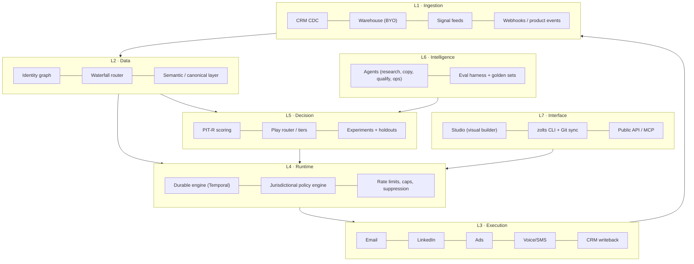

# 02 — Product and platform architecture

## Guiding principle

> Everything a GTM engineer configures must be **versionable, testable, reversible text**. The UI is an editor over that text, never the source of truth.

## Layers

The loop is closed: L3 writes outcomes back into L1, which feed retraining in L5. **That loop is the compounding moat.**

## Critical components

### 1. Durable runtime
A GTM program is a long-running workflow: wait three days, retry a downed provider, respect quiet hours, pause when the contact replies. Implementing this with cron plus queues is guaranteed debt.

- **Temporal** as the engine: durable execution, retries, workflow versioning, deterministic replay.
- Every execution produces an **auditable trace**: which signal triggered it, which data was purchased and from whom, what the scorer decided, which text which model generated from which prompt, what was sent, and what happened.
- Cost is attributed per execution (credits, tokens, sends) — the basis of the per-play P&L.

### 2. Policy engine (pre-execution, blocking)
Every action passes a policy evaluation before it executes: contact jurisdiction, legal basis, permitted channel, suppression, frequency, quiet hours, tenant quotas, spend cap. A failure blocks the action with a recorded reason — never "best effort". Detail in [11](11-compliance-and-governance.md).

### 3. Canonical semantic layer
A single entity model (Account, Person, Signal, Membership, Play, Touch, Outcome). Customer objects map onto this canon through an **AI-assisted mapper** with human confirmation. Custom fields live in `attributes JSONB` against a tenant-declared schema → any CRM, any vertical, no fork.

### 4. Waterfall router
Provider abstraction by *field*, not by *vendor*. See [07](07-data-engine-and-waterfall.md).

### 5. Experimentation service
Deterministic assignment (stable hash of `account_id + program_id + salt`) to control or treatment. No program runs without declaring its holdout. See [10](10-measurement-and-incrementality.md).

## Technical stack (decisions)

| Layer | Choice | Rejected alternative | Reason |
|---|---|---|---|
| Core language | TypeScript (Node 22) | Go | Iteration speed, one language front to back, connector ecosystem |
| ML / scoring | Python (FastAPI + scikit/LightGBM) | Pure TS | Mature modelling tooling; isolated service |
| Workflow runtime | Temporal | BullMQ / Airflow | Durability and replay; Airflow is batch, not event-driven |
| OLTP | Postgres 16 + RLS | MySQL | RLS for multi-tenancy, JSONB, pgvector, extensions |
| OLAP | ClickHouse | Own BigQuery | Per-event cost on touches and traces; dashboard latency |
| Customer warehouse | Snowflake/BigQuery/Databricks/Postgres (BYO) | Copy everything into Zolts | Removes the data governance objection and storage COGS |
| Streaming | Redpanda (Kafka API) | SQS | Event replay, log semantics |
| Cache / rate limiting | Redis | — | Per-provider and per-mailbox quotas |
| Vectors | pgvector | Pinecone | One less system to operate below 10^8 vectors |
| LLM | Claude (Anthropic API) primary, multi-model router | Single provider | Cost and latency per task; avoid single-vendor dependence |
| Frontend | Next.js + tRPC + Tailwind | — | — |
| Infrastructure | Kubernetes (EKS/GKE), Terraform IaC | Pure serverless | Long-running workers and per-region network control |
| Residency | Per-region clusters (eu-central-1, us-east-1) | Single region | European enterprise requirement |

## ADRs (architecture decisions, condensed)

**ADR-001 · Multi-tenancy via RLS on shared Postgres, with physical isolation available on Enterprise.**
Linear operating cost versus a database per customer; physical isolation is sold as an add-on (pricing power).

**ADR-002 · The DSL is the source of truth; the UI generates DSL.**
Prevents UI/engine divergence and enables GitOps, pull requests over GTM logic, and rollback.

**ADR-003 · Zero-copy by default over the customer's warehouse.**
Zolts materialises only what execution requires (IDs, program state, suppressions). Reduces GDPR surface and COGS.

**ADR-004 · Every agent writes proposals; it never executes.**
An agent emits a `proposed_action`; the runtime validates it against policy and evals before materialising it. Strict proposal/execution separation.

**ADR-005 · Idempotency is mandatory on every external action.**
`idempotency_key = hash(program_version, entity_id, step_id, window)`. Without it, a Temporal replay duplicates emails: an unrecoverable trust failure.

**ADR-006 · One connector SDK with contract tests.**
Every connector implements the same interface (`discover`, `read`, `write`, `capabilities`, `limits`) and passes a contract suite in CI. This contains connector debt, the sector's main engineering sink.

**ADR-007 · Durable execution is a Postgres outbox with leases, not an external orchestrator.**
Every external action is a row written in the same transaction as the state change that justified it. Workers claim rows with `for update skip locked` under a lease; a worker that dies leaves an expired lease another worker reclaims. This gives at-least-once delivery at the runtime and exactly-once at the provider via the idempotency key of ADR-005, with a database as the only infrastructure.

Reconsider when any of these becomes true: a play needs human-in-the-loop waits measured in weeks rather than days, a single action needs to fan out to more than a few hundred children, or the execution history itself becomes a compliance artefact a customer audits directly. Until then an external orchestrator is a second system to operate, a second failure domain and a third party holding the record of what was sent to whom. `runtime/repo/actions.py` is the seam: swapping the claim and the retry schedule is a contained change, which is why the state machine lives in one file.

**ADR-008 · Tenant isolation is enforced by the database, and a missing tenant raises.**
Every tenant-scoped table has `force row level security`, so the owning role is bound by the policy too — without forcing, migrations and application code see different databases. The application connects as a role that cannot bypass RLS. The tenant is set per transaction, and a query that does not set it raises rather than returning an empty set: an empty set is indistinguishable from a correct answer, which is how an isolation bug survives a suite that asserts on results.

The privileged surface is two `security definer` functions, both returning identifiers only: one resolves an API token to a tenant (the one lookup that cannot be tenant-scoped, because resolving the tenant is its purpose), and one claims due actions across tenants for the workers.

**ADR-009 · The internal schema is never named after a plausible database role.**
Postgres resolves `"$user"` ahead of `public` in the default `search_path`. A schema named `zolts` alongside a role named `zolts` caused a second migration run to create a complete duplicate of every table inside the shadowing schema, silently, and report success. The schema is `zolts_internal` and every connection pins `search_path` at connect time. Two locks, because the failure is invisible until a query returns the wrong data.

**ADR-010 · Cost governance is delegated to Trazum, not reimplemented.**
Before the runtime spends on a model call it asks `spend_guard` over MCP whether it may. The pricing catalogue and the verdict live in one place; a second price table in this repository would drift, and the copy that drifts is the one that authorises the spend.

Three properties make the tool usable as a gate rather than as a report: it never makes a provider call to answer, so consulting it is free; without a ceiling somebody set it answers `cannot-tell` rather than a yes nobody measured, which matches this runtime's own rule that an unmeasured thing is not a pass; and a refusal carries the cheaper ways to make the same call, priced for this call, so the agent has a lever instead of a dead end.

Fail-closed: an unreachable guard refuses. A cost control that opens when it breaks is not a cost control.

**ADR-011 · One SDK, a movable endpoint.**
Agents call Claude through the official Anthropic SDK. `base_url` is configurable, so a tenant can route through their own gateway — OmniRoute serves the Messages API shape, so the SDK reaches it unchanged — without this repository growing a provider-neutral abstraction that has to be kept honest against every provider it claims to support.

**ADR-012 · A generated message is a proposal, never a send.**
An agent writes a row in `proposal`. It cannot write to `action`. The only two paths from generated text to a provider are the eval gate approving it and a human approving it, and both record which one it was. The question "who approved this message" has a row as its answer, and the answer distinguishes a threshold from a person.

**ADR-013 · Two CRMs are built natively; the long tail is bought, not written.**
A GTM runtime that only reads HubSpot is a HubSpot add-on. But "connect to every CRM" is the sink ADR-006 names: a hundred providers, each with its own auth, object model, pagination and rate limits, maintained forever by a team that does not exist yet.

The split is by what being wrong costs.

| Layer | Approach | Why |
|---|---|---|
| The CRM the entry segment actually uses | Native connector | Depth wins the deal: task creation in the rep's own workflow, and opt-out state read correctly |
| Everything else in the long tail | A unified CRM API (Merge, Nango or equivalent) as **one more `CrmSource`** | Converts a permanent engineering liability into a variable cost |
| A customer whose CRM nobody supports | The ingest API plus a webhook endpoint, driven by their own iPaaS | Already built; it is the same `POST /v1/accounts` and `/v1/people` the runtime uses |

The seam that makes all three interchangeable is `runtime/connectors/crm.py`: canonical records, a declared `Capabilities`, and a contract suite every source passes in CI. A unified-API vendor is not an architectural decision under this design — it is an implementation of an interface that two native connectors already satisfy, and it can be added or dropped without touching the sync, the entities or the policy engine.

**The field that decides whether a connector is an asset or a liability is `reads_opt_out`.** A CRM that cannot say whether someone unsubscribed must not have its silence read as permission: the contact is stored with consent `unknown`, the policy engine has no rule that admits `unknown`, and the operator is told which source cannot answer. Unified APIs normalise this field worst of all — it is the one place where a native connector still earns its cost — so the capability is declared per source and the contract suite fails a source that claims it and never returns one.

**ADR-014 · A CRM the runtime has never seen is connected by a document, not by code.**
ADR-013 splits the market into a native tier, a bought long tail and an ingest API. It assumes every CRM is a CRM somebody sells. A partner running an in-house system built around their own object model is none of the three: there is no connector to write, no unified API that covers it, and telling them to build an iPaaS pipeline moves the integration cost onto the customer at exactly the moment they are deciding whether to buy.

The unit of work stops being the connector and becomes the mapping.

| | Connector | Mapping |
|---|---|---|
| Artefact | Python module in this repository | YAML document authored by the tenant |
| Who ships it | This team, on a release cycle | The tenant, at publish time |
| Review | Code review, tests, deploy | Schema validation at the door, versioned by `spec_hash` |
| Blast radius | Every tenant | One tenant |
| Cost of the hundredth one | Linear engineering, forever | Zero |

`GenericSource` reads a mapping and implements the same `CrmSource` protocol as HubSpot and Pipedrive, and it passes the same contract suite. That is the load-bearing claim: a mapping is not a lesser integration on a side path, it is a first-class source whose behaviour happens to be configuration. This is product invariant 5 — *program logic is versioned configuration, never ad-hoc code* — applied to integration.

The path language is deliberately small: nested fields, an array index, an array element flagged primary, and a fixed transform pipeline. Anything more expressive is a program, and a customer-authored program evaluated against a customer payload inside this runtime is a liability sold as a feature.

Two transports, because a CRM is either reachable or it is not. `http` means the runtime pulls, paging the way the mapping says it pages. `push` means the tenant posts batches, because their system sits behind a VPN or has no API at all. Everything after the transport is identical — same normaliser, same canonical records, same policy engine — which is the reason the transport is not part of the contract.

**Consent is where a mapping earns or loses its keep.** `reads_opt_out` is not a flag the author sets; it is derived from whether the document names the field that carries opt-out state. A mapping that stays silent about consent is published, and every contact it imports is stored `unknown` and is unreachable until a basis is established elsewhere. The one shape refused outright is `default: allowed` with no value map, which marks the entire imported list contactable regardless of what the CRM says: that has to be a sentence somebody wrote, not a shape they fell into.

A customer-authored document is an input, and the publish endpoint treats it as one. Three things are refused outright, each for a reason found by executing the code rather than by reading it:

| Refused | Why |
|---|---|
| An unmapped value read as consent | A bare boolean was being guessed at, which granted `allowed` for a state the document never named and inverted every positively-phrased field: `email_ok: true` meant consent and was read as an opt-out. A boolean is mapped like any other value |
| A `base_url` on loopback or link-local | The runtime makes that request with its own network position; `169.254.169.254` answers with the instance's cloud credentials. RFC1918 stays allowed, because a CRM behind a VPN is the use case rather than the threat |
| A provider name a built-in connector owns | The built-in wins wherever the name is resolved, so the mapping would store cleanly and never be used |

Path syntax is checked at publish for the same reason. `extract` walks only as far as a record takes it, so a malformed third segment in a field that is usually absent surfaces on the one record that has it — halfway through a customer's first sync.

What this costs: mapping correctness is the tenant's, not this team's, and the sync report says so in a caveat on every run. What it buys: the answer to "does it work with our CRM?" stops being a roadmap question.
