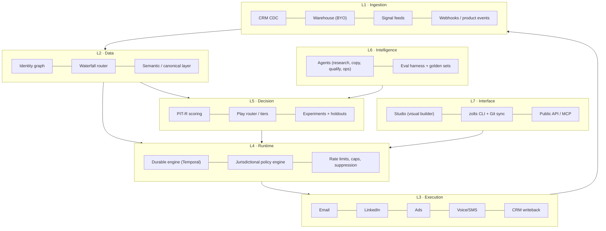

# 02 — Product and platform architecture

## Guiding principle

> Everything a GTM engineer configures must be **versionable, testable, reversible text**. The UI is an editor over that text, never the source of truth.

## Layers

The loop is closed: L3 writes outcomes back into L1, which feed retraining in L5. **That loop is the compounding moat.**

## Critical components

### 1. Durable runtime
A GTM program is a long-running workflow: wait three days, retry a downed provider, respect quiet hours, pause when the contact replies. Implementing this with cron plus queues is guaranteed debt.

- **A Postgres outbox with leases** as the engine (ADR-007): every external action is a row written in the same transaction as the state that justified it, claimed under a lease, retried with backoff, dead-lettered. Temporal was the plan this section was written around; what ships needs no second system, and ADR-007 says what would make that the wrong call.
- Every execution produces an **auditable trace**: which signal triggered it, which data was purchased and from whom, what the scorer decided, which text which model generated from which prompt, what was sent, and what happened.
- Cost is attributed per execution (credits, tokens, sends) — the basis of the per-play P&L.

### 2. Policy engine (pre-execution, blocking)
Every action passes a policy evaluation before it executes: contact jurisdiction, legal basis, permitted channel, suppression, frequency, quiet hours, tenant quotas, spend cap. A failure blocks the action with a recorded reason — never "best effort". Detail in [11](11-compliance-and-governance.md).

### 3. Canonical semantic layer
A single entity model (Account, Person, Signal, Membership, Play, Touch, Outcome). Customer objects map onto this canon through an **AI-assisted mapper** with human confirmation. Custom fields live in `attributes JSONB` against a tenant-declared schema → any CRM, any vertical, no fork.

### 4. Waterfall router
Provider abstraction by *field*, not by *vendor*. See [07](07-data-engine-and-waterfall.md).

### 5. Experimentation service
Deterministic assignment (stable hash of `account_id + program_id + salt`) to control or treatment. No program runs without declaring its holdout. See [10](10-measurement-and-incrementality.md).

## Technical stack (decisions)

The table was written before a line of the runtime existed, and two of its rows are not what ships (D-45). The column on the right is the measurement; the ADRs below record why it differs.

| Layer | Planned | Rejected alternative | Reason | **What ships** |
|---|---|---|---|---|
| Core language | TypeScript (Node 22) | Go | Iteration speed, one language front to back, connector ecosystem | **Python 3.11**, one language for the reference core, the runtime and the API (FastAPI). TypeScript remains the plan for a studio front end, which does not exist yet |
| ML / scoring | Python (FastAPI + scikit/LightGBM) | Pure TS | Mature modelling tooling; isolated service | **Deterministic scoring in `zolts/`**, explainable per factor; no trained model yet |
| Workflow runtime | Temporal | BullMQ / Airflow | Durability and replay; Airflow is batch, not event-driven | **A Postgres outbox with leases** (ADR-007); on Vercel the worker is a cron-invoked tick (ADR-041) |
| OLTP | Postgres 16 + RLS | MySQL | RLS for multi-tenancy, JSONB, pgvector, extensions | **Postgres 16 with RLS forced** on every tenant-scoped table (ADR-008) |
| OLAP | ClickHouse | Own BigQuery | Per-event cost on touches and traces; dashboard latency | **Not built.** Touches, decisions and costs are Postgres rows; the console reads them directly. Returns when a tenant's volume makes that the bottleneck (`docs/20`, "what would break first at scale") |
| Customer warehouse | Snowflake/BigQuery/Databricks/Postgres (BYO) | Copy everything into Zolts | Removes the data governance objection and storage COGS |
| Streaming | Redpanda (Kafka API) | SQS | Event replay, log semantics |
| Cache / rate limiting | Redis | — | Per-provider and per-mailbox quotas |
| Vectors | pgvector | Pinecone | One less system to operate below 10^8 vectors |
| LLM | Claude (Anthropic API) primary, multi-model router | Single provider | Cost and latency per task; avoid single-vendor dependence |
| Frontend | Next.js + tRPC + Tailwind | — | — |
| Infrastructure | Kubernetes (EKS/GKE), Terraform IaC | Pure serverless | Long-running workers and per-region network control |
| Residency | Per-region clusters (eu-central-1, us-east-1) | Single region | European enterprise requirement |

## ADRs (architecture decisions, condensed)

**ADR-001 · Multi-tenancy via RLS on shared Postgres, with physical isolation available on Enterprise.**
Linear operating cost versus a database per customer; physical isolation is sold as an add-on (pricing power).

**ADR-002 · The DSL is the source of truth; the UI generates DSL.**
Prevents UI/engine divergence and enables GitOps, pull requests over GTM logic, and rollback. The first clause was enforced from the first commit — `POST /v1/programs` validates a whole document against `examples/schema/zolts-program.schema.json`, runs the same linter as `scripts/validate.py`, checks the holdout and stores a new version. The second had no implementation until ADR-029: the console was read-only and nothing in the repository emitted a program document.

**ADR-003 · Zero-copy by default over the customer's warehouse — intent, not yet implementation.**
Zolts would materialise only what execution requires (IDs, program state, suppressions), reducing GDPR surface and COGS. **This is not what ships.** The word *warehouse* appears nowhere in `runtime/`: contacts and accounts are copied into Zolts's own Postgres through the CRM connectors. Stated in the present tense it was a claim a buyer's security review would ask to see, and there is nothing to show. Decision 29 holds the revisit.

**ADR-004 · Every agent writes proposals; it never executes.**
An agent emits a `proposed_action`; the runtime validates it against policy and evals before materialising it. Strict proposal/execution separation.

**ADR-005 · Idempotency is mandatory on every external action.**
`idempotency_key = hash(program_version, entity_id, step_id, window)`. Without it, a Temporal replay duplicates emails: an unrecoverable trust failure.

**ADR-006 · One connector SDK with contract tests.**
Every connector implements the same interface (`discover`, `read`, `write`, `capabilities`, `limits`) and passes a contract suite in CI. This contains connector debt, the sector's main engineering sink.

**ADR-007 · Durable execution is a Postgres outbox with leases, not an external orchestrator.**
Every external action is a row written in the same transaction as the state change that justified it. Workers claim rows with `for update skip locked` under a lease; a worker that dies leaves an expired lease another worker reclaims. This gives at-least-once delivery at the runtime and exactly-once at the provider via the idempotency key of ADR-005, with a database as the only infrastructure.

Reconsider when any of these becomes true: a play needs human-in-the-loop waits measured in weeks rather than days, a single action needs to fan out to more than a few hundred children, or the execution history itself becomes a compliance artefact a customer audits directly. Until then an external orchestrator is a second system to operate, a second failure domain and a third party holding the record of what was sent to whom. `runtime/repo/actions.py` is the seam: swapping the claim and the retry schedule is a contained change, which is why the state machine lives in one file.

**ADR-008 · Tenant isolation is enforced by the database, and a missing tenant raises.**
Every tenant-scoped table has `force row level security`, so the owning role is bound by the policy too — without forcing, migrations and application code see different databases. The application connects as a role that cannot bypass RLS. The tenant is set per transaction, and a query that does not set it raises rather than returning an empty set: an empty set is indistinguishable from a correct answer, which is how an isolation bug survives a suite that asserts on results.

The privileged surface is two `security definer` functions, both returning identifiers only: one resolves an API token to a tenant (the one lookup that cannot be tenant-scoped, because resolving the tenant is its purpose), and one claims due actions across tenants for the workers.

**ADR-009 · The internal schema is never named after a plausible database role.**
Postgres resolves `"$user"` ahead of `public` in the default `search_path`. A schema named `zolts` alongside a role named `zolts` caused a second migration run to create a complete duplicate of every table inside the shadowing schema, silently, and report success. The schema is `zolts_internal` and every connection pins `search_path` at connect time. Two locks, because the failure is invisible until a query returns the wrong data.

**ADR-010 · Cost governance is delegated to Trazum, not reimplemented.**
Before the runtime spends on a model call it asks `spend_guard` over MCP whether it may. The pricing catalogue and the verdict live in one place; a second price table in this repository would drift, and the copy that drifts is the one that authorises the spend.

Three properties make the tool usable as a gate rather than as a report: it never makes a provider call to answer, so consulting it is free; without a ceiling somebody set it answers `cannot-tell` rather than a yes nobody measured, which matches this runtime's own rule that an unmeasured thing is not a pass; and a refusal carries the cheaper ways to make the same call, priced for this call, so the agent has a lever instead of a dead end.

Fail-closed: an unreachable guard refuses. A cost control that opens when it breaks is not a cost control.

**ADR-011 · One SDK, a movable endpoint.**
Agents call Claude through the official Anthropic SDK. `base_url` is configurable, so a deployment can route through a gateway of its own — a customer's, or one that logs, filters or pins a region; OmniRoute serves the Messages API shape, so the SDK reaches it unchanged — without this repository growing a provider-neutral abstraction that has to be kept honest against every provider it claims to support. One endpoint per deployment, set by `ZOLTS_MODEL_BASE_URL`, not one per tenant: this sentence used to promise per-tenant routing, and no tenant has ever had a place to store an endpoint (D-42, decision 36). `docs/11` states what each agent sends.

**ADR-012 · A generated message is a proposal, never a send.**
An agent writes a row in `proposal`. It cannot write to `action`. The only two paths from generated text to a provider are the eval gate approving it and a human approving it, and both record which one it was. The question "who approved this message" has a row as its answer, and the answer distinguishes a threshold from a person.

**ADR-013 · Two CRMs are built natively; the long tail is bought, not written.**
A GTM runtime that only reads HubSpot is a HubSpot add-on. But "connect to every CRM" is the sink ADR-006 names: a hundred providers, each with its own auth, object model, pagination and rate limits, maintained forever by a team that does not exist yet.

The split is by what being wrong costs.

| Layer | Approach | Why |
|---|---|---|
| The CRM the entry segment actually uses | Native connector | Depth wins the deal: task creation in the rep's own workflow, and opt-out state read correctly |
| Everything else in the long tail | A unified CRM API (Merge, Nango or equivalent) as **one more `CrmSource`** | Converts a permanent engineering liability into a variable cost |
| A customer whose CRM nobody supports | The ingest API plus a webhook endpoint, driven by their own iPaaS | Already built; it is the same `POST /v1/accounts` and `/v1/people` the runtime uses |

Salesforce is the third native connector, added in ADR-018 because the entry segment's enterprise buyers ask for it by name. It is also what proved the seam holds: it shares almost nothing with the first two, and the contract did not move to accommodate it.

The seam that makes all three interchangeable is `runtime/connectors/crm.py`: canonical records, a declared `Capabilities`, and a contract suite every source passes in CI. A unified-API vendor is not an architectural decision under this design — it is an implementation of an interface that two native connectors already satisfy, and it can be added or dropped without touching the sync, the entities or the policy engine.

**The field that decides whether a connector is an asset or a liability is `reads_opt_out`.** A CRM that cannot say whether someone unsubscribed must not have its silence read as permission: the contact is stored with consent `unknown`, the policy engine has no rule that admits `unknown`, and the operator is told which source cannot answer. Unified APIs normalise this field worst of all — it is the one place where a native connector still earns its cost — so the capability is declared per source and the contract suite fails a source that claims it and never returns one.

**ADR-014 · A CRM the runtime has never seen is connected by a document, not by code.**
ADR-013 splits the market into a native tier, a bought long tail and an ingest API. It assumes every CRM is a CRM somebody sells. A partner running an in-house system built around their own object model is none of the three: there is no connector to write, no unified API that covers it, and telling them to build an iPaaS pipeline moves the integration cost onto the customer at exactly the moment they are deciding whether to buy.

The unit of work stops being the connector and becomes the mapping.

| | Connector | Mapping |
|---|---|---|
| Artefact | Python module in this repository | YAML document authored by the tenant |
| Who ships it | This team, on a release cycle | The tenant, at publish time |
| Review | Code review, tests, deploy | Schema validation at the door, versioned by `spec_hash` |
| Blast radius | Every tenant | One tenant |
| Cost of the hundredth one | Linear engineering, forever | Zero |

`GenericSource` reads a mapping and implements the same `CrmSource` protocol as HubSpot and Pipedrive, and it passes the same contract suite. That is the load-bearing claim: a mapping is not a lesser integration on a side path, it is a first-class source whose behaviour happens to be configuration. This is product invariant 5 — *program logic is versioned configuration, never ad-hoc code* — applied to integration.

The path language is deliberately small: nested fields, an array index, an array element flagged primary, and a fixed transform pipeline. Anything more expressive is a program, and a customer-authored program evaluated against a customer payload inside this runtime is a liability sold as a feature.

Two transports, because a CRM is either reachable or it is not. `http` means the runtime pulls, paging the way the mapping says it pages. `push` means the tenant posts batches, because their system sits behind a VPN or has no API at all. Everything after the transport is identical — same normaliser, same canonical records, same policy engine — which is the reason the transport is not part of the contract.

**Consent is where a mapping earns or loses its keep.** `reads_opt_out` is not a flag the author sets; it is derived from whether the document names the field that carries opt-out state. A mapping that stays silent about consent is published, and every contact it imports is stored `unknown` and is unreachable until a basis is established elsewhere. The one shape refused outright is `default: allowed` with no value map, which marks the entire imported list contactable regardless of what the CRM says: that has to be a sentence somebody wrote, not a shape they fell into.

A customer-authored document is an input, and the publish endpoint treats it as one. Three things are refused outright, each for a reason found by executing the code rather than by reading it:

| Refused | Why |
|---|---|
| An unmapped value read as consent | A bare boolean was being guessed at, which granted `allowed` for a state the document never named and inverted every positively-phrased field: `email_ok: true` meant consent and was read as an opt-out. A boolean is mapped like any other value |
| A `base_url` on loopback or link-local | The runtime makes that request with its own network position; `169.254.169.254` answers with the instance's cloud credentials. RFC1918 stays allowed, because a CRM behind a VPN is the use case rather than the threat |
| A provider name a built-in connector owns | The built-in wins wherever the name is resolved, so the mapping would store cleanly and never be used |

Path syntax is checked at publish for the same reason. `extract` walks only as far as a record takes it, so a malformed third segment in a field that is usually absent surfaces on the one record that has it — halfway through a customer's first sync.

What this costs: mapping correctness is the tenant's, not this team's, and the sync report says so in a caveat on every run. What it buys: the answer to "does it work with our CRM?" stops being a roadmap question.

**ADR-015 · A partner signs up by invitation, and minting one has no HTTP surface.**
Creating a tenant required database access, so every partner cost founder time and the product could not be sold without a human in the loop. Removing that human is the difference between a product and a service.

Open self-serve signup is the obvious answer and the wrong one here. It puts an unauthenticated tenant-creating endpoint on the internet for a product sold to a handful of design partners, and it gives away the one thing worth keeping at this stage: control of who gets in.

| | Open signup | **Invitation** | Founder runs the CLI |
|---|---|---|---|
| Who decides who gets in | Nobody | The operator | The operator |
| Partner needs a shell | No | No | Yes |
| Unauthenticated write surface | Signup, forever | Signup, redeemable once per token | None |
| Abuse story | Tenant spam, mailbox enumeration | A leaked token creates one tenant | None |

Minting is a CLI command with no HTTP route at all. An operator capability reachable from a tenant's key is a privilege escalation waiting to be found, and there is no super-tenant in this data model to hold one safely.

Three properties the redemption path must have, each of which is a test:

1. **A token is never stored.** sha256 at rest, shown once at mint time, unrecoverable — the same discipline as an API key.
2. **Invalid, expired and already-redeemed are indistinguishable.** Telling them apart tells a caller which tokens exist.
3. **Redemption is once, even under concurrency.** The row is locked with `for update` before the tenant is created and marked redeemed only once it exists. Marking it redeemed first and naming its tenant afterwards leaves a committed row that is half-redeemed, which the table's own check constraint refuses — that constraint caught the first implementation.

Starter programs are published **as drafts**. A tenant that signs up and starts contacting people before anyone has read a program is not onboarding, it is an incident. And seven of the eleven blueprints ship no example program: the response says so and names what the blueprint declares, because an empty list with no sentence beside it is how a new tenant concludes the product is broken.

Invitations are operator state, not tenant state — they exist before their tenant does — so the table carries `redeemed_tenant_id` rather than `tenant_id`, and the role that serves tenant requests has its access to it revoked.

**ADR-016 · A reply is read before it is counted, and a verdict must quote.**
Every reply was recorded as `reply_positive`. Somebody writing "take me off your list" was counted as a conversion, left contactable, and folded into the lift the product reports. Two failures at once, and the second is the worse one:

| | |
|---|---|
| Compliance | An opt-out written in prose was invisible. Only a provider-signalled unsubscribe ever suppressed anybody |
| Measurement | The primary conversion signal counted negative replies as wins. In cold outreach most replies are negative, so every reported lift was inflated by an unknown and unbounded amount — in a product whose entire claim is honest measurement |

The triage agent classifies the reply's text into `unsubscribe`, `negative`, `wrong_person`, `not_now` or `positive`, and stops there. It does not suppress, does not record an outcome, and does not decide whether it is confident enough: the runtime does, which is product invariant 1. An unsubscribe found here goes through the **same** suppression path a provider's unsubscribe event takes, because two suppression mechanisms would have to agree forever.

**A verdict must quote the reply.** The classification carries the span of text that supports it, and a verdict whose quote is not in the reply is discarded entirely. The failure mode of a classifier over free text is a confident label with nothing behind it, and it reads exactly like a correct one — while deciding whether somebody is contacted again. This is the same discipline the copywriter's provenance check applies to a draft, in the direction that matters more.

Three things a blocked verdict is not: a weaker signal, a reason to fail the webhook, or a default. Absent a usable verdict — agents off, no model, no body in the payload, the spend guard refusing, the quote unverifiable — the reply is recorded as `reply_positive`, exactly as before.

That last choice is deliberate and it over-counts. Making the safe default "not a conversion" would move every existing tenant's measured lift on a deploy, silently, in the direction that flatters nobody but surprises everybody; and a provider that reports a reply with no body has genuinely told us only that a human responded.

**So the over-count is not hidden, it is counted.** Every outcome records whether anybody read the words behind it (`verified_by`), and the measurement reports *conversions read of conversions total* beside the lift itself — not in a footnote, because a caveat nobody reaches is not a disclosure. A program whose lift rests on 62% unread replies says so on the same screen as the lift.

Three things that buys, in order of what they are worth:

| | |
|---|---|
| Nobody's number moves on a deploy | The correction is a disclosure, not a silent restatement |
| The buyer watches the mechanism work on their own data | Every competing tool would have drawn the chart. This one shows what the chart rests on |
| It closes by itself | The share falls as providers send bodies and tenants enable the agent layer. No migration, no announcement |

The alternative — deflating quietly — trades a visible over-count for an invisible under-count. That is a different bias, not less bias, and it forfeits the only hard-to-fake evidence this product has that it does not flatter its own numbers.

Cost is governed like every other model call: the spend guard prices the classification first and a refusal blocks it rather than downgrading the answer. A reply arriving at a tenant over their ceiling is recorded, not guessed at.

**ADR-017 · The price list lives in code; the document is what a test checks it against.**
`cost_event.billed_credits` existed from the first migration and no caller ever set it. `docs/12` prices eight billable actions and four plans in full, and the runtime billed nothing: the column was there, the structure was there, and every action was free.

A price that lives only in prose is a price two people read differently. So `zolts/billing.py` holds the list and the plans, and a test parses `docs/12` and asserts they agree. When they diverge the **document** is corrected, per the repository's own rule — the reverse would let an invoice drift by editing a paragraph.

Four decisions the metering makes, each of which was a defect before it made them:

| | |
|---|---|
| **An unpriced action raises** | `credits_for("enrichment.mobile")` fails rather than returning zero. A silent zero is how a whole category of usage becomes free without anybody deciding it should be |
| **Billing does not depend on knowing our own cost** | Recording a credit only `if result.cost_micros` made every send through a provider that reports no COGS free to the customer. A send is one credit whether or not we know what it cost us |
| **A closed period keeps the terms it was sold** | The plan's numbers are copied in when the period opens. A customer who upgrades mid-month is billed on what they were sold for the month they consumed, and a price list that changes must not restate a closed one |
| **Enterprise has no default terms** | `plan_for("enterprise")` returns nothing and the statement refuses to compute. A number here is a number somebody eventually invoices |

**A tenant at their ceiling is held, not cancelled and not silently extended.** The check runs before the spend and before anything about the particular action — a tenant who has run out should not also have their work cancelled for a contact that could not be resolved this minute. They have not done anything wrong: the action goes back to pending, due when the period turns.

**The overage rate was never open; it was unimplemented.** `docs/12` prices additional credits on a volume ladder (0-100k → €0.010, 100k-500k → €0.008, >500k → €0.006) and an additional seat at €90/month. The runtime charged for neither, and reported that the rate was "contractual" — a statement that read as prudence and was in fact a price list the product had not read. Both are now charged, and a test re-reads each number out of `docs/12` so they cannot drift apart quietly.

The document leaves one thing genuinely ambiguous: what the ladder is measured over. It is applied **graduated, over the overage alone** — the first 100,000 credits past the plan at €0.010, the next 400,000 at €0.008, the rest at €0.006. The alternative, one flat rate chosen by total volume, has a cliff at every boundary: a tenant crossing 100,000 credits would watch the whole invoice reprice downward, so consuming more would cost less. That is not a discount, it is a defect, and the test that rules it out asserts the property rather than the arithmetic — **the bill never falls as consumption rises**, checked across the whole ladder.

A statement reports the blended rate it worked out at. A tenant who sees €0.008 in the price list and €0.0094 on the invoice has not been overcharged, and the number that explains it belongs on the statement rather than in a support conversation.

**The ceiling had to become raisable before any of that could be earned.** `docs/18` I6 settled "overage with an 80% alert and a configurable hard ceiling"; the runtime stopped every tenant at their included credits, which is a ceiling that cannot be raised. So overage was priced in the document and unreachable in the product — no tenant could consume a credit beyond their plan, and the expansion revenue `docs/12` names as the first driver of NRR was arithmetic nobody could run. `tenant.credit_ceiling` defaults to null, meaning the included allowance, so the default behaviour is unchanged and nobody overspends by accident. Raising it is provisioning, like changing a plan, and a deliberate act is what overage bills for. The 80% alert now exists too, and fires on the ceiling rather than the plan, because it is the ceiling that stops work.

**ADR-018 · Some CRMs are not one host, and the connection's config is part of the address.**
HubSpot and Pipedrive each answer at a single hostname, so a credential is the whole address and `CrmSource.accounts(credential)` was enough. Salesforce gives every org its own — `https://acme.my.salesforce.com` — and the third connector is where that assumption surfaced.

The contract did not change. A source that needs configuring exposes `from_config(config)`; the sync path calls it when it exists and leaves every other source untouched. The connection row already carried a `config` column for exactly this kind of thing, and the sync had simply never read it.

| What only Salesforce does | How it is handled |
|---|---|
| Per-org base URL | `from_config` builds a configured connector; absent an `instance_url` it raises **naming it**, rather than requesting some other org's host |
| Records come from SOQL, not resource paths | One endpoint; the query names the fields |
| Paging is a URL the server hands back | Nothing to increment and nothing to guess. A repeated continuation terminates rather than looping |
| Employee count is an integer | Stored as an attribute and declared as a caveat, exactly as HubSpot's is. Inventing a band from a number is a mapping nobody agreed |

**The interesting field is `HasOptedOutOfEmail`, and it is a boolean.** A boolean cannot distinguish "asked us to stop" from "was never asked". `true` is an opt-out and is reported as one; `false` is reported as `ALLOWED`, which is correct in this model rather than a guess: `ALLOWED` means *legitimate interest applies — the CRM was checked and carries no opt-out*, not that anybody consented.

That distinction is worth stating because getting it wrong has a precedent in this repository. The tenant-authored mapping layer shipped reading a bare boolean as an opt-out flag, which inverted consent for every positively-phrased field and granted a legal basis the document never named. Here the field's meaning is fixed by Salesforce and the mapping is written once, in code, with a test on both values.

So Salesforce claims `reads_opt_out` and genuinely cannot report "never asked". The contract suite's never-asked row skips for this source, and a dedicated test asserts that the skip is a property of the CRM rather than a gap in a fixture — along with the caveat telling an operator that an org holding opt-out in a custom field or in Marketing Cloud needs a mapping instead.

**ADR-019 · A play reads what the contact did, and a send moves rather than being cancelled.**
Every enrollment walked every step regardless of what happened. A breakup email to somebody mid-conversation is the shape of automation a buyer points at when they say these tools embarrass them — and `wait: 2d` after a Friday afternoon is Sunday afternoon, then 03:00 for a contact three timezones away.

Both are versioned configuration, per product invariant 5. Neither is a new language.

**Branching.** A step may carry `when`, evaluated in the same expression language as triggers and exit rules against an `engagement` scope read from touches and outcomes. A second condition language is a second set of rules to get wrong, and a counter kept alongside those tables is a second source of truth that drifts.

The distinction worth naming is `no_response` versus `not has_replied`. They are not the same, and flattening them sends a breakup to somebody who is reading.

**The send window.** The policy engine already denies on quiet hours — for voice, SMS and WhatsApp, where the interruption *is* the harm. Email is different: nothing is harmed by a message existing at 03:00, it is wasted. So the window is not a second policy check.

| | |
|---|---|
| It moves a send | Discarding a step because it fell on a Sunday throws away work over a scheduling detail |
| It never moves one earlier | Bringing a send forward would shorten a wait the program declared |
| It is the customer's local time | 08:00 Madrid is 07:00 UTC in January and 06:00 in July. A window stored in UTC drifts by an hour twice a year |
| It is opt-in | A program declaring none behaves exactly as before. Adding one silently to every program would move live sequences on a deploy |
| A window that wraps midnight is refused | It is two windows, and declaring it as one silently sends at the hour it was meant to avoid |

**ADR-020 · Sending capacity is enforced by the runtime, and what it enforces depends on who owns the mailboxes.**
`zolts/deliverability.py` had modelled warm-up curves, reputation factors, the [09](09-execution-and-deliverability.md) thresholds, per-provider segregation and a staggered ramp since the reference core existed, and its tests proved every one of them. Nothing in the runtime imported it. The `mailbox` table shipped in migration 002 with columns for warm-up and four rates, and no line of code ever wrote or read one of them. [15](15-risks-and-debt.md) ranks deliverability collapse as the highest-impact risk in the product and names the mitigation "sending capacity as managed inventory": the inventory existed as a specification and as a table, and was managed by nothing.

| Decision | Why |
|---|---|
| **Every rate is derived, never stored** | The four rate columns were dropped rather than populated. A stored rate is correct when written and wrong from then on, and it fails silently: a stale 0.0% bounce rate is indistinguishable from a healthy mailbox |
| **Warm-up is a date, not a counter** | `warmed_days` had to be incremented by something every day. One missed run and a mailbox is permanently younger than it is, sending under its real capacity forever |
| **No capacity holds the send** | The same posture as a tenant out of credits. The work is good and the condition passes on its own; what no retry budget should be spent on is a mailbox that will still be at its cap in five minutes |
| **A domain nobody registered has no capacity** | Missing authentication is not a reputation problem to recover from, it is mail filtered on arrival. Fail closed, like everything else here |
| **A complaint pauses the domain; a bounce pauses the program** | A complaint rate is a reputation problem and reputation is scored per domain. A bounce rate is a list-quality problem, and pausing the domain would stop every other program sharing it for a fault none of them has |
| **Cut-offs are checked on the event, not on a schedule** | A threshold evaluated overnight lets a bad afternoon run to completion, and these are the numbers whose damage cannot be undone on that timescale |
| **A complaint and an unsubscribe stopped being the same event** | Both suppress, and the suppression code was right to treat them alike. For reputation they are nothing alike, and routed through one `OPT_OUT` set the cut-off that matters most could never fire |

**What the gate buys depends on the provider, and saying so is the point.** Smartlead takes a recipient and picks the sending mailbox itself. On that path the allocated mailbox is Zolts' intent recorded on the touch, not an observation, and what the gate enforces is a bound on the volume Zolts releases per day. That is a real control and it is not the same control as choosing the mailbox. A per-mailbox guarantee the provider never agreed to is exactly the kind of claim that gets discovered to be false by a burned domain — registered as decision 19 rather than quietly implied.

**A tenant with no registered domain is reported, not blocked.** This runtime cannot enforce a cap on mailboxes it has never been told about, and refusing to send in that state would stop a tenant for a reason no operator could act on. So the console, the CLI and `/health/liveness` all say that capacity is unmanaged, because a fleet with no members and a provider-owned fleet look identical in a summary and are opposite in consequence.

**ADR-021 · Enrichment is bought in the order the waterfall says, and a miss is ours to absorb.**
`docs/12` prices eight billable actions. Two of them ran. The three enrichment actions — a verified email at 8 credits, a mobile at 25, firmographics at 4 — are the bulk of the consumption the pricing model assumes, and none of them existed: a Growth tenant paying €1,490 for 60,000 credits could physically spend about a tenth of them. `zolts/waterfall.py` had been the cost optimiser [07](07-data-engine-and-waterfall.md) calls the margin lever since the reference core existed, and nothing in the runtime imported it — the fourth complete specification in this repository with no caller.

| Decision | Why |
|---|---|
| **A miss is not billed to the tenant** | We pay every provider we ask; the customer pays for a field they got. The expensive half, and deliberate: it makes the waterfall's efficiency our margin rather than the customer's problem, which is what [07](07-data-engine-and-waterfall.md) claims the optimiser is for |
| **Hit rates are measured, not declared** | A registration carries a conservative default used only until that provider has made 30 calls in a cohort. Everything after comes from `enrichment_attempt`, so the optimiser gets better at a customer's own segments by running |
| **An error is not a miss** | A miss lowers a measured hit rate and the optimiser learns from it. Counting a 401 or a timeout the same way teaches it that a broken integration is a provider with poor coverage |
| **One table is the matrix and the provenance** | The latest hit for an entity and a field is where that value came from. Two tables could disagree about which provider supplied a phone number, and only one of them would be shown to a DPO |
| **A cohort is coarse** | Country and size, and no further. A matrix keyed finely enough to be interesting never accumulates enough calls per cell to mean anything, and the optimiser reads a cell with four observations as confidently as one with four thousand |
| **A value belonging to another person is refused** | Three people at one company and the provider knows one address. Writing it merges two identities, which is worse than not having the field |
| **A phone is a column** | National do-not-call registries are matched on the number. A phone in `attributes` is a phone that cannot be suppressed |

**Two defects a real run found that reading would not have.** The first version passed `credential=None` to every provider while `data_provider.connection_id` had pointed at a stored credential all along — three 401s against a real endpoint. The same run then hit a unique-constraint violation on the second row, because the provider returned one shared address for three colleagues, and lost the whole batch to it. The error handling was right both times: the 401 raised rather than recording three false misses, and the constraint refused rather than merging two people.

**Automatic enrichment mid-send is deliberately absent.** Buying data costs money, and doing it silently on every send would spend a budget nobody authorised. `zolts enrich` is the deliberate path; whether a program may buy a missing address on its own is decision 22.

**ADR-022 · The runtime goes and looks, and a check is priced per account-day.**
[06](06-signal-library.md) opens by calling signal-to-action latency the highest-leverage variable in the whole GTM system and a product SLA rather than an implementation detail. Nothing watched anything: a signal reached this runtime only when a customer pushed one at `POST /v1/signals` or a CRM sync implied one, so the product learned about a funding round when its customer already knew — and a runtime that is told cannot have a latency of its own, it inherits somebody else's.

| Decision | Why |
|---|---|
| **A definition carries the strength, the decay, the basis and the SLA** | [06](06-signal-library.md) requires cost, decay and legal basis of every signal, and a signal ingested with somebody's guess at its half-life decays wrongly for as long as it lives. Cost is deliberately absent from the definition: [12](12-pricing-and-unit-economics.md) prices a check per account-day, not per signal, and a definition naming its own price would contradict the price list |
| **Only what a live program is waiting on** | Watching a signal no program consumes is spending a data budget to fill a table. The catalogue is the menu; the live programs are the order |
| **A check is billed once per account per day** | The consequence is the point: a Tier A definition refreshing hourly costs the same as one refreshing daily, so the fast refresh its four-hour action SLA needs is affordable. Billing per check would make the product's own SLA the most expensive thing a customer could ask for |
| **A detection past its freshness SLA is refused and counted** | Acting on a three-day-old pricing-page visit with a 48-hour half-life spends a touch on somebody whose moment has gone. Counted rather than dropped, because a source that keeps finding things too late is a source to replace, and that only shows up if the staleness is recorded |
| **A source that errors leaves no trail** | Nothing recorded and nothing billed. The check history is what the refresh clock reads, so an outage that wrote "checked, found nothing" would silence the signal until the window passed again |
| **The source's confidence scales the strength** | [06](06-signal-library.md)'s decay function multiplies exactly this way. A feed 60% sure it saw a funding round should not enroll as hard as one that is certain |

**Time to touch was measured from the wrong end, and the comment beside it said so.** The console measured enrollment to touch while its own comment called the number the signal-to-touch SLA. For a pushed signal those are nearly the same instant; for a detected one the difference is however long the source took to notice, and a program looked fast because the clock started after the slow part. It is now measured from the signal, and the detection half is reported separately — an operator whose latency is bad needs to know whether to change source or add workers, and those are opposite fixes.

**ADR-023 · A rail entry is a promise, and every one of them is now kept.**
The console shipped with three working views and five links that did nothing: Signals, Experiments, Spend, Policy and Audit log. That is the same defect as a specification with no caller, moved to where a customer meets it — and it is worse there, because a link that does nothing teaches the operator that clicking things in this product is pointless.

Underneath it was a harder problem than a missing screen. `/v1/accounts` and `/v1/people` were POST-only, so a tenant could create a prospect and never read one back. The prospect list was not unbuilt; it was unbuildable, and enrichment was reachable only by an operator with a shell.

| Decision | Why |
|---|---|
| **"Missing" comes from the engine's own rule** | `prospects_view` asks `dataprovider.unresolved`, the same function the enrichment path uses to decide whether to spend. A screen with its own idea of what is missing offers to buy a field the engine then declines to buy |
| **An opted-out contact is shown, not filtered** | An operator who cannot see them wonders why the count does not add up, and the answer — that somebody unsubscribed — is one they need |
| **`POST /v1/enrich` takes named ids** | It spends a data budget. An endpoint that bills for whatever the caller happened to have unresolved is one nobody can predict the cost of |
| **Three links were removed rather than left** | The data behind Policy and Audit log exists and a view for each is honest work still to do. A link pretending it is done is not |

A test now asserts that every rail entry carries a `data-view` and that something renders it, so the next dead link fails a build rather than a customer's afternoon.

**One defect the tests found immediately.** The enrich handler called `Settings.from_env()` to reach the secret key, and that requires the database URL as well — so it worked only in a process whose environment matched the one that built the app, which is no test and no deployment that passes configuration in rather than exporting it. The app already carried the key on `app.state`.

**ADR-024 · A step is charged when the runtime ran it, not when it queued it.**
`docs/12` prices program execution at 0.2 credits and the runtime billed none of it. It is the highest-volume action in the price list — a six-step play over ten thousand accounts is twelve thousand of them — so the base unit of the product's own consumption was free, and every program running produced margin nobody invoiced.

The word in the price list is *execution*, and it decides where the meter goes. The planner queues exactly one step at a time and an exit rule cancels what is still pending, so a step billed at the queue is a step a reply or an opt-out correctly threw away — charged for.

| Disposition | Billed | Why |
|---|---|---|
| Sent, generated, or handed to a person | **Yes** | The runtime did the work the customer is buying. A manual step is not a no-op: creating the task was the job |
| Refused by the policy gate | No | Billing it would make the safest configuration the most expensive one to run, and would put a customer's suppression list on their invoice |
| Held for budget or capacity | No | A tenant out of credits has done nothing wrong, and holding is not a service anybody charges for |
| Belonging to the holdout | No | Never queued, so never billed. A holdout that costs credits is a holdout customers waive, and product invariant 4 depends on it being free |

The billing mark lives on the action's own row rather than in a separate ledger, because **the action is the step**: an outbox row already carrying the idempotency key that makes that step unique within its enrollment. At-least-once execution therefore cannot mean at-least-once billing — a second settlement finds the row already marked — and the question "was this step charged" is answered by looking at the step rather than by joining two tables and hoping they agree.

One call site, not three. The rule is about the action's outcome and not about which branch reached it, so `meter_step` charges a succeeded action and nothing else; a future fourth disposition is billed correctly without anybody remembering to add a line.

**ADR-025 · The dossier is an artefact with a price, so it is stored and it is reused.**
`docs/08` gives the Researcher a role — account plus signals in, a dossier with citations and sources out — and `docs/12` prices it at 20 credits, the most expensive line in the list. Nothing produced one. The word existed in this runtime as a local variable inside the copywriter, holding evidence assembled for a single email and discarded when the email was written.

At that price the interesting decisions are all about *not* spending.

| Decision | Why |
|---|---|
| **Evidence first, model second** | An account nothing is known about is refused before a model is called. Twenty credits for a confident description of a company nobody has data on is the exact purchase this layer exists to prevent |
| **A current dossier is served, not rewritten** | `built_through` records the newest signal the dossier read, so freshness is a comparison rather than a clock: written a month ago on an account that has done nothing since, it is still the answer. Charging per request would make the console's own account page the most expensive screen in the product |
| **The budget is checked before the call** | It is the largest single purchase available, and a tenant who finds out afterwards has already been charged |
| **A refusal is stored and never billed** | The next caller learns why without paying to find out again, and an operator can see that the runtime declined rather than failed. Same rule as an enrichment miss (decision 21) |
| **Struck-out claims are kept and shown** | A message that loses a sentence to the verifier is a weaker message; a dossier that loses one is a research document with a hole, and the hole is the finding. What the model wanted to say and could not support is what tells an operator how much of the rest to believe |

Coverage is reported beside staleness, never alone. A dossier on every account, every one written before this quarter's news, is full coverage and no knowledge.

With this, all eight actions `docs/12` prices can be executed by the runtime that charges for them.

**ADR-026 · The two screens a regulated buyer asks for first.**
ADR-023 removed Policy and Audit log from the rail rather than leave links that did nothing, and recorded the debt. This pays it. Both answers existed in the database from the day the gate and the ledger did; neither was reachable without a terminal, which makes them evidence nobody can produce in the room where it is asked for.

| Decision | Why |
|---|---|
| **Policy is grouped by rule, not by contact** | One contact denied once is a correct denial. One rule denying four fifths of a program is a program to fix, and the per-contact list hides that behind its own length |
| **The rail counts denials, not decisions** | The total includes every allow and never moves. What an operator acts on is the work the engine stopped |
| **The audit log answers who, not what** | An audit asks which human authorised something. The runtime's own actions are in the touch and decision ledgers; this table is for the ones a person took |
| **Entries carry key ids, never tokens** | A token is shown once at creation, and this table is read by people who did not create the key |
| **Experiments stays off the rail** | The measurement is often right to withhold a conclusion, and a screen that renders "not significant" as a number is worse than no screen. It goes back when it can say what it rests on, not when it can draw a chart |

The rail is now eight entries and still has no link that leads nowhere; the test that asserts that has not changed.

**ADR-027 · A channel is a price and a limit, not only a connector.**
The connector contract has existed since the first one — `Request` in, `Result` out — and it is not where the assumptions lived. Three of them were email's and had been written as though there would only ever be one channel. Each is a defect with a customer on the other end.

| Was | Consequence |
|---|---|
| Every dispatch priced at `email.send` | `task` and `crm` both have a registered provider, so a HubSpot task written for a salesperson was billed to the customer as **an email they never sent** |
| Every dispatch allocated a mailbox seat | That task consumed no sending reputation and was **held anyway** once the mailboxes hit their daily cap — a limit borrowed from a channel it is not on |
| `linkedin`, `ads` and `webhook` dispatchable with no provider | The shipped flagship program's four LinkedIn steps queued, failed as a permanent error, and were **cancelled one at a time** while the sequence carried on. Loud in a row nobody reads is silent |

`runtime/channels.py` holds what the connector cannot: what a touch costs, what bounds the volume, and whether the runtime performs the channel at all. The planner reads its keys rather than carrying a second literal — two lists drift, and the one that drifts is the one that spends money.

**A channel the price list does not carry is priced `None`, never zero.** Zero is a price somebody chose; `None` is a price nobody has been asked for. A `task` and a `crm` write are dispatched and not separately billed, because the `program.step` that produced them was already charged and inventing a price here would contradict `docs/12`.

**A step naming a channel this runtime cannot execute becomes somebody's work.** That was already the planner's rule for an unknown channel and it is the right default: a play that names a channel we cannot send on should reach a person, not disappear. It now applies to LinkedIn, which is an improvement on cancelling it.

The price of a second sending channel is not set here (decision 27). Neither is whether an internal action needs its own consent basis — the pack requires consent for any channel it does not list, which is the fail-closed direction, and loosening it is a compliance decision rather than a refactor (decision 28).

**ADR-028 · A column's width is a declaration, and prose declares itself.**
The console's centre list sized its columns in fixed pixels. On a 1920px display the layout gave roughly 500px of spare width to empty gutter while `local-services-multisite` was still cut off inside a hard-coded 152px column. The screen had the room; the specification refused to use it.

| Column holds | Width | Because |
|---|---|---|
| A dot, a percentage, a count, a status | fixed px | The content has a known size, and a number column that breathes is harder to scan, not easier |
| A name, a key, an identifier, an address | `minmax(px, fr)` | Length is unbounded; where the screen has width to spare, the text gets it |
| A sentence | `w:` in the head spec | No width fits one on a line, so the column wraps to two and the row grows once, by a known amount |

`whatsapp requires consent, contact has none on record` was 245px wider than its column. No rebalancing could have fixed that, because it is not a value — it is prose. The head spec that names a column now also says how it behaves: `r:` right-aligns, `w:` wraps. One declaration is read by the header, by the cell, by the phone's stacked label, and by the guard, so a view cannot label a column one way and render it another.

**The guard checks the exemption is earned.** Prose cells are exempt from the no-clipping rule, so the check also asserts they actually wrap — a view could otherwise declare `w:` and keep clipping behind the exemption. Both directions are verified by breaking them: a fixed column returns to the spec and the wide-screen check fails; `.cell.w` loses `white-space:normal` and the prose check fails.

At 1280px an identifier may still ellipsise. That is honest: the centre column has 723px for eight columns there, the full value is on the `title` attribute and in the detail panel. The invariant is not "text never truncates" — it is **"where there is width to spare, the text gets it"**, and it is checked at 1920px where that is true.

**ADR-029 · The console emits a whole document, and the schema draws the form.**
"The UI generates DSL" was a sentence in ADR-002 with a button under it labelled *Open in editor* that did nothing. A read-only console is not a smaller version of an editable one: an operator who cannot change a holdout without a deploy will change it somewhere else.

| Decision | Alternative rejected | Because |
|---|---|---|
| The form emits a complete document | Send the changed fields as a patch | A patch makes the engine decide how to merge, so there are two authors — the divergence ADR-002 exists to prevent |
| Publishing writes a new version | Edit the running version in place | Enrollments already executing under v2.1.0 would point at a spec that no longer describes what they did |
| Controls are derived from the schema | List the bounds in the console | A restated range goes on being offered after the schema moves, and the operator learns it is wrong from a 422 |
| Eleven money-and-risk dials, not every field | A free-form YAML editor | Changing an audience's SQL or a play's copy from a console is a code review, not a form. Blast radius decides the surface |

`zolts.dsl.TUNABLE` names the paths; `zolts.dsl.controls()` reads type, minimum, maximum, enum and pattern out of the schema at call time. The served console and the static demo render from the same derivation, so neither can offer a value the validator rejects.

**Clearing a box is refused, not interpreted.** An emptied field that previously held a value is ambiguous between "publish the old number" and "remove the ceiling", and the second silently uncaps what a program may spend per account. The editor names the field and disables publish until a number is back.

**The check is the round trip, not the render.** `scripts/browser_console.py` opens the editor in a real browser against a real server against a real database, changes the holdout, publishes, and then asserts in SQL that a new version exists at the bumped number carrying the typed value — and that the audience the form never touched survived. A test that only proved the form rendered would have passed against a UI that emitted a patch.

**ADR-030 · A published version is written once.**
Found by mutation, not by reading: breaking the editor's version bump to see the guard fail produced a *passing* run. `programs.publish` was a plain upsert — `on conflict (tenant_id, key, version) do update set spec = excluded.spec` — so republishing v2.1.0 with a different holdout silently replaced the spec of a version that was already live.

| Consequence | Why it is not cosmetic |
|---|---|
| Enrollments already executing under v2.1.0 point at a spec that no longer describes what they did | The audit log says the program did X; the program now says Y |
| One measured lift covers two different programs | The holdout, the score floor and the audience can all have changed mid-experiment |
| Product invariant 5 — "program logic is versioned configuration" — is false | Configuration you can overwrite in place is not versioned |

**Identical content still succeeds.** A retried request and a re-seeded starter program change nothing, and refusing them would turn the API's own idempotency into a failure. The conflict clause updates only `metadata` and only `where program.spec_hash = excluded.spec_hash`; a mismatch matches no row, returns nothing, and `publish` raises `VersionIsImmutable`.

**409, not 422.** The document is valid; the version is taken. An operator republishing v2.1.0 with a new holdout needs to be told to bump it, not that their spec is wrong.

The general lesson is the one this repository keeps relearning: a guard that passes when you break the thing it guards is not a guard. The mutation was cheap and the defect it exposed had been shipping since the first version of `publish`.

**ADR-031 · The five product invariants were mutated, and two had no guard.**
The method that found the mutable version was applied to the rest: break each invariant's enforcement point on purpose, run the suite fail-fast, and see whether anything notices. Two did not.

| Invariant | Mutation | Before |
|---|---|---|
| 1 · Agents propose; the runtime disposes | an agent imports a connector | **nothing** — it happened not to, which is a fact about four files, not a property |
| 2 · Every external action carries an idempotency key | the key drops the step, so a sequence's steps collide | caught |
| 3 · Every action records a policy decision | the gate records nothing | caught |
| 3 · …**with a reason** | the gate records `rationale=None` | **nothing** — the whole suite passed |
| 4 · Every program declares a holdout or a written waiver | the waiver check is deleted | caught |
| 5 · Program logic is versioned configuration | the version is not bumped | **nothing** — this is ADR-030 |

**A reason is not optional.** `rationale` was a nullable column and `record_decision` took `str | None`, while `zolts.policy.PolicyDecision.rationale` has always been a plain `str` — the engine produced one and the persistence layer did not require it. The console's Policy view reads that column straight to the screen, so a null renders as a decision nobody can explain, which is the only question the table exists to answer. Migration 018 makes it `not null` with a non-blank check; `record_decision` raises `DecisionWithoutAReason` so the failure names its cause rather than surfacing as a constraint violation three layers down.

**Invariant 1 is now structural.** No module under `runtime/agents/` may import `runtime.connectors`, `runtime.channels`, `runtime.fleet`, the worker, the gate or the action repository. A model call is not an external action in this sense — it is the agent thinking, it is guarded for spend, and it touches nobody's prospect. What is forbidden is reaching the machinery that contacts a person or writes to a customer's CRM. The fifth agent is the one that would have broken this, and the failure mode is an email nobody approved.

The score: **three of five invariants were enforced, two were intentions.** Both are now checked, and each check was verified by the mutation that motivated it.

**ADR-032 · The commands CI runs and the commands the platform runs are the same commands.**
CI built the image, migrated inside it, seeded a tenant, ran preflight both ways, booted the container and curled `/health` and `/console`. All of that exercised the image's **default CMD**. `fly.toml` runs neither of its processes with that command:

| | Verified by CI | Run by a deploy |
|---|---|---|
| API | the Dockerfile `CMD`, port 8000 | `python3 -m runtime.cli serve --host 0.0.0.0 --port 8080` |
| Worker | **nothing** | `python3 -m runtime.cli worker` |

The worker is the product. The API answers questions; the worker is what actually contacts anybody. A renamed flag or subcommand would have left the suite green while the next deploy brought up an API that answers and a worker that crashlooped — and the visible symptom is a console showing a queue that grows and never drains, with no error anywhere.

**The process table is read, never restated.** `tests/test_deployment.py` parses `fly.toml` and checks each command against the parser that has to accept it, plus two things a parser cannot catch: that `--port` matches `http_service.internal_port` (a mismatch builds, boots, fails every health check and is rolled back), and that the API binds `0.0.0.0` rather than a loopback address unreachable from outside its own container.

**Parsing is not running.** A command that parses can still fail on a missing file, an unset variable or a wrong working directory, so CI now also executes both — the worker with `--once` so it drains and exits, the API against the port `fly.toml` routes to.

What is still unverified is Fly itself, and that is correct: it needs an account and three secrets that are the founder's to hold. Everything up to the boundary of that account is now executed rather than described. The host was later decided to be Vercel (ADR-041); the container path this ADR describes stays built and executed in CI as the option for a customer who insists on their own infrastructure.

**ADR-033 · The restore is run, and the first attempt to run it proved nothing.**
`scripts/restore.sh` ends with the line *"a restore that has not been preflighted is a backup nobody has tested"*, and the script had never been executed. Two tests asserted the *reasoning* behind its first step — `pg_dump` of one database emits `GRANT ... TO zolts_app` and no `CREATE ROLE`, because roles are cluster-wide, so a restore into a fresh project silently produces an application role with no privileges — and nothing ran the four steps. That is the worst place in the system to keep an untested claim: a restore happens after a customer's data is gone, and a typo in step 3 is found at the one moment there is no time to debug it.

**The first version of the test was worthless, and the mutations said so.** It restored into a new database on the *same cluster*, where `zolts_app` already exists — so the condition the script guards against never arose. Deleting the entire role-creation step left every test passing. Roles being cluster-wide is the whole reason the failure exists, and a test that restores beside the original database cannot see it.

The fix is to rewrite the dump so its grants name a role this cluster does not have. That is a dump carried to a fresh managed project, reproduced without a second cluster.

| Mutation | First version | Now |
|---|---|---|
| step 1 deleted and `ON_ERROR_STOP` dropped — the silent failure | passed | 5 tests fail |
| `ON_ERROR_STOP` dropped alone, against a dump with a bad statement | passed | fails |
| step 3 deleted, against a dump one migration behind | passed | fails |

**A second wrong test, corrected rather than accommodated.** The step-3 test first faked a stale dump by deleting the newest migration's bookkeeping row from a current one, and the restore then failed on `add constraint ... already exists`. That looked like a defect in migration 018 and was not: `Database.migrate` commits the DDL and the bookkeeping row together and rolls both back on failure, so a migration is either applied and recorded or neither, and the state the test built cannot occur. The test now builds a real predecessor — every migration but the last, applied and recorded — and asserts the restore brings it forward.

The lesson is the session's, repeated at one more level: it is not enough to run the thing. The run has to be able to fail.

**ADR-034 · The audience decides who may be enrolled, and until now nothing read it.**
`spec.audience` is required by the schema and validated on every publish. Enrolment matched on the signal type, the trigger window, the trigger predicate, the cooldown and the holdout — and never on membership.

| The program said | What happened |
|---|---|
| software companies, 51–500 people, six countries | anyone who emitted the trigger was enrolled |
| not accounts with an open opportunity | accounts with a live deal were enrolled |
| not suppressed accounts | suppressed accounts were enrolled, occupying a holdout arm and a denominator |

The policy gate suppressed at send time and always did, so nobody was contacted who should not have been. But an enrolment is not free: it spends enrichment, it fills an experiment arm, and it puts an account into a program's reported measurement. The audience is where those accounts should never have entered.

**It is a membership test, not a list.** The runtime asks "is this subject in the audience", one subject at a time, because that is the question enrolment has. Materialising the whole audience per signal is the same answer at a much larger cost, and stale by the time it is computed.

**It fails closed, and says why.** A broken audience stops the enrolment rather than allowing it, and records an `enrollment.refused` audit row — because a program that has silently stopped enrolling looks exactly like a program with no matching signals.

**The savepoint is not incidental.** A failing statement aborts the whole transaction, so catching the exception without one leaves the caller unable to run anything further — including the audit row that explains the refusal, and the signal record that justified the enrolment. The audience runs inside a nested transaction so a failure rolls back to it and the caller continues.

**Executing it revealed that all four shipped programs could not run.**

| Program | Referred to | Exists |
|---|---|---|
| `series-a-hiring-surge` | `a.industry_code_group`, `opportunity`, `suppression.account_id` | column no, table no, column no |
| `workspace-expansion-trigger` | `workspace` | no |
| `replenishment-winback` | `customer` | no |
| `new-site-and-reputation` | `a.industry_code_group` | no |

Four flagship programs, none of which could enrol anybody once the field was read. They passed schema validation because the schema checks the shape of the document, not whether the query inside it can execute.

**The rule the rewrite follows:** facts the runtime owns are columns; facts a tenant brings are `attributes`. Plan tier, weekly active users, lifetime orders and location count are the tenant's own product data and belong in the JSONB column that already existed, not in tables Zolts invents on their behalf. Numeric comparisons go through `jsonb_path_exists`, so a missing attribute or a string where a number was expected is *false* rather than an error that stops the audience.

**One exclusion is absent rather than fake.** There is no `opportunity` table and no CRM sync that would fill one, so "not accounts with an open opportunity" is removed from the flagship program with a comment saying so, rather than written as a clause that always passes. A guard that cannot fail is worse than no guard, because it reads as protection. Decision 32.

**The guard is that every shipped audience runs.** A test loads each example program and executes its audience against the real schema. It would have caught all of this on the first commit, and it is the same shape as every other guard this repository has had to learn: run the thing, and make the run able to fail.

**ADR-035 · A program buys what it declared, and may only declare what can be billed.**
`spec.enrich` was the second field in the same condition as the audience: present in every shipped program, and read by nothing. The waterfall existed, was priced, was measured and had a hit-rate optimiser; the only way to trigger it was an operator typing `runtime.cli enrich` for one field of one entity. A program declaring `require: [email, phone]` spent nothing and got nothing, and the sequence sent to whatever contact details happened to already be there.

**The vocabularies did not even overlap.** The programs asked for `work_email`, `linkedin_urn`, `title`, `tech_stack`, `headcount_by_dept`, `funding_history`; `zolts/billing.py` prices `email`, `phone`, `firmographics`. Executing the block would have raised "not a priced field" for every field of every program — the specification could not have worked if anything had called it.

| Option | Consequence |
|---|---|
| Price the six missing fields | Six prices nobody has set, and pricing is not an engineering decision |
| Alias `work_email` → `email` | The vocabulary problem moves rather than closes, and `tech_stack` still has no price |
| **Programs may ask only for what is priced** | Three fields that bill correctly, today. Decision 33 |

**A runtime that buys what it cannot bill pays for its customers.** `BUYABLE` is exactly the set the price list carries, and a test asserts the two agree — a field priced and not buyable can never be bought; one buyable and not priced raises inside a worker tick.

**The cap is per subject, not per field, and it is enforced where the prices are.** `max_cost_per_contact` is what a program may spend resolving one contact across every field it asked for; read per field, a program naming six fields would spend six times what its author intended. The first implementation checked the running total between fields and permitted one purchase that crossed the cap — a declared 0.50 spending 0.80, which a customer can prove. The remaining budget now goes down into `enrichment.resolve`, which knows what each provider costs and does not try one it cannot afford.

**Refused at publish, not at runtime.** A field with no price, an account field asked of a person, a person field asked of an account: each is a configuration mistake, and discovering one while a worker is mid-tick turns it into a stalled program. The check runs beside the audience's.

**A miss is absorbed and does not block.** ADR-021 already decided that not finding a phone number is an answer. The step proceeds with what is known, because a sequence that stops on a missing optional field is a sequence that stops.

**ADR-036 · An override is applied or refused, never ignored.**
`spec.policy.overrides` allows four keys and the gate read one. `quiet_hours`, `channels_require_basis` and `lists_check` were parsed by the schema, stored in the spec, rendered in the console — and dropped.

| A program declaring | What happened |
|---|---|
| quiet from 19:00 where the pack is quiet from 20:00 | it sent at 19:00 |
| consent required for email where the pack asks legitimate interest | it sent on legitimate interest |
| its own do-not-contact list beside the Robinson list | the list was not checked |

The schema's own sentence has always been *"Only overrides stricter than the tenant policy are accepted"*. None were accepted at all.

**Ignoring is the worst of the three possible behaviours.** Honouring an override does what the operator asked. Refusing it tells them it cannot be done. Ignoring it lets them believe they are protected by a rule that nothing applies — and the belief is what makes it dangerous, because the override is exactly what somebody writes after a complaint.

**Stricter has a direction per field, and each is one a compliance officer would recognise.**

**The stricter of the two wins, per field and per jurisdiction.**

| Field | What applies | A weaker declaration |
|---|---|---|
| `quiet_hours` | the longer window | does not shorten the pack's |
| `channels_require_basis` | the basis harder to satisfy | does not weaken the pack's |
| `lists_check` | the union | impossible: a program cannot drop the jurisdiction's by omission |

The first implementation raised on anything weaker, and **refused all four shipped programs**. Program 01 declares `email: legitimate_interest`, which is the ES baseline and a relaxation of the DE and CA packs — a program shipped for six countries states one baseline, and under a stricter jurisdiction the jurisdiction applies. Refusing it was wrong twice over: it rejected correct programs, and it framed a multi-country product as a configuration error.

So the operator is never less protected than they asked for, and never less protected than the law where the contact lives. A refusal is reserved for a declaration nobody can act on: a half-written window, a timezone nothing implements. Those are mistakes, not relaxations.

`zolts.policy.tighten` is pure logic in the reference core, beside the pack it tightens. `evaluate` applies the program's block before the first rule runs, so an override cannot be sidestepped by the ordering.

**It is deliberately not `zolts.overlay`, which answers a similar question differently.** `overlay.resolve` merges the customer's own configuration layers — blueprint, industry pack, tenant, program — and there a lower layer weakening an inherited policy raises `PolicyLoosened`, because every layer is the customer's and one contradicting another is a mistake somebody made. `tighten` merges the customer's configuration with a jurisdiction's rule, which nobody in their organisation authored, so the stricter simply wins. A customer may not contradict themselves, and may not overrule the law: two layers of the same shape, two answers, and the distinction is why neither should be collapsed into the other.

**Two of my own bugs found by the smoke run, not by the tests.** The first version read `opens`/`closes` — the vocabulary the *schedule* block uses for sending windows — while every program writes `start`/`end`; the second refused a program for restating a basis the pack already required. Both rejected all four shipped programs, every unit test passed, and the nine-stage loop caught it because it had been made able to fail an hour earlier.

**`max_touches_per_person_per_week` stays where it was**, applied by the gate through `ActionContext`: it is a counter about a contact's recent history rather than a rule of the jurisdiction, and moving it into `tighten` would put two unrelated things in one function. The guard against this drifting is a test that reads the schema's own key list and asserts every key is either tightened or accounted for by name.

**ADR-037 · A program is admitted where it is stored, not where it arrives.**
Four checks decide whether a program may exist: it declares a holdout, its audience is something the runtime can evaluate, every enrichment field it names has a price, and every policy override it declares can be read as stricter than the pack. All four ran in the `POST /v1/programs` handler and nowhere else.

| Path to a stored program | Checks it ran |
|---|---|
| `POST /v1/programs` | four |
| `zolts bootstrap` | none |
| self-service signup | none |
| the demo seed | none |
| the smoke run | none |

Signup is the one that matters. It publishes into a live tenant with no operator watching, and a program with no holdout, an audience by `segment_ref` that nothing resolves, and an enrichment field the price list does not carry was accepted through it and activated — while the API refuses the same document three times over.

**The checks moved into `runtime.repo.programs.publish`**, the one function all five callers already go through. A guard reachable by one of five callers is not a guard; it is a habit of the caller that happens to have it, and habits are not enforced by anything.

**One exception type at the boundary, the diagnosis intact.** `admission.NotAdmissible` wraps whichever check refused and carries its message unchanged. A single type is what stops a caller catching three of the four and letting the fourth through; keeping the message is what stops the 422 becoming unreadable.

**The enrolment-time holdout check stays.** The table is older than the check: a row written before admission existed, or by an operator at a psql prompt, is still a program the runtime must refuse rather than enrol into a measurement it cannot make. Defence in depth here is not duplication — the two guards protect different populations, one the rows being written and the other the rows already there.

**What this constrains.** Anything that decides whether a program may exist belongs in `runtime.engine.admission`, and admission is called from `publish`. A new check added to a handler is a check four callers do not run. The imports inside `admission.check` are load-bearing: `runtime.engine.enroll` imports `runtime.repo.programs`, so a module-level import would close a cycle the moment the repo imports admission.

**ADR-038 · A deal is an object, and a CRM that cannot read one says so.**
The flagship program has carried this comment since it was written: *the exclusion that is missing, deliberately and visibly: accounts with an open opportunity*. There was no `opportunity` table and no sync that would fill one, so the clause was absent rather than written as something that always passes. It is now written, and this ADR is about what had to be true first.

**Outbound into a live deal is the expensive kind of wrong.** It reaches somebody the sales team is already talking to, through a channel that says nobody is. Of everything a GTM runtime can get wrong, it is the one a customer's account executive notices personally.

**`status` is the connector's answer, not ours.** Every CRM names its stages differently — "Closed Won", `IsWon`, a pipeline id, a word — and reading a label we do not own is how a won deal becomes an open one. The contract asks for open, won or lost; the provider's own stage is kept beside it, verbatim, so an operator recognises what they are looking at. Won is tested before closed in all three native connectors, because a won deal is also a closed one and the other order files every win as a loss.

**A source that cannot read deals declares it, exactly like opt-out state.** `Capabilities.reads_opportunities` is the second field on that dataclass whose honesty is load-bearing, and the contract suite enforces it the same way: a source claiming to read deals and returning none fails, and the suite now carries a fifth source — a mapping whose author never wrote the deals section — because otherwise the tests for a source that cannot read them would skip on every source and pass forever.

**The hole this closes is not the missing clause, it is the ambiguous empty table.**

| The audience asks | The table says | What it used to mean |
|---|---|---|
| does this account have an open deal | nothing | no deal — contact them |
| does this account have an open deal | nothing, because no CRM was ever asked | no deal — contact them |

`not exists (select 1 from opportunity …)` reads those two identically, so a tenant whose CRM cannot read deals would get a clause that protects nobody while looking exactly like protection. `crm_sync_state.opportunities_synced_at` is written only when a source that declares `reads_opportunities` has actually run, and an audience mentioning `opportunity` **refuses to enrol** until one has, with the reason in the audit log. Fail-closed: the cost of the refusal is a program that enrols nobody and says why; the cost of the alternative is an email into a live deal.

**The refusal is visible where an operator already looks.** It is written to `audit_log` as `enrollment.refused` with the reason in the detail, which is the table the console's Audit log view reads. A program that has stopped enrolling because nothing can answer its audience looks exactly like a program with no matching signals, and the difference is the whole point.

**Matching the table name rather than parsing the SQL** is deliberate. The question is "does this program's decision depend on deals", and any mention of the relation means yes. A false positive costs an explicit refusal until a CRM delivers deals; a false negative costs the thing this ADR exists to prevent.

**What is knowingly imprecise.** The guard asks whether *any* source has delivered deals, not whether the source that delivered *this account* did. For a tenant with one CRM — the entry segment — the two are the same question. For a tenant with two, one of them deal-blind, accounts from the blind one read as having no deals. `crm_sync_state` holds one row per provider precisely so the sharper per-account answer is a query change rather than a migration. Recorded rather than hidden.

**ADR-039 · The sealing key is replaceable, and the runtime can say when it has been replaced.**
One key seals every connector credential and every webhook signing secret, for every tenant. `docs/23` carried that as SEC-1 from the day it was written: *one key compromise decrypts every credential for every tenant, and today there is no tested path to rotate*. A key that leaks and cannot be replaced is a permanent compromise of every customer's CRM, and the cheapest moment to build the replacement is before there is any customer data to replace it under.

**A rotation is three states, and only the middle one is hard.**

| State | The runtime must |
|---|---|
| before | seal and open with the old key |
| during | **open with either, seal with the new** |
| after | seal and open with the new — and be able to prove it |

`crypto.Keyring` is the middle state: `ZOLTS_SECRET_KEY` seals, `ZOLTS_PREVIOUS_SECRET_KEYS` only opens. Trying keys in turn is safe rather than sloppy, because AES-GCM authenticates: a wrong key fails its tag check instead of returning plausible bytes.

**`secret_key_id` exists so that "is the rotation finished" is a count.** It is a truncated hash of the key's own hash — it names a key without disclosing anything about it, which is what lets it sit in the clear beside the ciphertext. Without it the only way to answer the question is to decrypt every row, and an operator mid-rotation asks it repeatedly. This is the same lesson as `crm_sync_state` in ADR-038: when a state is ambiguous and safety depends on telling the two cases apart, make the difference a column rather than an inference.

**The rotation pages by id, not by "what is not yet rotated".** The first draft selected rows whose key id was not the primary's, batch after batch — and a row that no configured key opens never stops matching, so the run re-read it until somebody killed it. Verified by putting that draft back: the test had to be terminated at 45 seconds. Paging by id cannot repeat, and `MAX_BATCHES` turns a regression of it into an error with a name instead of a process that hangs in CI.

**A credential nothing can open is named, not raised on.** Raising would abandon every other credential in the database on account of one whose key is already gone. The row keeps its key id, `outstanding` keeps counting it, the CLI exits non-zero, and preflight refuses to start in production — but the other credentials are safe by then.

**What actually retires the old key is removing it from the environment**, not running the command. The CLI says so on completion, because a rotation that leaves the old key configured has moved the ciphertext and kept the exposure.

**ADR-040 · A payload that cannot answer a question is answering "no".**
`POST /v1/signals` is the front door for data this runtime does not control. `runtime/engine/triggers.py` has always said so — *signal payloads are external data and a partial one is a non-match, not an outage* — and that was true only of a field that is absent. A field that is **present and unusable** raised `TypeError` and came out of the endpoint as a 500 (D-37).

| The payload | The answer | Who is told |
|---|---|---|
| the field, correctly typed | matches, or does not | nobody — this is the normal path |
| the field absent | non-match | nobody — a partial payload is a non-match by design |
| the field present and unusable | non-match | **the sender, in the response; the operator, in the audit log** |

**The third row is the whole ADR.** Silence would make a source that quotes its numbers indistinguishable from a source with nothing to report, and the two need opposite responses: one is a normal quiet week, the other is an integration that has been broken since a deploy nobody connected to it. So `triggers.matches` collects what it could not evaluate, `enroll` turns each into an `IngestOut.warnings` entry and a `signal.unanswerable` audit row, and the 200 stays a 200.

**The sender is told first**, because the sender is the only party who can stop quoting the number. A warning in the response reaches the engineer whose integration is failing; a log line reaches somebody who has to be looking.

**Only `TypeError` is absorbed.** It is the shape a data problem takes when a comparison meets the wrong type. An expression that is invalid — a typo, an unknown function — is a broken program rather than a bad payload, and it still raises.

**What this constrains.** Any future path that evaluates a tenant's expression against external data follows the same three rows: absent is quiet, unusable is named, invalid still raises. A path that raises on the second is a 500 waiting for the first customer whose CRM exports strings.

**ADR-041 · The runtime deploys where the product surface already lives, and the worker is a schedule there.**
The founder's decision: everything on Vercel, on the Pro plan, with Neon for Postgres. `zolts.vercel.app` already served the static demo; `fly.toml` and `render.yaml` described a second platform nobody had an account on, and `docs/24` ordered the whole backlog behind three secrets that were never going to be set on it. One platform, one bill, one place to look.

Vercel has functions and a cron, and no processes and no release hook. Each absence is answered by a shape the runtime already had:

| Fly | Vercel | Why it holds |
|---|---|---|
| `serve`, a process | `api/index.py` exposes the same `create_app`; `vercel.json` rewrites every path the static site does not answer to it | Rewrites run after the filesystem, so `/` stays the demo and `/console`, `/health` and `/v1/*` reach the API |
| `worker`, a loop | `/api/tick`, invoked by Vercel Cron — once a day on Hobby, once a minute on Pro (decision 43) — drains the outbox in passes until it is empty or a fifty-second budget runs out, and says which | `Worker.tick()` was already invocation-shaped. A pass the platform cuts off leaves actions leased; the lease expires and the idempotency key deduplicates the retry (ADR-005, ADR-007) |
| `watch`, by hand | `/api/watch` every fifteen minutes, in a shuffled order so a spent budget does not starve the same tenant every time | A check is billed per account-day and each definition carries its own refresh, so a frequent pass costs nothing while nothing is due |
| `release_command = migrate && preflight` | `.github/workflows/deploy-vercel.yml` migrates, runs preflight in production mode, then `vercel deploy --prod`, then opens the URL; `vercel.json` turns the platform's own deploys of `main` off | The platform cannot refuse a push; the workflow can, and a push cannot go around it (ADR-032) |

**The scheduled routes are locked, and fail closed.** Vercel sends `Authorization: Bearer $CRON_SECRET`; the routes refuse a wrong or missing bearer with 401 and refuse to run at all — 503 — when no secret is configured. Open, they would be a public URL that drains the outbox and one that bills every tenant's signal checks to whoever calls it. The variable keeps Vercel's name because the platform sends the header for that name only. `scripts/mutation_check.py` breaks the comparison on every push.

**A dead worker is visible without work (D-39).** `outbox draining` fails when work is due and unclaimed for thirty minutes, and cannot fail while nothing is due — so a worker that died on a quiet Friday, or a cron that never fired, was reported healthy until Monday's first action was due and half an hour more. Every tick now writes a heartbeat (`worker_heartbeat`, migration 021), and liveness fails when the last one is older than five minutes or there has never been one. On this host it is the only evidence the cron fires; on Fly it is a crashlooping worker reported before a customer notices. A fresh deployment reports itself as not draining until something has ticked, which is the truth.

**What it constrains.** Anything that runs on a schedule is invocation-shaped from now on: bounded by a budget under its interval, resumable, safe to be killed between transactions, and explicit about whether it stopped because the work was done or because the budget was. Nothing may keep state in the process between requests and expect it back — the signup throttle is per instance here, and says so. A migration is applied by the release job, never by the function; the smoke fails a release whose running code carries a migration the database has not applied.

**What it needs from the account.** A cron every minute and a five-minute function are Pro-plan features; on Hobby the platform refuses the whole deployment. This document called that *the right failure* — a runtime that cannot tick should not pretend to. That was wrong in the way a stance is wrong when nobody measures its cost: every deploy failed, so the public address served a build from before the brand while `main` carried it, and no merge reached a reader. The shipped cadence is now the daily one the plan accepts, and `ZOLTS_VERCEL_PLAN=pro` restores the minute tick in one variable (decision 43). A minute cron keeps Neon's compute awake, so a free tier's compute allowance is spent rather than banked. The function runs in Frankfurt (`regions`) beside a database in `eu-central-1`; a function in Washington talking to a database in Frankfurt pays the Atlantic on every query, and a tick makes dozens.

**Verified on the account, not described.** Three probe deployments — `vercel.json` plus a stub function, never the product — were sent to the founder's project through the platform's API the day this was written. The first was refused at `patchBuild` with `cron_jobs_limits_reached`: *Hobby accounts are limited to daily cron jobs. This cron expression (`* * * * *`) would run more than once per day* — the plan gap, named by the platform. The second failed to build: the root `requirements.txt` said `-r runtime/requirements.txt` and the builder's parser refuses an include (`PYTHON_REQUIREMENTS_PARSE_ERROR`), after the test guarding that file had passed because it asserted the include was present rather than that the lists were the same (D-40). The third, with the crons removed and the list copied, built in five seconds on Python 3.12 under uv, imported every runtime dependency (psycopg 3.3 with its pool, cryptography, FastAPI, httpx, PyYAML, jsonschema, anthropic) and answered `/health` with `"path": "/health"` — the rewrite hands the function the original path, which is the one fact the whole routing design rests on — with the `vercel.json` headers on the function's response. Two things could not be verified below Pro: that the minute cron fires, and that `regions` moves the function to Frankfurt (the probes reported `iad1`).

**What stays.** The container path — `Dockerfile`, `fly.toml`, `render.yaml`, `docker-compose.yml` — is still built, booted and executed in CI, because it is what a customer who insists on their own infrastructure gets. Both hosts run the same code and the same worker, built by the same function (`runtime.engine.worker.from_settings`), and a deployment on either is opened by the same `smoke_deployed.py` — which on this host also asserts that `/api/tick` is locked and, given the secret from the environment, that one tick runs.

**ADR-042 · The baseline is captured at onboarding and written once.**
`docs/17` calls capturing what a tenant's GTM cost and produced before Zolts *the irreversible phase-1 requirement*, `docs/13` makes it an exit criterion and `docs/14` a KPI — and nothing stored one (D-41). The month-9 conversation with a CFO compares after with before, and "before" is only ever available at the start.

**One row per tenant, and it is never replaced.** `tenant_baseline` holds four declared spend fields, the prior window's funnel, and the figures derived from them — cost per meeting, cost per opportunity — stored rather than computed on read, so the number a partner signed is the number the row holds three months later. A second capture answers 409. This is ADR-030's rule applied to a different object: a baseline that can be corrected after the pilot has run is a baseline that will be, and the lift it exists to measure becomes a comparison with a number somebody chose afterwards.

**The row and the letter check each other.** The digest is sha256 over the canonical fields (`zolts.baseline`, pure) and the pilot letter quotes it; either party can recompute it. What cannot be true is refused before it is frozen — a window that ends before it starts, more replies than contacts — because a signed typo is worse than no baseline.

**Activation without a baseline is noted, not refused (decision 35).** The activation response carries a `lint` line, the audit log an `program.activated_without_baseline` row, and the console keeps the line across its reload and shows it on the program it was about — it reloaded and discarded it at first (D-43). Refusing would put the one irreversible requirement behind the one step every onboarding wants to reach quickly, and the operator running the onboarding (`docs/26`) is the person the note is for.

**What this constrains.** The baseline's fields are the letter's fields; adding one is a migration, a schema change and a new digest, never a silent recalculation. Any future import from a CRM writes the same row through the same `freeze`, with `source = 'crm'`, and is refused the same way if one exists.

**ADR-043 · The incrementality report is frozen at the close of a period, written once, and never says "met".**
`docs/10` promises every program a real income statement and `docs/17` a month-9 conversation that compares after with before. The "before" is frozen (ADR-042). The "after" was recomputed on every request — the measurement endpoint, the console — so the figure a partner read in month three was not one anybody could show in month nine (D-46).

**One report per program per closed billing period, cumulative.** `runtime/reporting.py` composes it from what the runtime already records — enrollments by arm, outcomes by type, the unread share (decision 16), touches, policy decisions, credits by kind, the CRM's deal values, the baseline's digest — with no input of its own, which is `docs/17`'s guardrail for anything sold to a CFO. It is frozen in the same transaction as the statement, because that is when the period's costs stop moving, and it runs from the program's first enrollment to the period's end rather than per month: a three-month pilot cut into months is three comparisons too small to resolve, and a report per window invites choosing the window. The only comparison in it is treatment against a concurrent control.

**Written once, by construction.** `incrementality_report` is unique per program and period, inserted with `on conflict do nothing`, and the serving role has `update` and `delete` revoked on it and on `tenant_baseline`: the two documents a partner signs against have no statement that can restate them. The rendered document is stored verbatim beside its canonical fields, so a later template never re-renders a signed report; the digest is sha256 over inputs and derived figures alike, and `zolts.report.from_mapping` rebuilds the report from the JSON so either party can recompute both the hash and the text.

**Three words.** The verdict is *significant*, *not significant* or *not resolvable*, decided by the same rules the measurement endpoint applies — five conversions in each arm before anything is declared, the control rate floored before the MDE — in one place, `zolts.report.Comparison`. "Met" is not in the vocabulary and the letter in `docs/26` says so. Pipeline is computed on the opportunity comparison alone, never on replies, only when that comparison is itself significant, and only from deal amounts the CRM actually holds; otherwise the report says why it is withheld.

**The canonical form is versioned, because adding a figure changed old documents.** The sentence below — *adding a figure is a new field and a new digest* — was true of the rows and false of the verification. `canonical()` had no version, so a body frozen under one key set and rebuilt under the next recomputed the *new* shape: the digest a counterparty calculated was not the digest in the letter they were holding, and the stronger of the two checks this artefact is sold on failed silently (D-72). `SCHEMA_VERSION` names the current shape, `KEYS_ADDED_IN` keeps every earlier one, and `from_mapping` rebuilds a document in the version the body declares — a body with no version key being version 1. So a letter signed against an older form still verifies against a newer checkout, and the rendered text a reader re-derives is the text that was signed rather than a longer one. **Every change to the key set is a new version with its keys recorded**; a version bumped without them is a shape nothing can reproduce, and a test fails when the two disagree.

**What this constrains.** A report is read (`GET /v1/programs/{program_id}/reports`, `zolts report`) and never requested: an endpoint that froze one on demand would freeze it on a favourable read. Adding a figure is a new field in the canonical form and a new digest, never a silent recalculation of stored rows. The console's projection of pipeline from a declared €24,000 per opportunity (`docs/21`) stays a projection; the frozen report carries only what the tenant's own CRM holds.

**ADR-046 · A period's go-to-market spend is declared for that period, written once, and optional.**
The cost per incremental meeting is all in (decision 46): the tenant's own spend plus what Zolts billed. Their own spend came from the baseline frozen at onboarding, prorated by days, and nothing re-measured it. A tenant who hires two more people or drops a tool keeps being priced at the figure they gave on their first day, and the error is invisible — the report has no second number to disagree with. The document disclosed the assumption, which is honest and is not the same as being right.

**One declaration per billing period.** `tenant_period_spend` is keyed on the period, carries the same four fields as the baseline in the same units, and `zolts period-spend --tenant --period --file` records it. The four fields are `zolts.baseline.SPEND_FIELDS` itself rather than a copy: two lists that must agree and are written twice are two lists that will disagree, and the point of the change is that the before and each after are one measurement.

**Written once, and the serving role cannot restate it.** The same reasoning as ADR-042 and ADR-043, now applied to the third document a signed report rests on: a figure a report divides by must not be one somebody chose after reading the result. `on conflict do nothing`, and `update` and `delete` revoked from the app role.

**Optional, and too late once the reports are frozen.** A period with no declaration falls back to the prorated run-rate, because making a month's close wait on a data-entry step would block billing for a figure that is reported and never enforced. A declaration *after* the period's reports are frozen is refused with different words from a duplicate: the operator has not repeated themselves, they have missed the window, and a row written then would disagree with every document of that period while changing none of them.

**A declaration is never prorated.** The figures are for the period, whatever its length. Prorating them would put back the assumption they exist to remove.

**The report names which basis it used.** `own_spend_basis` is `declared` or `run rate`, it is covered by the digest, and the rendered document disclaims the assumption and does not disclaim the measurement. The same figure means different things and a reader cannot tell by looking at it, so two reports with identical euros and different bases hash differently — they are two claims, not one.

**What this constrains.** A tenant never types this: it is operator work on the operator's surface, like the baseline and for the same reason (`docs/17`'s guardrail — the CFO document takes no input of its own from the customer). Adding a fifth spend field is a change to the baseline's vocabulary first, and to this second.

**ADR-047 · A guardrail is a metric the holdout can also exhibit, and it is reported rather than enforced.**
`spec.experiment.guardrail_metrics` was declared by all four shipped archetypes and read by nothing, which `zolts/controls.py` recorded as the sharpest of eleven unenforced controls: a programme that won on its primary metric while damaging a guardrail reported an unqualified win. Wiring it up was the smaller half. None of the six names the archetypes declared existed in the metric registry, and four of them could never (D-76).

**Why four of them could never.** An unsubscribe, a complaint and a bounce are recorded on the *touch* — `unsubscribed_at` and `complained_at` in `runtime/engine/inbound.py` — and the holdout is never touched, because `planner` stops on `variant == "control"` as product invariant 4. A comparison of one of those against a holdout therefore has a control arm that is structurally zero, is never resolvable, and would report *not resolvable* for ever while reading like a measurement that has not yet gathered enough data. They are real limits and they are already enforced, per mailbox and per domain, by the deliverability rules ADR-020 sets: 0.3% complaints pauses a domain, 2% unsubscribes triggers a review. A programme naming one as an experiment guardrail is asking the holdout a question the holdout cannot be asked, and the right answer is to say so rather than to measure nothing.

**Refused at admission, with the reason.** `zolts.metrics.resolve_guardrail` refuses a name the runtime cannot count, a name the holdout cannot exhibit, and a value metric — a value metric's count is tested and its amount explicitly is not, so a guardrail on the amount has no verdict to report and could never fire. `runtime/engine/admission.check` adds the two failures that need the primary metric in hand: a guardrail that *is* the primary metric cannot disagree with itself, and the same name twice gives a reader who counts breaches two of them. All five arrive as `NotAdmissible`, which is the 422 the primary metric already got.

**Measured the same way, read the other way.** What survives is compared against the same concurrent holdout, over the guardrail's own events inside the guardrail's own window. The verdict vocabulary is its own three words — *held*, *degraded*, *not resolvable* — because `Comparison.verdict` tests `lift > mde` and can only ever say *significant* when the treatment arm did better; a reader who saw "significant" beside a guardrail would read it as good news. A drop has to clear the same detectable effect a gain does, or the guardrail fires on noise and an operator learns to ignore it.

**Reported, never enforced.** Nothing pauses a programme, exactly as nothing acts on the cost ceiling (decision 45). What changes is that a breach qualifies the verdict paragraph rather than living in a section below it, because a reader who stops after the first paragraph is the reader the qualification is for. `zolts/controls.py` records the control as *reported*, not *honoured*: treating the two as one is the confusion that module exists to prevent.

**Three of the four archetypes now declare none.** Churn, margin and rep time are the guardrails those programmes want, and none of them is an outcome this runtime records. Adding an outcome type nothing writes would be this repository's commonest defect shape wearing a new name, so the archetypes say what they cannot measure and why, in the file. The key stays present and empty rather than deleted: an archetype that drops it teaches the reader the field does not exist.

**What this constrains.** A new guardrail is a new row in `zolts.metrics.METRICS`, which is a decision about what the product measures and needs an outcome the runtime actually records. A guardrail declared by a programme published before this — the only way an unmeasurable one can now exist — is dropped from the measurement and named in the document with its reason, because a freeze that raised would stop a whole tenant's period close over one stale programme, and a declared control that vanishes from the report is the original defect arriving one layer later.

**ADR-048 · An exit rule is evaluated where the outcome arrives, not only on the next tick.**
`runtime/engine/planner.apply_exits` reads `spec.exit` and nothing else does, and for the whole of the product's life its only caller was a test (D-77). Every shipped archetype's exit block was declarative content: nothing exited on `outcome.type in (...)`, nothing on `days_in_program > 45`. It stayed invisible because the two exits that do fire cover the ends of a sequence — `sequence_complete` when the steps run out, and `opted_out` from `inbound._opt_out` — leaving the case in between silent, which is a person who books a meeting and keeps receiving the rest of the sequence.

**Two call sites, and the second is the one that matters.** `plan_next` queues the following step with its wait already applied, so by the time a reply is read the next email is already in the outbox with a due time of its own. An exit evaluated only on the next tick runs *after* that email has gone. So the rules are applied where the outcome is recorded — beside the opt-out path that already suppresses, exits and cancels — and again on the tick, for the rules no outcome triggers.

**What an exit rule may test.** `days_in_program` and `engagement`, always; `outcome`, only where one exists. `engagement` is the same mapping a step's own `when` clause reads: a second vocabulary for the same facts is a second set of rules to get wrong. On a tick there is no outcome, and `zolts.expr` answers a comparison against an absent field with False — so a rule about an outcome is a non-match there rather than an error, which is the posture ADR-037 and D-37 set for a payload that cannot answer its own predicate.

**`suppress` writes to the suppression list, and says so when it cannot.** The flag was in the schema and read by nothing. It now adds the contact through `entities.suppress`, the same table and the same reason vocabulary `_opt_out` uses, because a rule that says *stop contacting this person* and writes it somewhere else is a second suppression mechanism that has to agree with the first for ever. Where the exit has no address to write — an event with no person behind it — the effect is `suppression.unattributed` rather than silence: a declared control that quietly does nothing when it cannot find its subject is a promise kept by luck.

**The lint was replaced, not repaired.** `zolts/dsl.py` reported *no exit rule sets suppress: opt-outs would not be recorded*, and the claim was false: an opt-out is recorded unconditionally by the runtime, with no flag to set. The only rule satisfying that check in any archetype tested `outcome.type == 'unsubscribe'` — a type nothing writes, because triage routes that verdict to the suppression path before an outcome exists. So a check certifying opt-outs were handled was answered by a rule that could not fire. What is linted now is what an exit rule can actually be wrong about: naming an outcome the runtime never records. It found a second dead rule on its first run — the e-commerce archetype's `purchase`, which is recorded as `won`.

**What this constrains.** `zolts.dsl.RECORDED_OUTCOMES` and what `runtime/engine/inbound.py` writes are two lists that must agree, and the core cannot import the runtime to share one. The agreement is therefore measured by a test rather than remembered: an outcome type added to the runtime and not to the lint would make the lint reject a rule that works.

**ADR-049 · A declared quality constraint is applied by the code that can apply it, and a dial is offered only if some code reads it.**
`zolts/waterfall.py` has held the accuracy exclusion since the reference core, with its reason in the docstring: a provider below the SLA is excluded outright, because a hit from it would deliver a value the programme promised not to send. `runtime/enrichment.py` called `optimise(providers, cohort)` and left the floor at its default of zero, so nobody was ever excluded. The function was correct, tested, and not on the path — the third shape in `docs/22` — and the flagship archetype shipped `accuracy_sla: 0.95` with the inline comment *the router picks a waterfall that meets this* (D-79).

**Down the same path as the cost cap.** The floor travels from the programme's enrich block through `enrich_step._buy_all` into `enrichment.resolve` and on to the optimiser, exactly as `budget_micros` does, and for the same stated reason: a constraint can only be honoured by the code that knows each provider's numbers. Applying it one level up would mean deciding without them.

**An excluded floor is not a miss.** When every registered provider is below the declared floor, the result names the floor and the best accuracy available rather than reporting that nobody had the value. They are different answers to the customer: one sends an operator looking for data that does not exist, the other tells them to lower the floor or register a better provider.

**Measured accuracy, not per-value confidence.** The registered accuracy is what a provider achieves across the cohort; the confidence returned with one lookup is a different number, recorded on the attempt and not gated on. Extending the floor to individual values would refuse answers from a provider that clears it on average, which changes hit rates and coverage — a separate decision, registered as open (decision 49) rather than taken as a side effect of this one.

**And the guard that could not see any of it.** After D-63 a test was written so the console can never offer a dial the runtime ignores. It compared the dial list against the *registered controls*, so a dial escaped it by not being registered — which is how `spec.enrich.*.accuracy_sla` was offered while the router was never told it, and how `spec.route.strategy` was offered for the life of the product while its only occurrence in the shipped codebase was the line offering it (D-80). A guard that passes when you break what it guards, sitting on the guard written for the previous instance of that shape.

**So the guard now asks the code.** A dial's key is a name in a document, and code that reads it carries that name as a string literal; a parameter merely *called* `accuracy_sla` is not that. The check searches `runtime/` and `zolts/` for the literal and fails on a dial nothing reads, which no longer depends on anybody remembering to register it. Two of the shipped dials pass their key as a variable — `_cap(block, "max_cost_per_account")` — which is why the literal is what is searched for rather than the call shape: a check that flagged those would fail on correct code, and a suite that fails on correct code teaches the team to press re-run.

**What this constrains.** `spec.route.strategy` leaves the dial list on the terms `budget.on_exceed` left it: registered as unenforced with what it costs, and returning when an enrolment carries a rep for it to assign to. A new dial has to be read by something before the console may offer it.

**ADR-050 · A full tier falls through to the next one the account qualifies for, and the holdout spends the allowance too.**
`docs/04` has said since the first draft that human capacity is a finite resource and is modelled as one. It was not modelled: `capacity_per_week` appeared nowhere under `runtime/`, so routing admitted without counting (D-81). It hid behind a real capacity gate — `runtime/fleet.py` does enforce capacity, per mailbox and per domain (ADR-020) — so an operator watching deferrals work concluded the programme's own block was what worked, exactly as the tenant credit ceiling made `spec.budget` look enforced in D-63.

**Counted at the routing choke point.** `resolve_tier` takes the tier occupancy of the last seven days and skips a tier whose declared capacity is spent. One caller, the same place the tier was already chosen.

**A full tier falls through rather than refusing.** The account is still worked, by a cheaper play, which is what a routing capacity means; refusing throws away a signal already paid for. It falls only into a tier whose own predicate it also satisfies — the thresholds descend in every shipped programme, but the schema does not require that, and a cap must not push an account into a tier that refuses it. When no tier it qualifies for has room, it is not enrolled, and the audit log says the ceiling is why: a silent non-enrolment reads as a scoring problem, and the difference between *nothing wanted this account* and *everything that wanted it is full* is the difference between a scoring problem and a staffing one.

**Tiers are not experiment arms.** The holdout is assigned by a hash of the entity, independently of routing, so moving an account between tiers changes which play it gets and never which arm it is in.

**The holdout spends the allowance.** A cap applied after the arm split would truncate the treatment arm and not the control one — treatment would be the early arrivals and control everybody, biasing the comparison this product exists to make. So the count is of accounts *routed to a tier*, every variant, and the holdout is drawn from what the cap admits. The consequence is deliberate and worth stating: a tier capped at 25 with a 10% holdout puts about 22 accounts in front of a person, not 25.

**Rolling seven days, not an aligned week.** A tenant declares no timezone, so an aligned week has no anchor to align to, and it would release the whole allowance in a burst every Monday. An exited enrolment still spent its place: an allowance is spent when an account is routed, or a programme that churns through accounts admits far more than the cap in a week.

**Exact to within one worker.** The count is read inside the enrolling transaction under read-committed isolation, so two concurrent enrolments can both see the same occupancy and exceed the cap by one. The runtime plans one tenant at a time, so the bound is one; making it exact would need a lock on a counting cap, which costs more than the last account is worth.

**What this constrains.** `capacity_per_week_per_rep` is *not* enforced and cannot be against the schema as it stands: there is no representative anywhere in the data model. No `user` or `seat` table exists, identity is a tenant and an API key, the review queue records `approved_by` as a credential rather than a person, and neither `account` nor `enrollment` carries an owner — only `opportunity` does, filled from the CRM long after routing. It shares that root cause with `spec.route.strategy`'s `owner_of_record` and `territory_round_robin`, and both wait on decision 50.

**ADR-051 · A human task carries its own deadline, and a person closes it.**
A step on the `task` or `voice` channel is real work for a person. `worker._dispatch` recorded it as a touch with `status = 'queued'` and `content.awaiting = 'human_review'`, and **nothing in the system could ever close it**: every code path that moves a touch off `queued` lives in `inbound.py` and is driven by a provider event — opened, replied, bounced — and a task has no provider (D-83). The work item was write-only.

That is also why `spec.plays.*.steps.sla_hours` was read by nothing and could not have been (D-84). A deadline measured against a state nothing leaves reports every task as breached for ever: a measurement that never measures, which is the shape D-76 found in a guardrail whose control arm is structurally zero. The SLA needed a completion before it could mean anything, which is why the two are one change.

**The deadline is stamped on the work, not computed from the programme.** `due_at` is set when the task is created, from the step's declared `sla_hours`. A task created under a four-hour promise keeps it when the programme is republished with twenty-four — the same reasoning that freezes a metric with the version that declared it (`docs/10`), applied to a promise about response time. Computing it from the current spec would let an operator clear a breach by editing a number. A retry reaching the same idempotency key keeps the original deadline, for the reason the mailbox is kept: re-queuing work must not quietly move the promise made about it.

**Completion is a column, not a status.** `status` describes what a *provider* did with a message and a task has no provider, so the fact and its time go on `completed_at` and `completed_by`, as `complained_at` and `unsubscribed_at` do. It happens once: the predicate requires `completed_at is null`, so the first person to say they did the work is the record and a second call is refused rather than applied.

**Absent is not zero.** A step declaring no `sla_hours` has no deadline and is never late. It is still work; nobody said when it was due. Reading a missing SLA as *due immediately* would report every such task as a breach the moment it was created.

**Reported, never acted on.** An overdue task is listed and nothing escalates it, because escalation needs somebody to escalate to and no representative exists in the data model (decision 50). It is deliberately **not** a liveness signal: `/health/liveness` is what an uptime monitor reads (D-36), and a customer whose reps are slow must not make the deployment look down.

**What this constrains.** A human step does not gate the sequence — the action succeeds when the task is created, and the next step proceeds. That was already true and is now registered rather than implicit (decision 51). The surfaces are the API and the command line; the console view is a follow-up, because the screenshot check that would prove it cannot run in the development container and an unverified screen in that file is how D-38 happened.

**ADR-052 · Provenance asks whether a claim is true; the authority asks whether we may say it.**
A blueprint declares `policy.discount_authority` — `ecommerce-dtc` says `{max_pct: 15}` — and nothing read it, so nothing constrained the copywriter against it (D-85). `runtime/agents/copywriter.py` had no reference to a blueprint at all.

**These are two different questions and the second is not a special case of the first.** ADR-012 requires every claim to map to a retrieved span, a CRM field or the proof library; an offer with no such backing was therefore already stopped, one layer earlier, as an unsupported quantified claim. The dangerous case is the *evidenced* one: the proof library carries the Q4 promotion, the model cites it correctly, and the message commits the seller to twenty-five per cent under an archetype that permits fifteen. No amount of evidence makes that permissible, because an offer binds in a way a fact does not.

**An unauthorised offer is never dropped.** `zolts/provenance.py` states the rule it follows for a claim whose removal breaks the message: the message goes to a person rather than out with a hole. Deleting the offer and sending the rest is precisely that case, and a reviewer who cannot see the offer cannot judge it — so the sentence stays in the draft and is listed beside the dropped claims.

**A number is not an offer until a word makes it one.** *20% of our customers renew early* is a fact; *20% off* is a commitment. The check requires a discount cue in the same sentence as a money-shaped figure, because a check that asked an operator to approve arithmetic would be waived by the second week. Over-firing is bounded by the ceiling itself: a percentage at or below what the archetype permits passes whatever the sentence says, so only a figure above it can ever cost a review.

**A currency amount against a percentage ceiling needs a person.** `€500 off` cannot be compared with `max_pct: 15` without an order value nobody supplied. Passing what cannot be judged is the flattering direction; the alternative — adding `max_amount` — is a schema change, registered as decision 52 rather than assumed.

**Silence is not a ceiling of zero.** A blueprint that declares no authority has said nothing, and reading that as *offer nothing* would send every message mentioning a discount to a person on an archetype that never asked for it.

**Read from the archetype, not the programme.** A programme may tighten an inherited policy and never loosen it (`zolts/overlay.py`), so the ceiling belongs to the blueprint the tenant signed up under, which `tenant.blueprint_id` names.

**What this constrains.** The decimal separator matters: `1,5` is one and a half in half of Europe and fifteen in the other half, and reading it as fifteen is the direction that sends the offer out. A separator leaving one or two digits behind it is decimal; anything else is grouping, because a group is three digits.

**ADR-053 · A threshold the document calls non-negotiable is read by a test, not restated by a comment.**
`docs/09` heads its threshold table **"Operating thresholds (non-negotiable)"**, and `zolts/deliverability.py` opens the constant beneath it with the comment *"The table in docs/09, as data"*. Nothing checked that it was, and it was not: the reply-rate row names an alarm at 2% and a review at 1%, and only the review had ever been written. A mailbox replying at 1.5% was in alarm in the document and healthy in the product (D-87).

**This is ADR-017's mechanism, one document over, for a sharper reason.** The price list lives in code and a test reads `docs/12` to check it. A price that drifts is invoiced wrongly and corrected afterwards; a bounce cut-off that drifts burns a sending domain, and that is not correctable on the timescale that matters. The module's own docstring already said its errors do not surface as a failing test — which is the argument for making one surface them, not for accepting it.

**The document's notation decides the direction, and nothing is inferred from the metric's name.** A leading `<` in a threshold cell means the rule fires *below* the number, a bare number means at or above it. Four rows are ceilings and one is a floor; a fifth row added tomorrow is read the same way, rather than by somebody remembering which metrics count upward.

| Checked | How |
|---|---|
| Every rate bound the document names | `Metrics` built at that bound, and `assess` must return a rule about that metric. Not a comparison of two tables: a table comparison passes on a constant nothing reads, which is this repository's dominant defect |
| Nothing fires early | A product stricter than the contract it published costs sending capacity nobody agreed to give up, and reads to an operator as a defect |
| A cut-off that says *paused* pauses | Two rows pause and two say a human reviews. A review that silently paused would stop a tenant over a copy problem; a pause that became a review would let a burning domain keep sending |
| Emails per mailbox per day | As a property, measured rather than restated: the largest capacity any mailbox can be granted, over every warm-up day and the best metrics the model rewards, stays below the alarm. The runtime does not enforce this row directly — its own arithmetic already stays under it, and the assertion is that it keeps doing so |
| *Never a mass activation* | The one row with no number. `ramp_plan` must never bring the whole fleet up in one wave, for any size of fleet |

**An alarm that costs capacity and an alarm that asks a human to look are different things.** `reputation_factor` halves a mailbox on any alarm, so implementing the 2% reply row as an ordinary alarm would have halved the fleet of every tenant whose cold outreach replies at 1.9% — a normal figure — for a targeting problem no amount of sending headroom fixes. `reply.alarm` is advisory and does not reach the multiplier. `reply.collapsed` at 1% is not: engagement that low is a signal the mail providers read themselves. That distinction was a comment until a mutation survived it, and it is now two tests.

**What this constrains.** The table is now the contract in both directions. Relaxing a bound means editing the document and watching the suite go red, which is the point — a threshold that can be loosened in prose is not non-negotiable, whatever the heading says. `docs/09` was the first of fourteen documents no test reads (VER-4); it went first because it is the only one whose numbers, wrong, are unrecoverable.

**ADR-054 · A compliance page states what ships, and a test holds it there in both directions.**
`docs/11`'s GDPR table was written in the present tense under the heading *Product implementation*, for eleven obligations. Six had no implementation anywhere in the runtime: no privacy notice, no legitimate-interest assessment, no subject-request path, no retention job, no records of processing, no sub-processor register. The AI Act section called the special-category prohibition *a hard engine rule, not a setting* — it is a setting, registered as a control nothing reads. The governance section described five roles, a DPO veto and a recorded sign-off in a product whose only identity is a tenant and an API key (D-89).

**This shape has now cost three times.** ADR-003 claimed zero-copy over a customer warehouse in the present tense (D-21); ADR-011 and `docs/23` claimed a tenant could route model calls through their own gateway (D-42). Both were corrected the same way and both corrections held, because each carries a test. The pattern is the decision, not the individual sentence.

| | |
|---|---|
| **Every row carries a status** | *Built*, *Partly built* or *Not built*. Three states rather than two, because a half-built row read as *built* is the one a reviewer finds in the room, and read as *not built* it understates what the product can already show |
| **Every row has a probe** | A row nobody wrote a probe for is a claim nobody checked, which is how a table came to say eleven things and mean five. The completeness check runs both ways: a row with no probe fails, and a probe with no row fails |
| **The guard fails in both directions** | A *Not built* row whose mechanism appears in the runtime fails the suite. A correction nothing enforces is a sentence somebody restores next quarter, and the direction that matters more is the one where the product improves and the page goes on apologising |
| **The count is read, not remembered** | The prose states how many rows had nothing behind them and a test compares it to the table. `docs/22` has twice held a number that had drifted from the rows beneath it |

**Nothing is deleted; the ambition moves to a column that says so.** A row a buyer cannot be shown costs more than a row that says *not yet*: the first is discovered under questioning, the second is a roadmap. Six of these need a founder or counsel before an engineer — which jurisdictions require disclosure, who the sub-processors are, what a first retention job may delete — so `docs/24` sizes each as COMP-1 to COMP-7 and `docs/18` registers the two that have a default.

**Row-level security became a property rather than a list.** `docs/03` said *row-level security on every table*, which was true and true by hand: `003_rls.sql` forces it over a hard-coded array of sixteen names, and every tenant-scoped table added since — thirty-two now — was forced by somebody remembering. That is D-23 again, a fact about a list rather than a property. The check asks `pg_class` for every table carrying a `tenant_id` and requires enabled, forced *and* a policy. Parsing the migrations would have re-read the same list the defect lives in.

**What this constrains.** A new obligation, a new claim or a new mechanism now has to arrive with its probe, and a mechanism that ships turns the page red until somebody edits it. That is the intended cost: the failure mode here is not a wrong line of code, it is a true sentence that stopped being true and nothing noticed for two quarters.

**ADR-055 · A jurisdictional obligation is a field in the pack, and a newer shipped pack supersedes an older one.**
`zolts.evals.compliance_checks` has refused a draft carrying no AI-disclosure marker since the agent layer shipped, and nothing ever asked it to: `requires_ai_disclosure` was a keyword defaulting to `False` on `generate.run` and `copywriter.draft` with no caller that set it (D-90). A written, tested, switched-off control is this repository's dominant defect landing in the section a regulator reads.

**The obligation is territorial, so it belongs in the pack rather than in code.** The EU AI Act's transparency duty applies where the recipient is, and ADR-044 built packs precisely so a regulatory change ships without a deployment. A `JurisdictionRule` now carries `ai_disclosure`; the shipped pack sets it for the EU jurisdictions it covers and for the unknown jurisdiction, and counsel changes that list by republishing a document. Decision 55 records the default and the reasoning behind the two edges.

| | |
|---|---|
| **Unknown means required** | The same fail-closed direction as consent. A marker costs a sentence; its absence where the law wanted one is a breach, and the pack's whole posture is that an unknown jurisdiction is not an implicit allow |
| **Absent in an old document means not required** | `from_document` reads a missing field as `False`. Reading silence as *required* would change what a pack published last year meant, and a decision citing its digest would no longer describe what happened |
| **The digest covers it** | A canonical form that omitted the field would hash the same across a change to it, so the digest would certify a rule it never covered — the reason `to_document` names every field a rule decides by |
| **Resolved once, at the gate** | The gate is the one place that reads the *published* pack. A second lookup at generation would be a second answer the day an operator publishes their own, so the answer rides on `GateResult` and the worker hands it on |
| **An override may add it, never drop it** | `tighten` merges through `replace`, so a programme's policy block that says nothing about disclosure inherits the jurisdiction's answer rather than clearing it |

**And the release path had a hole the same size.** `install_shipped` took the active seat only when nothing was active at all. That is right for a pack an operator published under ADR-044 and silently wrong for one an earlier release installed: a deployment upgrading from a release whose shipped pack said one thing to a release whose shipped pack says another went on deciding under the old rules for ever, and the only symptom was that nothing changed (D-91). So ADR-044's claim had a mirror image — a regulatory change that ships *with* a deployment did not take effect either. The distinction is `published_by`: a row this code wrote is ours to supersede, a row `publish` wrote is not.

**It had never been seen because the case had never arisen and because CI is always right.** `PACK_V1` had not changed since it was written, and every CI run builds a fresh database, which is the branch that works. The test for it therefore builds its own premise — it installs an older shipped pack, asserts that it *is* active, and only then asks whether the newer one takes the seat. A test that started from whatever the database happened to hold would have certified the machine it ran on (D-73).

**What this constrains.** Changing `PACK_V1` now changes what every deployment decides under at the next migration, which is the intended power and the reason the operator's own pack is protected from it. And a jurisdictional obligation added in code rather than in the pack is a regression: the next one belongs in `JurisdictionRule`, in the canonical form, and in `docs/11`'s table with a probe behind it (ADR-054).

**ADR-056 · A touch names the person it reached, because the cap that governs it counts people.**
`zolts.policy` has enforced `max_touches_per_person_per_week` since the policy engine shipped. `docs/09` calls the frequency cap **global** — *"if they received an email and a LinkedIn invitation this week, the third touch is delayed even if it comes from a different program"* — and `docs/06` promises *cross-program deduplication at person level*. The gate counted `touch where enrollment_id = ?`, and an enrolment is on an **account** in every shipped programme (D-92).

**It was wrong in both directions at once, which is why neither direction ever looked like a bug.**

| | |
|---|---|
| Across programmes | A person enrolled in three plays had three budgets of three. Nine touches in a week, every one reported compliant — the shape of automation `docs/09`'s own thesis says a buyer points at when they say these tools embarrass them |
| Within one programme | An account's five contacts shared one budget of three, so a colleague who had been sent nothing was held by somebody else's touches. Nobody complains about a message that was not sent |

**It could not have been right, because the row did not say who received it.** `Worker._resolve_contact` picks the contact at dispatch and the recipient was discarded immediately after. So this is a column before it is a rule: migration 028 adds `touch.person_id`, and the four call sites that write a touch name it.

**Not back-filled, deliberately.** A touch written before this cannot be attributed without guessing which contact of the account it went to, and a cap counting a guess is worse than one counting less — it holds a contact somebody else was sent. The window is seven days, so the gap closes by itself in a week.

**What counts, and what does not.** Only `sent_at is not null`: a policy refusal writes a row with no send time, and a contact the gate blocked must not spend the allowance of one it allowed. Only `direction = 'out'`: a reply is something the person did. A queued human task has no send time either, and is governed by the per-tier capacity `docs/09` gives that channel rather than by this cap — a rep who has not called yet has not contacted anybody.

**The call site is the guard, not the helper.** Deleting `person_id` from the send site left the entire suite green, because every test built its touches through the repository function directly. That is D-85 exactly, and it is fixed the same way: one test dispatches through the worker and reads the row back, and an AST bar requires every `record_touch` in the worker to name a person. There is no natural failure to catch this — the symptom is a fourth message in a week, to somebody nobody in this repository will ever be.

**ADR-064 · One contact, one timeline, built from the six tables that already held it.**
Six tables held a contact's story. A signal on the person or on their account. An enrolment. A policy decision with the rule that made it and the digest of the pack that held the rule (D-53). A proposal with the evidence behind every sentence and the claims removed for having none. A touch with its provider and its cost. An outcome. An audit entry. Each was rendered on its own screen, and no screen read one contact across all six (D-104). A customer's DPO answering a subject access request and a customer's CRO asking *why did this person get this email* are asking the same question, and the product could not answer it without a SQL client.

| Decision | Why |
|---|---|
| **The rule lives in `zolts.timeline`; the reader in `runtime.timeline`** | The same split as `zolts.attention`: what a timeline *is* — the kinds, what each proves, the order — is product logic and is tested without a database. What it is built *from* is I/O |
| **Every kind says what a reader may conclude** | Written once for the DPO and the CRO alike, and shown verbatim. A row with no sentence is a row the reader skips, and the row they skip is the one the request was about |
| **A kind the rule does not know is refused** | Never rendered blank. The surface labels every kind the rule knows and a test fails if one is missing |
| **Newest first; within one instant, effect above cause** | A decision and the touch it allowed can share a second. Read top-down the touch is what happened and the decision is why. Time alone puts the why first half the time |
| **Account events belong to the person** | The worker resolves an account enrolment to a contact through `membership`; the timeline follows the same join. Leaving account rows out shows three emails and nothing that explains one |
| **Older touches are recovered through the enrolment** | `touch.person_id` exists since ADR-056; a touch from before it names nobody. The story does not start on the day the column did |
| **Read on demand, never inlined** | A contact's story is hundreds of rows and the console model is one payload. `GET /v1/people/{id}/timeline` answers when a contact is chosen, through the same session the page already holds |
| **Another tenant's person reads as no person** | One 404 for both, on purpose: a difference is a way to enumerate a neighbour's book |

**This is the first half of COMP-2.** `docs/11` marks data subject rights *not built*: nothing resolved a request, exported, erased or issued a certificate. The screen is the resolution; export and erasure remain, and the document now says *partly built* with the remainder named rather than implied.

**ADR-063 · A screen that spends money shows the price, sends only what was selected, and does not choose the legal basis for you.**
`POST /v1/enrich` has said, since enrichment became executable, that *the console sends the rows the operator selected*. The console sent nothing. The Prospects screen computed which contacts were missing an email or a phone — by its own comment, using the same rule the engine uses to decide whether to spend money — and offered no way to buy any of it (D-103). One panel below, the cost of a dossier was the literal string `20 credits`.

| Decision | Why |
|---|---|
| **The price is on the button, before the click** | A phone number is 25 credits and an email is 8, in the same selection on the same screen. A purchase whose cost appears only on the invoice is how a data budget disappears |
| **Every price is read from `zolts.billing`** | A surface holding its own copy quotes a stale one the day the list changes, and nothing fails. The test is behavioural: move the list and the view has to move with it, because a dict compared against the dict that built it passes on any dict |
| **Named rows, never everything unresolved** | The endpoint already enforces it. A screen that disagreed would offer a purchase nobody can predict the bill for |
| **Only a row with something buyable can be selected** | A row that highlights and then buys nothing is a control that lies about what it will spend |
| **The legal basis is chosen, never defaulted** | It is recorded against every value bought and cannot be reconstructed later. A field the screen fills in silently records the screen's default rather than a decision, so nothing is preselected and the buy refuses until somebody picks |

**Where a basis is unbacked, the screen says so at the point of assertion.** `docs/11` marks the legitimate interest assessment **Not built** (COMP-5): the basis may be declared and no assessment is captured, stored or versioned. That sentence belongs beside the button, not in a compliance appendix, because this is where somebody is about to assert it. A test reads the document and fails if the screen keeps saying it after the gap closes.

**ADR-062 · An action that gave up is recovered one at a time, from a screen, with the error intact.**
`docs/25`'s outbox runbook told the operator, for a dead action whose error is a `401`, `403` or `invalid_grant`: re-enter the credential, then requeue. The requeue it supplied was a raw SQL `update` to run by hand against production, and it did three things wrong at once (D-102).

| What it did | Why it matters |
|---|---|
| `last_error = null` | Destroyed the only record of why each action died, at the moment somebody is deciding what to do about it |
| `where … and channel = 'email'` | Keyed on channel rather than on cause, so it revives the actions whose cause is still there alongside the ones just fixed. Those spend their retries and die again, now with no error to read |
| No actor, no reason | The audit log has nothing to say about the largest manual intervention the runtime supports |

Nothing in the product offered an alternative. `actions.dead_letter` had no caller. `GET /v1/actions?state=dead` answered and no screen asked. The worklist ranks a dead action at its second-highest urgency — *nothing will deliver it and nothing else will notice* — and sent the operator to Programs, which does not mention them. Four instances of this register's dominant shape converging on one hole.

| Decision | Why |
|---|---|
| **One action at a time** | The bulk statement's appeal was that it cleared a screen; its cost was that it acted on rows nobody had looked at |
| **The error is kept** | What killed an action is what the operator is deciding about. It stays on the row and is copied into the audit entry |
| **A revive re-runs with the action's own idempotency key** | Not a new guarantee: `runtime/engine/worker` already relies on it when a lease expires. At-least-once at the runtime, exactly-once at the provider. This is that path with a person as the trigger instead of a timeout |
| **The attempt budget is restored** | Leaving it at the maximum sends the action back to dead on the first hiccup, which is a requeue that requeues nothing |
| **Only from `dead`** | A pending action is already coming and a succeeded one is done. Reviving a cancelled one retries a policy decision, which for a suppression is contacting somebody who asked not to be |
| **`discarded` is its own state** | Not `cancelled`, which is the policy gate's and names the rule that made it. Without a way to retire a dead row nobody will act on, the worklist carries it forever, and a permanent alarm is one the operator learns to scroll past |

**The screen reads the runbook's triage rather than restating it.** `docs/25` keys the next step off the error text — an expired credential is revived after the connection is fixed, a `429` is not revived at all — and a test requires every token the runbook triages on to appear on the screen. Guidance duplicated in prose drifts from the guidance in front of the operator, and only one of the two is read during an incident.

**ADR-061 · A person can stop a send, and both directions of the switch carry a written reason.**
`runtime/breakers.py` was the only writer of `sending_domain.paused` in this repository. The only actor that could ever stop a send was a cut-off firing on rates already earned, and `docs/09` calls reputable sending capacity the one resource whose damage is not recoverable on the timescale that matters. `runtime/fleet.py` states the product's own job as *stop a send or pause a burning domain*; it could do neither on a person's word. An operator who knew before the numbers did — a list bought rather than built, a misaddressed campaign, a partner on the phone — could only watch and wait for a threshold to agree with them (D-101).

The reverse direction existed and was worse than absent. Lifting a pause was a flag on the command that *registers* a domain, so the only way to say the cause was fixed was to re-declare SPF, DKIM, DMARC and one-click unsubscribe in the same statement. Getting one wrong does not raise. It arrives weeks later as mail filtered on delivery.

| Decision | Why |
|---|---|
| **Two narrow acts, one column each** | Nothing else in the same statement, so an operator acting under time pressure cannot rewrite the authentication record as a side effect of stopping the sending |
| **A reason is required in both directions** | `zolts/deliverability` already argues that an unexplained pause gets worked around, and it is at least as true in reverse: the audit row that says somebody lifted a cut-off and not why is the row read back during the next incident by a person who needs exactly the missing half |
| **A reason that restates the act is refused** | "Paused", "resume", "fixed", "ok" pass a non-empty check and carry nothing. A field that accepts them teaches the operator the field is a formality, and a formality is what the next person types |
| **A resume is classified against the rates and recorded as what it was** | Clean, an override, or a lift that the breaker takes back on the next reputation event. The operator is entitled to override; they are not entitled to have it recorded as though the domain were healthy |
| **The screen says which before the click** | The verdict on the paused domain is computed by the same two functions the act uses, so the sentence on the screen and the one in the audit row cannot disagree |
| **Audit, not policy decision** | Invariant 3 binds external actions and nothing leaves the building. Writing it as a policy decision would need a rule key and a pack digest that name nothing, and would put a row in the Policy view that is not a policy decision |

**An advisory alarm is not an objection.** `reply.alarm` fires under a 2% reply rate, and `zolts/deliverability` says in as many words that cold outreach lives just under 2% on a good day — which is why that rule alone does not halve a mailbox. The first draft read the health rather than the rule and would have called an ordinary reply rate an override, which makes the word mean nothing. It is the same defect as calling a live cut-off clean, pointed the other way, and the first draft had that one too: `assess` never reads the paused column, so its `PAUSED` is a rate still over one of the two cut-offs, not a restatement of state.

**The rate that decides a resume counts every mailbox on the domain, paused ones included.** `fleet.load` drops a hand-paused mailbox so its metrics do not dilute the fleet, which is right for capacity and wrong here: a domain that tripped the complaint cut-off would read as recovered the moment somebody paused the mailbox that did it. The sends that burned the domain are the domain's sends.

**ADR-060 · The console opens on the work, and the work is ranked by what ignoring it costs.**
The console had nine screens and they were the same screen nine times: a row of stat tiles, a table, a detail panel, each answering *what is the state of X* for a different X. None answered the question an operator actually arrives with — **what do I do now** — so answering it meant opening nine screens and joining them in your head. A surface that makes the reader do the joining is a surface that does not help them work, which is what the founder said about it in exactly those terms.

**Every judgement it needs was already being made.** A draft waiting for a person. A task past the SLA its step stamped. A mailbox in alarm. A tier missing the p95 two paid plans commit to (ADR-058). A cost per contact over the target `docs/08` sets. A programme published and never activated. Each was computed, rendered on its own screen, and collected by nothing — the register's dominant shape applied to the operator's attention.

| Decision | Why |
|---|---|
| **Ranked by the cost of ignoring, never by recency** | A newest-first list is an inbox, and an inbox rewards whoever shouted last. A burning sending domain outranks a draft waiting for approval because one is reversible and the other is not |
| **Built from the views it summarises, never from its own queries** | A home screen that counts the review queue a second time is a second answer waiting to disagree with the first, and the day they diverge the operator believes the summary. That is how a dashboard starts lying |
| **Every row carries what ignoring it costs** | A worklist without reasons is a to-do list somebody else wrote, and an operator reading one has no way to decide what to skip |
| **An unranked kind is refused, not sorted last** | A surface that silently drops an item it does not recognise to the bottom hides the thing nobody thought about |
| **The empty state says what the runtime is doing** | An empty screen that says nothing is indistinguishable from one that failed to load |

**The action stays where it already lives.** A row sends the operator to the screen that owns it rather than duplicating the control, so there is one place each thing is done and one place it can go wrong. A test reads the rail and fails if a kind points at a view that does not exist.

**Losing your place on every action was the other half of it.** Every action here reloads the page — activate, publish, approve, mark done — and each dropped the operator back on the landing screen. Invisible while the landing screen was Programs; obvious the moment it was not. The view now survives the reload, which is also what keeps D-43's activation note where decision 35 says it belongs.

**ADR-059 · A deploy is not done until something compares what production serves with what is on `main`.**
Two correct decisions produced a wrong outcome. `vercel.json` turns the platform's own deploys of `main` off so production is released only from the workflow, which migrates the database and runs preflight before taking traffic (ADR-041). The workflow's release job skips rather than fails while its Vercel secrets are unset, so that a run which is red teaches the team something. Both hold. Together they meant production served a build from weeks earlier behind **thirty-nine consecutive green runs**, and the founder found it by opening the page (D-100).

**A missing credential and a stale production are different states and are reported differently.** Skipping on the first is right: nobody has set it up yet, and failing would train the team to ignore red. The second is a fact about the product. It stays red until somebody deploys, and it needs no credential to detect.

| Decision | Why |
|---|---|
| **Every assembled page carries a build stamp** | A digest of the surface template, taken before any tenant's data is injected, so the static build and the API serving live figures stamp the same twelve characters for the same code. Digesting the render instead would make every tenant a different build |
| **The check opens the public address** | It needs no secret, so it cannot be gated on one, so it cannot skip into the silence that caused this |
| **Unreachable is not a pass** | Exit 2, never 0. A check that cannot reach its subject and reports success is a guard surviving the thing it guards against — `ambient_check.py`'s whole subject |
| **The stamp's absence is drift, not an error** | Every build since this existed carries one, so a page without it predates the stamp. That is exactly the condition that went unnoticed, and it has to be the loud case rather than the confusing one |

**What this constrains.** The drift job runs on every push to `main` and on the hourly schedule, and a test reads the workflow and fails if it ever grows a condition on a secret. Until the three Vercel secrets exist the job is red, and that is the intended reading: production genuinely is behind. The remedy is named in the failure message rather than left to a reader to reconstruct.

**ADR-058 · The time-to-touch verdict is per signal tier, and a stage with no probe says so.**
`docs/06` publishes a p95 target per signal tier across three stages and writes underneath it: *these are engineering KPIs, not marketing aspirations: they appear on the customer dashboard and in the contractual SLA of the Scale and Enterprise plans.* The runtime measured the latency — a detection and execution split, on the console's own signals view — and compared it to nothing (D-97). An operator read a number with no target beside it, which is the same as no SLA.

**Per tier, never per programme.** A programme may consume signals of several tiers, and the tiers are not competing descriptions of one deadline — they are different decay curves. A Tier C signal is a daily batch *by design*, so holding the programme that consumes one to Tier A's sixty minutes reports a failure on a system doing exactly what its own catalogue says. The obvious alternative, *the tightest tier a programme consumes governs it*, manufactures that failure on purpose. Judging per tier dissolves the question rather than answering it, and it is the shape the document's own table already has.

**The tier lives on the definition, not on the row.** `signal.type` carries the definition key and the catalogue carries the tier, so the map is handed to the query rather than denormalised onto every signal. Denormalising would freeze the tier as it stood the day the signal arrived and then disagree with the catalogue silently after a re-tiering. A signal type this release no longer ships drops out of the join instead of being counted under a tier nobody declared.

| Decision | Why |
|---|---|
| **The document's bound is strict** | Every target is written `p95 < x`, so a tier sitting exactly on its bound misses. A strict bound enforced loosely is off by exactly the amount a renewal argues about |
| **A silence is never a pass** | Four answers are not verdicts: no data, no target published, an unknown tier, and no probe. Each is distinct, because a missing probe reported as an absent obligation is how an unmeasured SLA reads as a met one |
| **Sent, not queued** | A touch in the outbox has reached nobody. Counting it as executed would make the SLA report best on the day the sender is broken |
| **The unmeasured stage keeps its target on screen** | Ingestion to signal available has no probe and the console still prints what was promised. Hiding it would make an unmeasured commitment look like an absent one |

**The one stage this runtime cannot answer, and why it is not faked.** `docs/06` targets ingestion to signal available. The split the console does publish — observed to ingested — is how long the *source* took to notice, upstream of that column and not a weaker version of it. Reporting it against this target would be the worse defect, because a verdict on the wrong quantity reads exactly like a verdict on the right one. `docs/06` carries a status per stage and a test fails in both directions, so the day a probe is built the page goes red rather than stale (ADR-054's mechanism, fourth document).

**ADR-057 · The overlay resolves at the choke point, and the archetype it resolves against is the tenant's.**
`docs/05` states the inheritance chain — Blueprint → Industry Pack → Tenant → Program — and calls it the third path between a generic product that needs six weeks of consulting and a per-customer fork that destroys margin. Each level may **add or restrict, never relax policy**. `zolts/overlay.py` implements exactly that and raises on any lower layer that weakens what it inherits, and **nothing in the runtime ever called it** (D-94).

**Two comments pointed at the resolver and neither reached it.** `programs.publish` says the blueprint in a programme's metadata is *not decoration* because *the overlay resolver needs it*; `generate.py` reasons that a discount ceiling belongs to the archetype because a programme may only tighten. Both are correct about a resolver that was never invoked. A comment describing a call that does not happen is worse than no comment: it is a reader's evidence that the mechanism is live.

**It runs where the other four admission checks run**, for the reason ADR-037 gives: five callers reach a stored programme, and a guard reachable by one of them is a habit of that caller rather than a property of the system.

| Decision | Why |
|---|---|
| **The tenant's blueprint governs, not the programme's metadata** | A programme may tighten what its archetype permits and never widen it, so the ceiling belongs to the archetype the customer signed up under. The same reading ADR-052 already takes for the discount authority, and the metadata field is a label rather than an authority |
| **No blueprint is not a ceiling of zero** | A tenant declaring none, or naming an archetype this release does not ship, has nothing to inherit from. Refusing every programme of such a tenant would make the overlay a gate rather than an inheritance, and would make an upgrade path a wall |
| **Equal is not looser** | `policy.tighten`'s first version read equality as a relaxation and refused all four shipped programmes. A rule that refuses the product's own examples is a rule nobody can ship, so a test publishes every shipped programme under the archetype its own document names |
| **Two layers, and the document says two** | The industry-pack and tenant layers are designed and not built. Resolving a chain of four when there are two would be the same defect in a new coat |

**What this constrains.** An archetype's policy is now load-bearing: tightening `blueprints/ecommerce-dtc.yaml` can refuse a programme that published yesterday. That is the intended power — it is what makes a compliance tier mean something — and it means a blueprint change is a release decision rather than a content edit. Two test fixtures were loosening their archetype and neither had any reason to; they were written before anything checked, which is the whole point.

**ADR-044 · The jurisdiction pack is a published document, and every decision names the one that produced it.**
`zolts/policy.py` opened with the sentence *packs are data, not code, so a regulatory change ships without a deployment*, and the only pack in existence was a dict in that same file. So a regulatory change needed a release, and — worse — `policy_decision` recorded a rule key and a reason while the rules behind them moved with every deploy: the question the table exists to answer, *under which rule was this person contacted*, resolved to whatever the code said today (D-53).

**A pack is a row, published by an operator.** `runtime/policy_packs.py` stores the document, `zolts policy-pack --file` publishes a new version, and exactly one is active — a partial unique index, because two active packs is a runtime whose answer depends on which row was read first. Publishing is deliberately not an HTTP route and deliberately not per tenant: a surface where a customer edits what a regulator requires is not one this product should have. A tenant's own tightening stays where it was, in its programme's `policy.overrides`, versioned with the programme (ADR-030) and refused if it loosens anything.

**A decision cites a digest, and the digest resolves.** `pack_digest` hashes the whole document — required basis per channel, blocked channels, suppression registries and quiet hours — so a field left out of the document would hash the same across a change to it. `record_decision` refuses a decision that cannot name its pack, the same way it refuses one with no reason, and the body behind the digest is kept for as long as the decisions citing it. Rows written before this carry no pack and are reported as unattributed rather than back-filled with today's digest, which would be a provenance nobody has.

**The shipped pack is installed with the schema.** A database with tables and no active pack is one where nothing may be decided, and `active()` raises rather than falling back to the dict — falling back is how a deployment ends up deciding under rules nobody can name.

**ADR-045 · Colour inside a data region means a measurement, and only a measurement.**
The surface carried a violet accent on near-black and painted with it freely. Two of the five measurement colours were reaching places they did not belong: a running programme's status dot wore the verified-lift green inside the programmes table, and the runtime's own p95 latency wore it in the signals view, unconditionally — a slow runtime and a fast one were the same colour, and that colour already meant something else on the same screen. `--live`, the latency semantic, was declared and rendered nowhere. Nothing was broken; a CFO reading colour before text was simply told the wrong thing.

**One accent, barred from data.** Steel `#5980A6` carries brand and interaction. Inside a chart, table or figure it does not appear, and the five semantics — verified lift, control arm, policy denial, held for review, live latency — are the whole vocabulary. Lifecycle is not a measurement and is drawn in ink. `tests/test_brand.py` walks the stylesheet and fails if the accent lands on a selector that paints a measured value, and fails if a declared semantic has no caller.

**Consequence: a new colour needs a new meaning, or it does not ship.** Adding a sixth semantic means adding a sixth thing the product measures. That is the point — the constraint is on the product, not on the palette, and it is what stops a dense screen from accumulating decoration that reads as information.

**The rule is enforced by region, not by distance.** Steel 700 and the live-latency semantic are 4.5 ΔE apart. Colours that close cannot be told apart in one region, so they never share one. Distance-based rules stop scaling the moment a palette grows; a region-based rule does not.

**Where hue cannot carry it, texture does.** Verified lift and the control arm are 8.1 ΔE apart in normal vision and 2.7 under deuteranopia, and they are the pair the product exists to compare. The treatment arm is a fill and the control arm is hatched on the mark's own 45° axis. The cost is that any future two-arm figure inherits this obligation: a chart that separates arms by hue alone is a defect, not a preference. `docs/27`.

