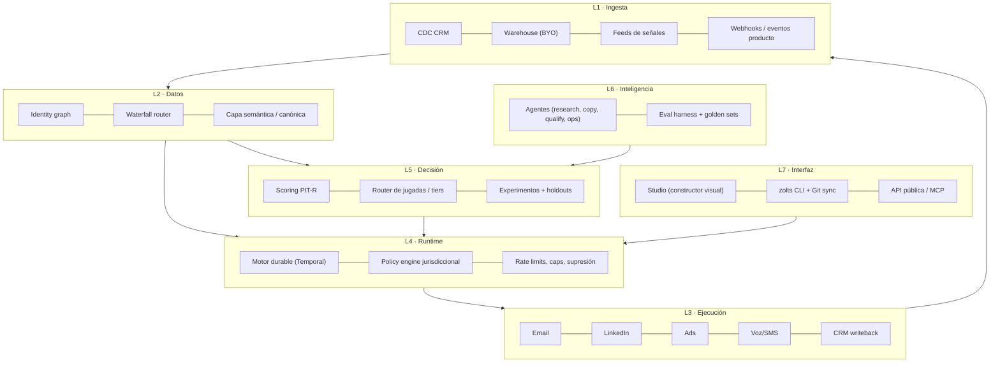

# 02 — Arquitectura de producto y plataforma

## Principio rector

> Todo lo que un GTM Engineer configura debe ser **texto versionable, testeable y reversible**. La UI es un editor sobre ese texto, nunca la fuente de verdad.

## Capas

El bucle es cerrado: L3 escribe outcomes de vuelta a L1, que alimentan el reentrenamiento en L5. **Ese bucle es el moat compuesto.**

## Componentes críticos

### 1. Runtime durable
Un programa GTM es un workflow de larga duración: espera 3 días, reintenta un proveedor caído, respeta horas silenciosas, se pausa si el contacto responde. Implementarlo con cron + colas es deuda garantizada.

- **Temporal** como motor: ejecución durable, reintentos, versionado de workflows, replay determinista.
- Cada ejecución produce un **trace auditable**: qué señal la disparó, qué datos se compraron y a quién, qué decisión tomó el scorer, qué texto generó qué modelo con qué prompt, qué se envió y qué pasó.
- Coste imputado por ejecución (créditos + tokens + envíos) → base del P&L por jugada.

### 2. Policy engine (pre-ejecución, bloqueante)
Cada acción atraviesa una evaluación de política antes de ejecutarse: jurisdicción del contacto, base legal, canal permitido, supresión, frecuencia, horas, cuotas del tenant, límite de gasto. Fallo = acción bloqueada con motivo registrado, nunca "best effort". Detalle en [11](11-compliance-y-gobierno.md).

### 3. Capa semántica canónica
Modelo de entidades único (Account, Person, Signal, Membership, Play, Touch, Outcome). Los objetos del cliente se mapean a este canon con un **mapper asistido por IA** + confirmación humana. Los campos custom viven en `attributes JSONB` con esquema declarado por tenant → cualquier CRM, cualquier vertical, sin fork.

### 4. Waterfall router
Abstracción de proveedores por *campo*, no por *vendor*. Ver [07](07-motor-de-datos-waterfall.md).

### 5. Experimentation service
Asignación determinista (hash estable de `account_id + program_id + salt`) a control/tratamiento. Nadie puede ejecutar un programa sin declarar su holdout. Ver [10](10-medicion-e-incrementalidad.md).

## Stack técnico (decisiones)

| Capa | Elección | Alternativa descartada | Motivo |
|---|---|---|---|
| Lenguaje núcleo | TypeScript (Node 22) | Go | Velocidad de iteración, un solo lenguaje front/back, ecosistema de conectores |
| ML / scoring | Python (FastAPI + scikit/LightGBM) | TS puro | Herramientas de modelado maduras; servicio aislado |
| Runtime workflows | Temporal | BullMQ / Airflow | Durabilidad y replay; Airflow es batch, no event-driven |
| OLTP | Postgres 16 + RLS | MySQL | RLS para multi-tenancy, JSONB, pgvector, extensiones |
| OLAP | ClickHouse | BigQuery propio | Coste por evento en touches/traces; latencia de dashboards |
| Warehouse cliente | Snowflake/BigQuery/Databricks/Postgres (BYO) | Copiar todo a Zolts | Elimina objeción de gobierno del dato y COGS de storage |
| Streaming | Redpanda (Kafka API) | SQS | Replay de eventos, semántica de log |
| Caché / rate limit | Redis | — | Cuotas por proveedor y por mailbox |
| Vectores | pgvector | Pinecone | Un sistema menos que operar hasta 10^8 vectores |
| LLM | Claude (Anthropic API) primario, router multi-modelo | Un solo proveedor | Coste/latencia por tarea; evitar dependencia única |
| Front | Next.js + tRPC + Tailwind | — | — |
| Infra | Kubernetes (EKS/GKE), IaC con Terraform | Serverless puro | Workers de larga duración y control de red por región |
| Residencia | Clusters por región (eu-central-1, us-east-1) | Región única | Requisito enterprise UE |

## ADRs (decisiones de arquitectura, resumidas)

**ADR-001 · Multi-tenancy por RLS en Postgres compartido, con opción de aislamiento físico en Enterprise.**
Coste operativo lineal vs. base por cliente; el aislamiento físico se vende como add-on (poder de precio).

**ADR-002 · El DSL es la fuente de verdad; la UI genera DSL.**
Evita divergencia UI/motor y habilita GitOps, PRs sobre lógica GTM y rollback.

**ADR-003 · Zero-copy por defecto sobre el warehouse del cliente.**
Zolts materializa solo lo mínimo para ejecutar (IDs, estado de programa, supresiones). Reduce superficie GDPR y COGS.

**ADR-004 · Todo agente escribe propuestas, nunca ejecuta directamente.**
El agente emite una `proposed_action`; el runtime la valida contra política + evals antes de materializarla. Separación estricta propuesta/ejecución.

**ADR-005 · Idempotencia obligatoria en toda acción externa.**
`idempotency_key = hash(program_version, entity_id, step_id, window)`. Sin esto, un replay de Temporal duplica emails: fallo irrecuperable de confianza.

**ADR-006 · Conector SDK único con tests de contrato.**
Todo conector implementa la misma interfaz (`discover`, `read`, `write`, `capabilities`, `limits`) y pasa una suite de contrato en CI. Contiene la deuda de conectores, que es el principal sumidero de ingeniería del sector.
